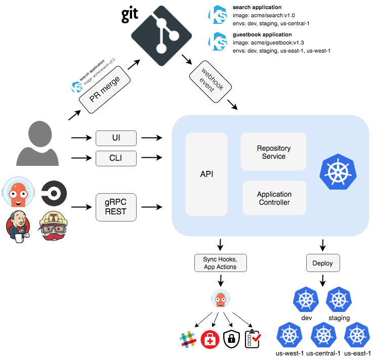
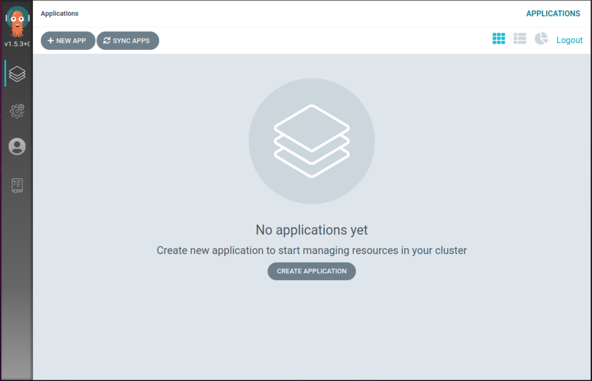
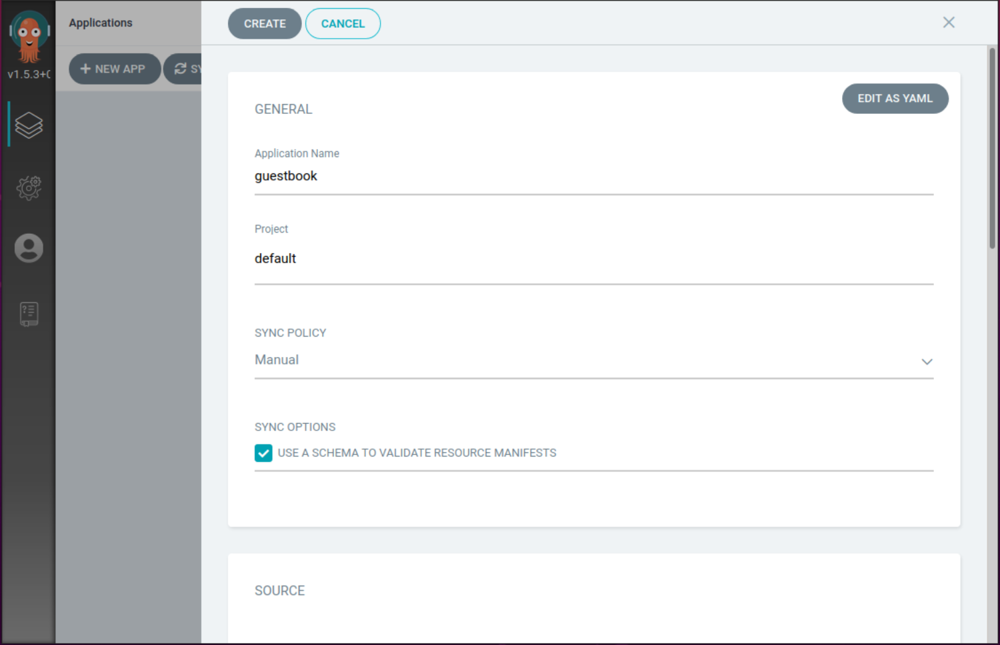
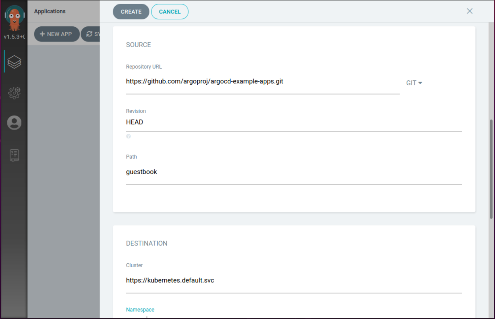
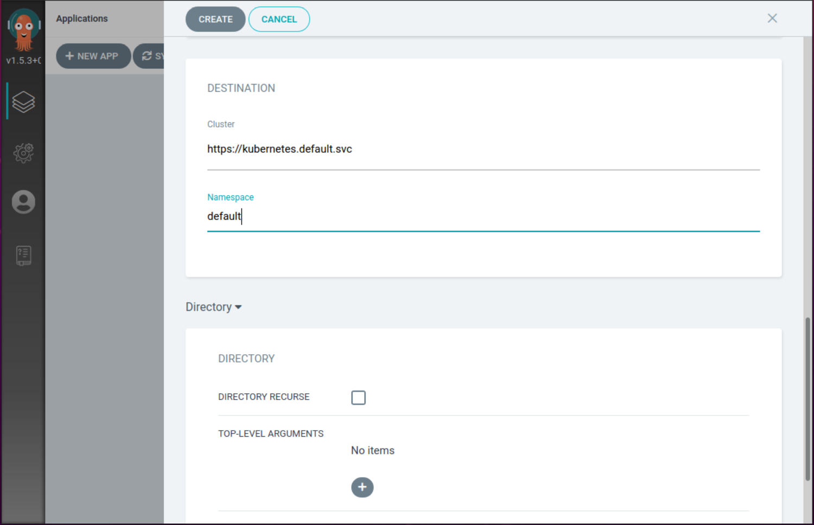
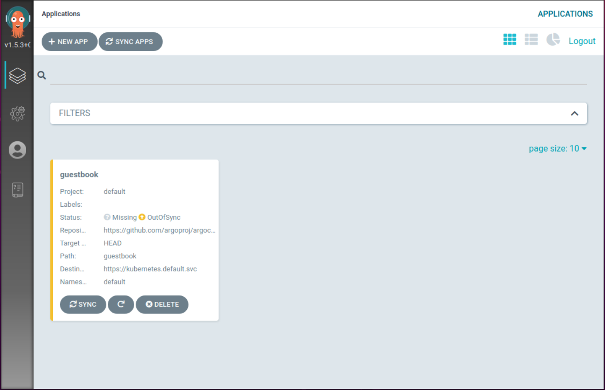
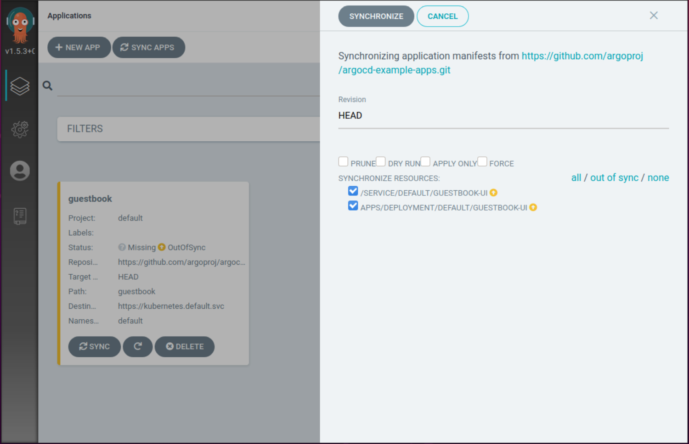
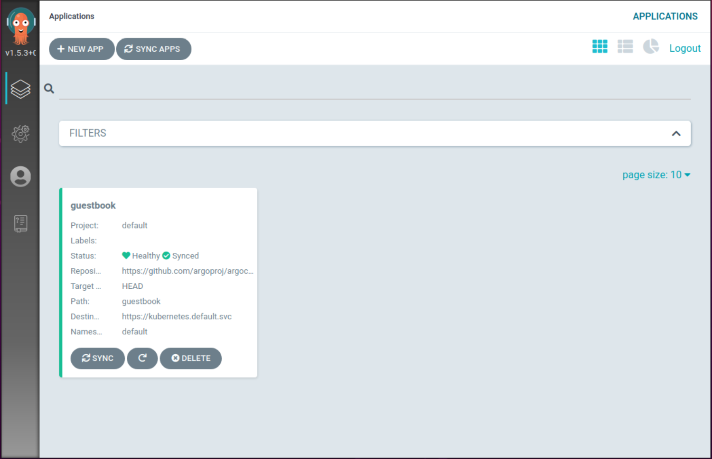
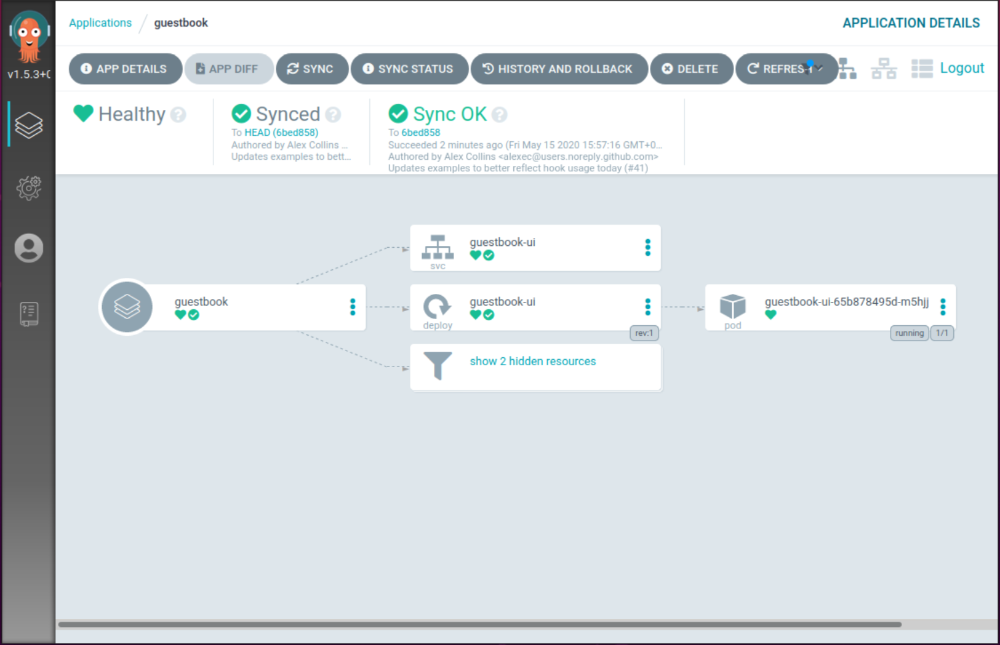

# Argo CD

# 1. Argo CD 개요
Argo CD는 쿠버네티스를 위한 선언적인 GitOps 기반의 지속적 제공(CD) 도구다.

Argo CD는 신뢰 가능한 단일 소스인 Git 저장소의 소스를 원하는 형태로 애플리케이션 상태를 정의하는 GitOps 패턴을 따른다.

쿠버네티스 매니페스트는 다음과 같은 방법으로 지정할 수 있다.
- YAML/JSON 매니페스트의 일반 디렉토리
- Kustomize
- Helm Chart
- ksonnet 애플리케이션
- Jsonnet 파일
- 사용자 정의 구성(CRD) 관리 도구

# 2. Argo CD 아키텍처


## API 서버
웹 UI, CLI 및 CI/CD 시스템에서 사용하는 gRPC/REST API 서버다.
- 애플리케이션 관리 및 상태보고
- 애플리케이션 작업 호출(예: 동기화, 롤백, 사용자 정의 작업)
- 저장소 및 클러스터 자격 증명 관리(K8s Secrets)
- 외부 ID 제공 업체에 인증 및 인증 위임
- RBAC
- Git 웹 후크 이벤트 리스너 및 전달자

## 저장소 서비스(Repository Service)
Git 저장소의 로컬 캐시를 유지 관리하는 서비스

## 애플리케이션 컨트롤러(Application Controller)
쿠버네티스 클러스터의 컨트롤러로 실행중인 애플리케이션을 지속적으로 모니터링하고 현재 활성 상태를 원하는 상태(Git 저장소의 소스)와 비교한다.

# 3. Argo CD 설치

## 1) 사전 요구 사항
- kubernetes CLI
- kubeconfig 파일 (기본 위치 ~/.kube/config)

## 2) 네임스페이스 생성
argocd 네임스페이스를 생성한다.
```
kubectl create namespace argocd
```

## 3) Argo CD 설치
쿠버네티스 리소스가 정의된 Argo CD 설치 파일로 배포한다.
```
kubectl apply -n argocd -f https://raw.githubusercontent.com/argoproj/argo-cd/stable/manifests/install.yaml
```

> 참고  
> Argo CD의 대부분 구성요소는 상태를 가지지 않으며, 고가용성을 구성하기 위해 별도의 매니페스트 파일을 제공한다.  
> https://raw.githubusercontent.com/argoproj/argo-cd/master/manifests/ha/install.yaml  

> 참고  
> GKE에서는 계정에 새 클러스터 역할을 생성 할 수 있는 권한이 있어야 한다.  
> ```kubectl create clusterrolebinding YOURNAME-cluster-admin-binding --clusterrole=cluster-admin --user=YOUREMAIL@gmail.com```

## 4) Argo CD 리소스 확인
argocd 네임스페이스의 리소스를 확인한다.
```
kubectl get all -n argocd

NAME                                                
pod/argocd-application-controller-56cc786677-9gsrc  
pod/argocd-dex-server-9755c5c9c-j6ftt               
pod/argocd-redis-8c568b5db-24gbp                    
pod/argocd-repo-server-778f98fc8f-6psp4             
pod/argocd-server-7696cd5f89-n8wrr                  

NAME                            TYPE        
service/argocd-dex-server       ClusterIP   
service/argocd-metrics          ClusterIP   
service/argocd-redis            ClusterIP   
service/argocd-repo-server      ClusterIP   
service/argocd-server           ClusterIP   
service/argocd-server-metrics   ClusterIP   

NAME                                        
deployment.apps/argocd-application-controller
deployment.apps/argocd-dex-server           
deployment.apps/argocd-redis               
deployment.apps/argocd-repo-server          
deployment.apps/argocd-server               

NAME                                                
replicaset.apps/argocd-application-controller-56cc78
replicaset.apps/argocd-dex-server-9755c5c9c         
replicaset.apps/argocd-redis-8c568b5db              
replicaset.apps/argocd-repo-server-778f98fc8f       
replicaset.apps/argocd-server-7696cd5f89            
```

## 5) Argo CD API 서버 접근
기본적으로 Argo CD의 API 서버는 외부 IP로 노출되지 않는다.

API 서버에 접근하기위해서 세 가지 방법중 하나를 선택할 수 있다.
- (로드밸런서, 노드포트) 서비스 종류 변경
- 인그레스 리소스 생성
- kubectl 포트 포워딩

### 서비스 종류 변경
API 서버의 기본 서비스 종류는 ClusterIP이다.
```
kubectl -n argocd get svc argocd-server

NAME            TYPE        CLUSTER-IP     EXTERNAL-IP   PORT(S)          AGE
argocd-server   ClusterIP   10.233.2.168   <none>        80/TCP,443/TCP   9m34s
```

kubectl patch 명령을 이용하여 로드밸런서로 변경한다.
```
kubectl patch svc argocd-server -n argocd -p '{"spec": {"type": "LoadBalancer"}}'
```

서비스 종류 및 외부 IP를 확인한다.
```
kubectl -n argocd get svc argocd-server

NAME            TYPE           CLUSTER-IP     EXTERNAL-IP      PORT(S)                      AGE
argocd-server   LoadBalancer   10.233.2.168   192.168.56.202   80:31894/TCP,443:32096/TCP   9m42s
```

# 4. Argo CD CLI 설치

## 1) 리눅스
argocd 명령의 최신 버전을 확인하고 변수에 저장한다.
```
VERSION=$(curl --silent "https://api.github.com/repos/argoproj/argo-cd/releases/latest" | grep '"tag_name"' | sed -E 's/.*"([^"]+)".*/\1/')
```

curl 명령을 이용하여 /usr/local/bin에 다운로드 한다.
```
sudo curl -sSL -o /usr/local/bin/argocd https://github.com/argoproj/argo-cd/releases/download/$VERSION/argocd-linux-amd64
```

argocd 명령에 실행 권한을 부여한다.
```
sudo chmod +x /usr/local/bin/argocd
```

argocd 명령이 실행되는지 확인한다.
```
argocd -h
```

## 2) macOS
argocd 명령의 최신 버전을 확인하고 변수에 저장한다.
```
VERSION=$(curl --silent "https://api.github.com/repos/argoproj/argo-cd/releases/latest" | grep '"tag_name"' | sed -E 's/.*"([^"]+)".*/\1/')
```

curl 명령을 이용하여 /usr/local/bin에 다운로드 한다.
```
sudo curl -sSL -o /usr/local/bin/argocd https://github.com/argoproj/argo-cd/releases/download/$VERSION/argocd-darwin-amd64
```

argocd 명령에 실행 권한을 부여한다.
```
sudo chmod +x /usr/local/bin/argocd
```

argocd 명령이 실행되는지 확인한다.
```
argocd -h
```

argocd-server-7696cd5f89-n8wrr

# 5. Argo CD CLI를 이용한 패스워드 변경
Argo CD의 CLI 및 웹 UI를 사용하기 위해 사용자 및 패스워드 인증이 필요하다.

기본 제공되는 계정은 admin 이며, 패스워드는 Argo CD의 API 서버 파드의 이름이 기본 패스워드다.

다음 명령으로 API 서버의 파드 이름을 쉽게 확인할 수 있다.
```
kubectl get pods -n argocd -l app.kubernetes.io/name=argocd-server -o name | cut -d'/' -f 2

argocd-server-7696cd5f89-n8wrr
```

## 1) CLI 로그인
argocd 명령으로 로그인 하자. Argo CD의 API 서버 주소는 로드밸런서의 외부 IP 주소다.
```
argocd login 192.168.56.202

WARNING: server certificate had error: x509: cannot validate certificate for 192.168.56.202 because it doesn't contain any IP SANs. Proceed insecurely (y/n)? y
Username: admin
Password:
'admin' logged in successfully
Context '192.168.56.202' updated
```

## 2) 패스워드 변경
argocd 명령을 이용하여 기본 패스워드를 변경하자.
```
argocd account update-password

*** Enter current password:
*** Enter new password:
*** Confirm new password:
Password updated
Context '192.168.56.202' updated
```

# 6. Argo CD에 사용할 애플리케이션
https://github.com/argoproj/argocd-example-apps.git

위 Git 저장소는 Argo CD에서 테스트 할 수 있는 다양한 형태의 애플리케이션 예제를 제공한다.

# 7. 애플리케이션 배포
웹 브라우저를 이용하여 Argo CD의 웹 UI로 접속하자.

## 1) 애플리케이션 생성
1. 좌측 상단에 NEW APP을 선택해 애플리케이션을 생성해보자.


2. GENERAL 항목
배포할 애플리케이션의 이름 및 프로젝트를 지정하자.
  - Application Name: guestbook
  - Project: default


3. SOURCE 항목
Git 저장소를 지정한다.
- Repository URL: https://github.com/argoproj/argocd-example-apps.git
- Revision: HEAD
- Path: guestbook


> 참고  
> argocd-example-apps 저장소의 guestbook 디렉토리에 정의된 애플리케이션이다.  
> 디플로이먼트 및 서비스가 YAML 형태로 정의된 매니패스트 파일을 가지고 있다.
> https://github.com/argoproj/argocd-example-apps/tree/master/guestbook
> 

4. DESTINATION 항목
배포할 클러스터 및 네임스페이스를 지정하자.
- Cluster: https://kubernetes.default.svc
- Namespace: default


> 참고  
> https://kubernetes.default.svc 클러스터는 Argo CD가 설치된 로컬 쿠버네티스 클러스터다.

- Create를 선택해 생성한다.

# 8. 애플리케이션 확인 
1. 정의된 guestbook 애플리케이션이다.


상태를 확인해보면 애플리케이션을 배포하기 위한 정보만 구성되어 있을 뿐 애플리케이션이 쿠버네티스 클러스터에 배포되지는 않았다.

SYNC를 선택해 동기화 하자.

> 참고  
> Argo CD에서 동기화는 Git 저장소의 소스와 쿠버네티스 클러스터를 동기화하는 개념이다. 즉, 리소스를 생성하고 모니터링하게 된다.

2. 동기화
SYNCHRONIZE를 선택해 동기화 하자.


3. 동기화된 guestbook 애플리케이션
상태를 확인해 보면 동기화된 것을 확인할 수 있다.


4. guestbook 애플리케이션의 상세 정보
guestbook 애플리케이션 박스를 선택하면 상세 정보를 확인할 수 있다.  
쿠버네티스 리소스의 의존성/상관 관계를 확인할 수 있다.

