# Spinnaker

# 3. CI/CD 구성

## 1) 시나리오
GitHub --> Docker Hub --> Spinnaker --> Kubernetes Deployment
- GitHub Repository: 컨테이너 이미지를 빌드하기 위한 Dockerfile 및 소스
- Docker Hub Registry: Automated Build 기능을 이용하여 GitHub의 소스를 이미지로 빌드
- Spinnaker: Docker Hub Registry에 빌드된 새 이미지가 빌드되면 Kubenetes Deployment 리소스로 배포

## 2) GitHub 저장소 준비
Dockerfile 및 소스를 저장하기 위해 저장소를 생성한다.

### (1) GitHub 저장소 생성
여기서 저장소 이름은 "spinnaker-scm"으로 생성 한다.

### (2) 로컬 Git 저장소 생성
```
mkdir spinnaker-scm
```
```
cd spinnaker-scm
```
```
git init
```
```
git remote add origin git@github.com:<ACCOUNT>/spinnaker-scm.git
```

## 3) Docker Hub 레지스트리 준비
GitHub의 Dockerfile을 자동화 빌드를 통해 이미지를 저장할 도커 레지스트리를 준비한다.

> 참고: 레지스트리 이름은 "spinnaker-autobuild"로 한다.

레지스트리를 생성할 때 자동화 빌드를 할 수 있도록 구성한다.(나중에 설정할 수도 있다.)

"Build Setting" 항목:
- GitHub 계정 연결
- GitHub 저장소 선택

"Build Rules" 항목:
- Source Type: Tag
- Source: /^v([0-9.]+)$/
- Docker Tag: v{\1}
- Dockerfile location: Dockerfile

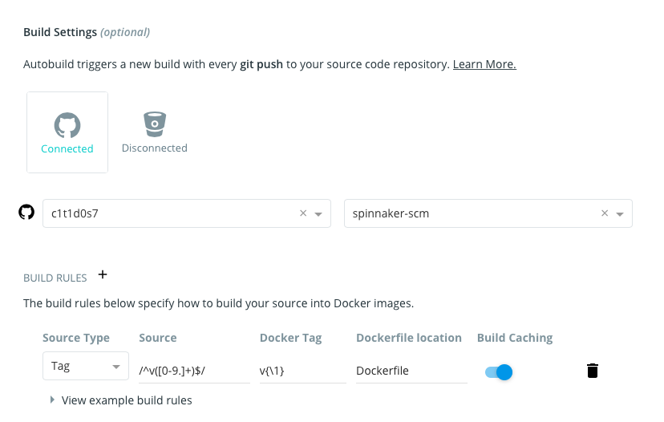

빌드룰의 의미는 GitHub의 태그(예: v0.1)가 생성되면 도커 컨테이너 태그를 vXXX(예 v0.1)로 빌드한다는 의미다.

## 4) Dockerfile 및 웹 소스 준비

### (1) Dockerfile 및 웹 소스 생성
> Dockerfile
```
FROM nginx:1.18.0-alpine
COPY index.html /usr/share/nginx/html
```

> index.html
```
Version 0.1
```

### (2) GitHub 저장소 푸시
변경사항 인덱싱
```
git add .
```
변경사항 커밋
```
git commit -m 'Nginx v0.1'
```
변경사항 master 브랜치 푸시
```
git push origin master
```
v0.1 태그 생성
```
git tag -a v0.1 -m 'Nginx v0.1'
```
v0.1 태그 푸시
```
git push orgin v0.1
```

## 5) 자동화 빌드 확인
Docker Hub 레지스트리의 빌드 탭을 선택해 자동화 빌드가 작동하는지 확인한다.

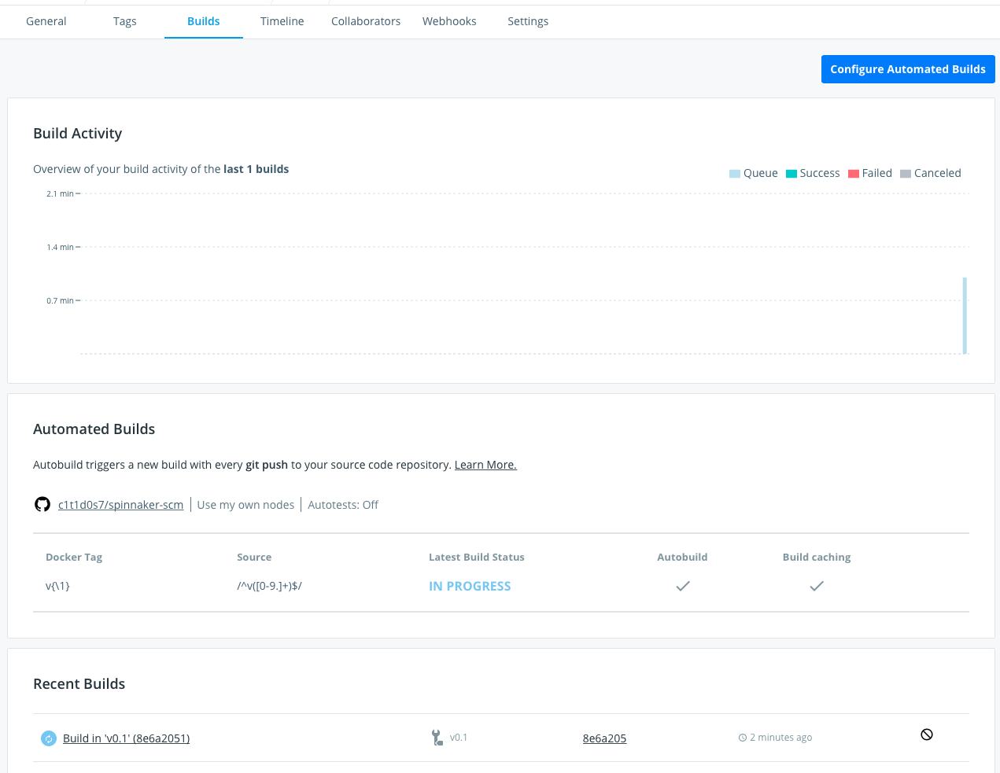

## 6) Spinnaker의 Docker 저장소 설정
도커 레지스트리를 활성화 한다.
```
hal config provider docker-registry enable
```

Docker 레지스트리 공급자의 이름으로 dockerhub 계정을 생성하고, 저장소를 지정한다.
```
hal config provider docker-registry account add dockerhub \
--address index.docker.io \
--repositories c1t1d0s7/spinnaker-autobuild
```
도커 레지스트리로 사용하는 Docker Hub의 주소는 index.docker.io 이며, 만약 도커 레지스트리가 사설 레지스트리인 경우 --username 옵션과 --password 옵션을 사용해 인증을 하도록 한다.

변경된 구성으로 Spinnaker를 재배포 한다.
```
hal deploy apply
```

spin-clouddriver 파드가 재배포되는지 확인한다.
```
kubectl get po -n spinnaker
```

## 7) Spinnaker의 애플리케이션 및 파이프라인 생성
Spinnaker UI에 접속해서 애플리케이션 및 파이프라인을 생성하자.

> 참고  
> 파드가 재배포된 경우 새로운 웹브라우저로 접속하자.  
> 간혹 새로 구성된(예: 도커 레지스트리 등) 정보가 로드되지 않을 수 있다.

### (1) 애플리케이션 생성
1. Applications 탭 선택
2. Create Application 선택
   - Name: delivery-test 
   - Owner Email: [EMAIL 주소]
3. Create 선택

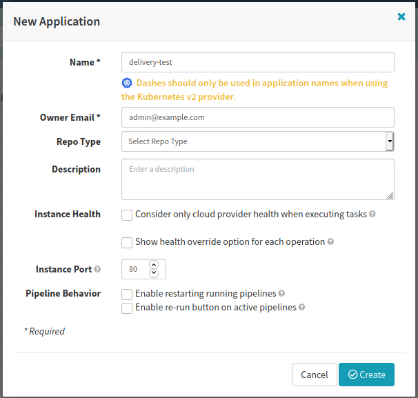

### (2) 파이프라인 생성
1. PIPELINES 탭 선택
2. Configure a new pipeline 선택
   - Type: Pipeline
   - Pipeline Name: nginx-pipeline
3. Create 선택

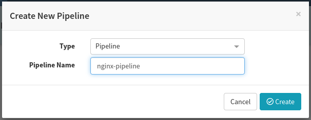

### (3) 자동화 트리거 설정
1. Automated Triggers 항목
2. Add Trigger 선택
   - Type: Docker Registry
     - Registry Name: dockerhub 선택
     - Organization: 도커 허브 계정 선택
     - Image: {ACCOUNT}/spinnaker-autobuild
     - Tag: v.*
3. 우측하단의 Save Change 선택 

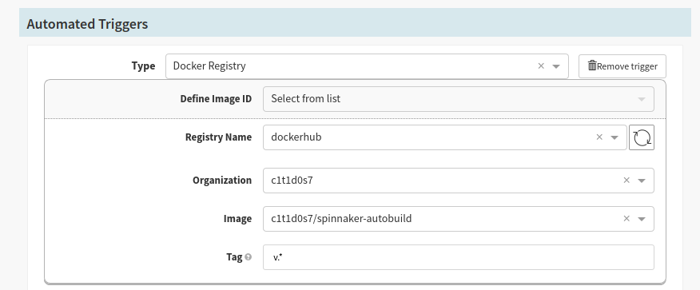

### (4) 파이프라인에 배포 단계 추가
1. Configuration 항목
2. Add Stage 선택
   - Type: Deploy (Manifest) 선택
   - Stage Name: Nginx Deployment
3. Account: my-k8s 선택
4. Override Namespace 선택
5. Namespaces: Default 선택
6. Manifest
```
apiVersion: apps/v1
kind: Deployment
metadata:
  name: web-test
  labels:
    app: web-test
spec:
  replicas: 3
  selector:
    matchLabels:
      app: web-test
  template:
    metadata:
      labels:
        app: web-test
    spec:
      containers:
      - image: "<ACCOUNT>/spinnaker-autobuild:${trigger['tag']}"
        name: web-test
        ports:
        - containerPort: 80
```
디플로이먼트 리소스를 생성하자. 이미지 이름은 적절한 이름으로 변경하고 이미지의 태그는 앞서 설정한 자동화 트리거에서 동적으로 참조하도록 구성하였다.
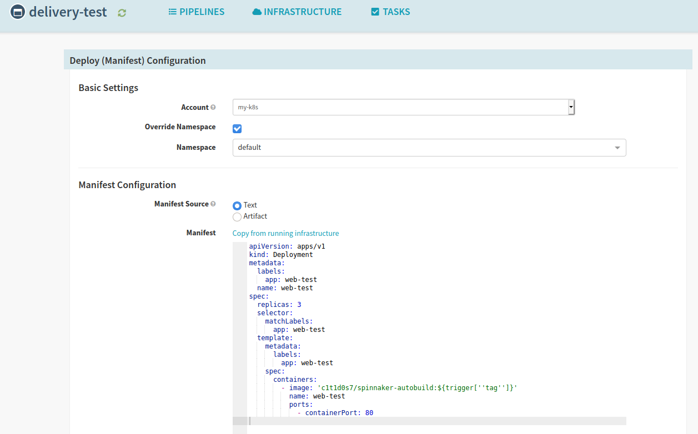

7. 우측하단의 Save Changes 선택 

### (5) Spinnaker의 애플리케이션 LoadBalancer 생성
1. INFRASTRUCTURE 탭 선택
2. LOAD BALANCERS 탭 선택
3. Create Load Balancer 선택
4. Manifest
```
apiVersion: v1
kind: Service
metadata:
  name: nginx-stage-lb
  namespace: default
spec:
  type: LoadBalancer
  ports:
  - port: 80
    targetPort: 80
  selector:
    app: web-test
```
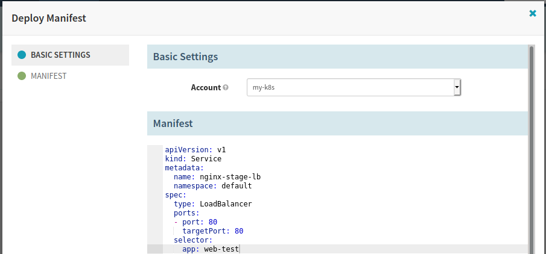

5. Create 선택
6. Operation succeeded! 확인
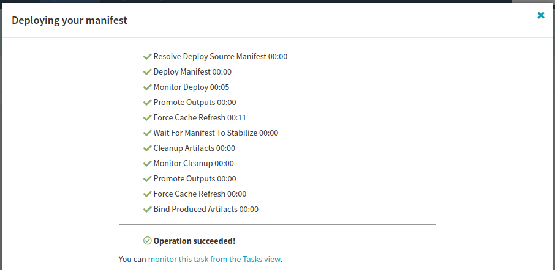

7. Close 선택

## 8) 파이프라인 배포 테스트
### (1) 수동 배포 및 애플리케이션 확인
1. PIPELINES 탭 선택
2. nginx-pipeline 파이프라인의 Start Manual Execution 선택
3. Select Execution Parameters
   - Type: Tag 선택
   - Tag: v0.1 선택
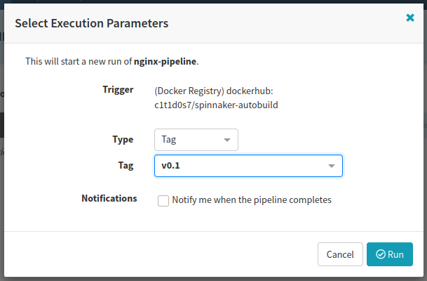
4. Run 선택

#### A. 수동 배포 확인
- 배포 중
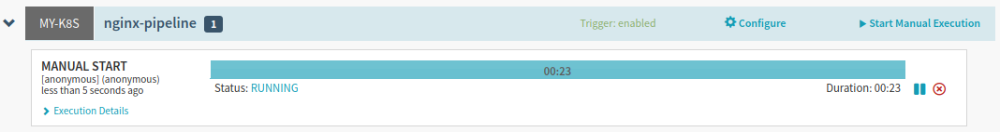
- 배포 성공
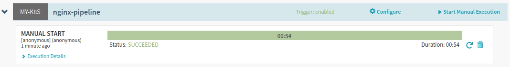

#### B. 애플리케이션 확인
1. INFRASTRUCTURE 탭 선택
2. CLUSTERS 탭 선택
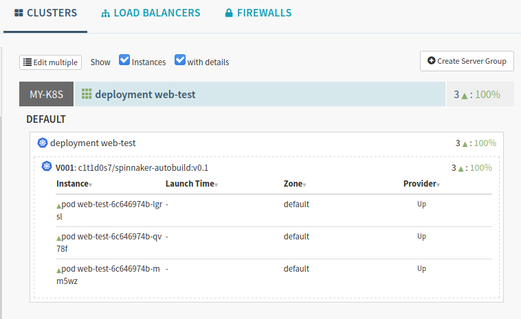

spinnaker-autobuild:v0.1 이미지로 세 개의 파드가 실행되고 있는것을 확인할 수 있다.

3. LOADBALANCERS 탭 선택
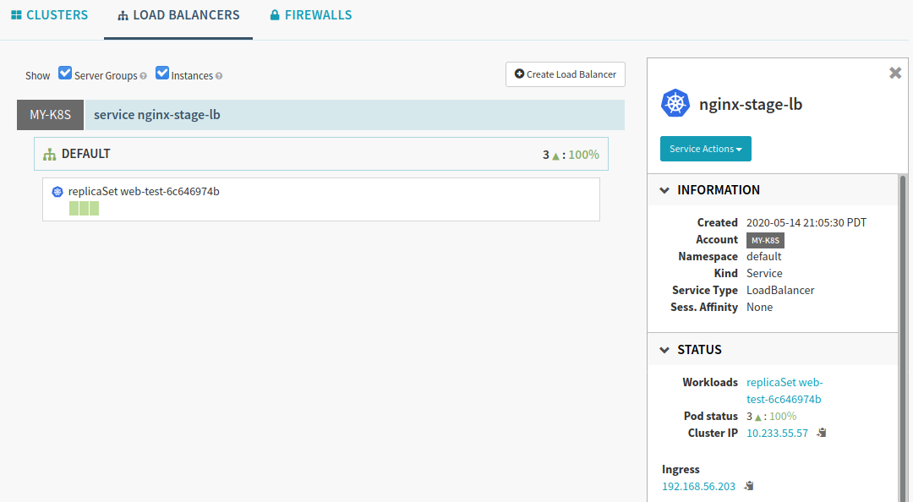

4. 우측 메뉴에서 Ingress 항목의 링크를 선택한다.
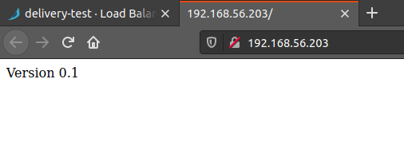

### (2) CI/CD 자동 배포 확인
GitHub의 코드를 수정한 후 v0.2 태그를 설정하여, 전체 CI/CD 파이프라인이 재대로 작동하는지 확인한다.

#### A. Nginx v0.2 변경
GitHub 저장소의 index.html을 수정한다.

> index.html
```
Version 0.2
```

#### B. GitHub 원격 저장소 푸시
변경사항 인덱싱
```
git add .
```
변경사항 커밋
```
git commit -m 'Nginx v0.2'
```
변경사항 master 브랜치 푸시
```
git push origin master
```
v0.2 태그 생성
```
git tag -a v0.2 -m 'Nginx v0.2'
```
v0.2 태그 푸시
```
git push origin v0.2
```

## 8) CI/CD 확인
- GitHub Tag v0.2
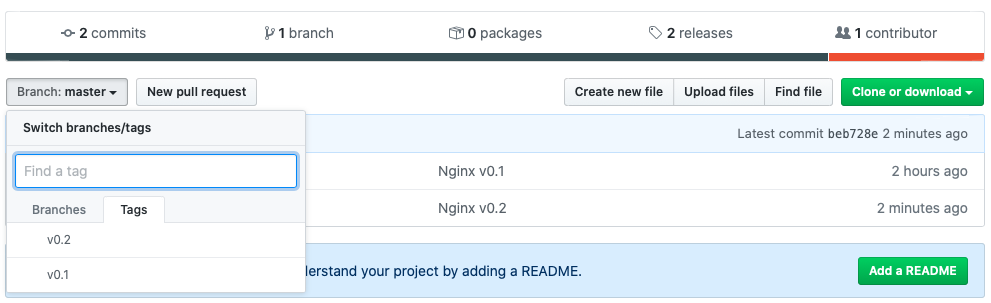

- Docker Hub Automated Build v0.2
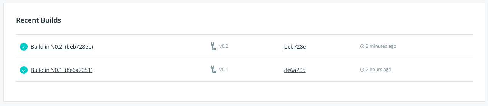

- Spinnaker - Pipeline - Automated Trigger
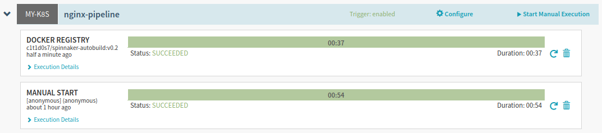

- Spinnaker - Clusters v0.2
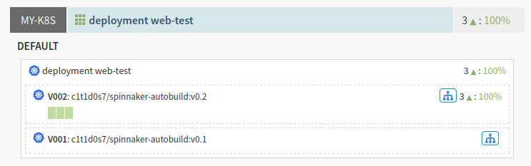

- Spinnaker - LoadBalancer v0.2
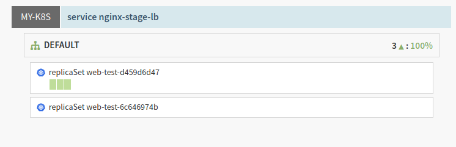

- Firefox - Nginx App v0.2
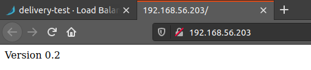

