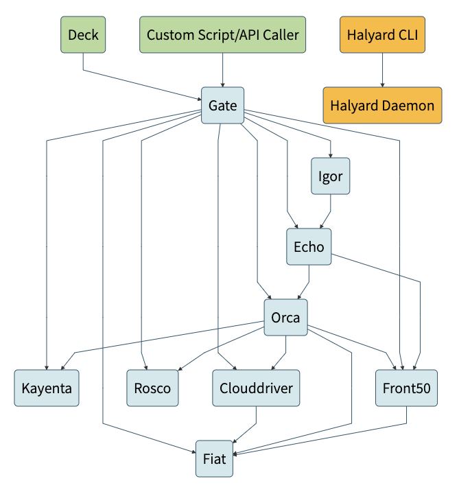
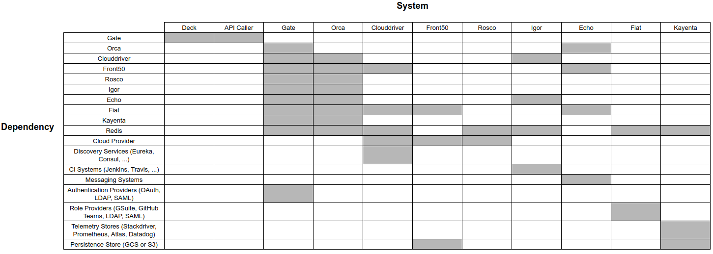
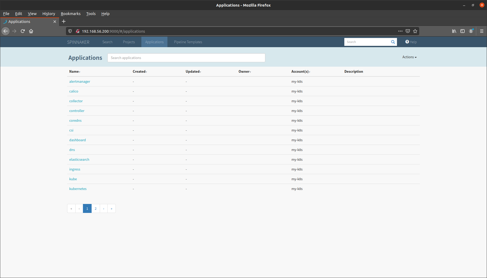

# Spinnaker

# 1. 아키텍처

## 1) Spinnaker 마이크로서비스
- Deck
  - 웹기반 UI
- Gate
  - API 게이트웨이
  - Spinnaker의 모든 마이크로서비스는 Gate를 통해 통신함
- Orca
  - 오케스트레이션 엔진
  - 모즌 임시 작업 및 파이프라인을 처리함
- Clouddriver
  - 클라우드 공급자에 대한 모든 변경 호출과 배포 된 모든 리소스의 색인을 생성하고 캐싱함
- Front50
  - 애플리케이션, 파이프라인, 프로젝트 및 알림의 메타데이터를 유지
- Rosco
  - 베이커리(Bakery)
  - 클라우드 공급자에 불변의(immutable) VM 이미지를 생성
  - packer를 이용해 이미지를 생성
  - 예) GCE 이미지, AWS AMI, Azure VM 이미지
- Igor
  - Jenkins, Travis와 같은 CI 작업을 통해 파이프라인을 트리거하는데 사용
- Echo
  - Spinnaker의 이벤트 버스
  - 알림 전송(예: Slack, 이메일, SMS)
  - GitHub 등 웹 후크에 작용
- Fiat
  - Spinnaker의 인증 서비스
- Kayenta
  - Spinnaker에 대해 자동화된 카나리(canary) 분석 제공
- Halyard
  - Spinnaker의 구성 서비스
  - Spinnaker의 배포 구성 작성 및 유효성 검사
  - Spinnaker의 마이크로서비스 배포 및 업데이트

## 2) Spinnaker 시스템 의존성



## 3) 포트 매핑
| 서비스        | 포트  |
|-------------|------|
| Clouddriver | 7002 |
| Deck        | 9000 |
| Echo        | 8089 |
| Fiat        | 7003 |
| Front50     | 8080 |
| Gate        | 8084 |
| Halyard     | 8064 |
| Igor        | 8088 |
| Kayenta     | 8090 |
| Orca        | 8083 |
| Rosco       | 8087 |

# 2. Spinnaker 설치

## 1) 사전 요구 사항
- Halyard를 설치할 로컬 시스템 또는 VM, Docker 컨테이너
- Spinnaker를 설치할 Kubernetes 클러스터

## 2) Halyard 설치
- Ubuntu 14.04, 16.04, 18.04
- Debian 8, 9
- macOS (10.13 이상)

### (1) Halyard 최신 버전 다운로드
#### Ubuntu/Debian
```
curl -O https://raw.githubusercontent.com/spinnaker/halyard/master/install/debian/InstallHalyard.sh
```

#### macOS
```
curl -O https://raw.githubusercontent.com/spinnaker/halyard/master/install/macos/InstallHalyard.sh
```

### (2) 설치
```
sudo bash InstallHalyard.sh
```

### (옵션) (3) Halyard 업데이트
```
sudo update-halyard
```

### (옵션) (4) Halyard 제거
```
hal deploy clean
```

```
sudo ~/.hal/uninstall.sh
```

## 3) 클라우드 공급자 선택

### (1) 지원되는 클라우드 공급자
- Amazon Web Services
- Azure
- Cloud Foundry
- DC/OS
- Docker Registry
- Google App Engine
- Google Compute Engine
- Kubernetes (Alibaba ACK, Amazon EKS, GCP GKE, OCI OKE)
- Oracle

```
hal config provider
```

### (2) 사전 요구 사항
- kubeconfig 파일
- kubectl CLI 도구
- (옵션) 서비스 계정
- (옵션) RBAC

#### (옵션) 서비스 계정
```
CONTEXT=$(kubectl config current-context)
```

```
kubectl apply --context $CONTEXT \
    -f https://spinnaker.io/downloads/kubernetes/service-account.yml
```

```
TOKEN=$(kubectl get secret --context $CONTEXT \
   $(kubectl get serviceaccount spinnaker-service-account \
       --context $CONTEXT \
       -n spinnaker \
       -o jsonpath='{.secrets[0].name}') \
   -n spinnaker \
   -o jsonpath='{.data.token}' | base64 --decode)
```

```
kubectl config set-credentials ${CONTEXT}-token-user --token $TOKEN
```

```
kubectl config set-context $CONTEXT --user ${CONTEXT}-token-user
```

#### (옵션) RBAC
```yaml
apiVersion: rbac.authorization.k8s.io/v1
kind: ClusterRole
metadata:
 name: spinnaker-role
rules:
- apiGroups: [""]
  resources: ["namespaces", "configmaps", "events", "replicationcontrollers", "serviceaccounts", "pods/log"]
  verbs: ["get", "list"]
- apiGroups: [""]
  resources: ["pods", "services", "secrets"]
  verbs: ["create", "delete", "deletecollection", "get", "list", "patch", "update", "watch"]
- apiGroups: ["autoscaling"]
  resources: ["horizontalpodautoscalers"]
  verbs: ["list", "get"]
- apiGroups: ["apps"]
  resources: ["controllerrevisions", "statefulsets"]
  verbs: ["list"]
- apiGroups: ["extensions", "apps"]
  resources: ["deployments", "replicasets", "ingresses"]
  verbs: ["create", "delete", "deletecollection", "get", "list", "patch", "update", "watch"]
# These permissions are necessary for halyard to operate. We use this role also to deploy Spinnaker itself.
- apiGroups: [""]
  resources: ["services/proxy", "pods/portforward"]
  verbs: ["create", "delete", "deletecollection", "get", "list", "patch", "update", "watch"]
---
apiVersion: rbac.authorization.k8s.io/v1
kind: ClusterRoleBinding
metadata:
 name: spinnaker-role-binding
roleRef:
 apiGroup: rbac.authorization.k8s.io
 kind: ClusterRole
 name: spinnaker-role
subjects:
- namespace: spinnaker
  kind: ServiceAccount
  name: spinnaker-service-account
---
apiVersion: v1
kind: ServiceAccount
metadata:
 name: spinnaker-service-account
 namespace: spinnaker
```

### (3) 클라우드 공급자 활성화
```
hal config provider kubernetes enable
```

### (4) 쿠버네티스 계정 추가
```
hal config provider kubernetes account add my-k8s --provider-version v2 --context $(kubectl config current-context)
```

### (5) 아티펙트 활성화
Spinnaker 아티펙트는 외부 리소스를 참조하는 명명된 JSON 객체  

Spinnaker의 파이프라인에서 참조하는 외부 리소스  

외부 리소스란?  
Docker 이미지, GitHub에 저장된 파일, Amazon AMI, Amazon S3, Google Cloud Storage 등

```
hal config features edit --artifacts true
```

## 4) 환경 선택

### (1) Spinnaker를 설치하기 위한 환경 유형
- Kubernetes에 분산 설치: 마이크로서비스를 개별 배포 (프로덕션)
- Debian 패키지의 로컬 설치: 단일 시스템에 패키지로 배포
- github에서 로컬 git 설치: 개발자

### (2) 분산 설치 설정
```
hal config deploy edit --type distributed --account-name my-k8s
```

## 5) 스토리지 서비스 선택
Spinnaker는 애플리케이션 설정 및 파이프라인의 구성을 유지하기 위해 외부 스토리지가 필요

### (1) 지원되는 스토리지 솔루션
- Azure Storage
- Google Cloud Storage
- MinIO: 소프트웨어 기반 쿠버네티스 네이티브 오브젝트 스토리지, 오픈소스, S3 호환
- Redis: 프로덕션 환경에 지원 또는 추천되지 않음
- Amazon S3
- Oracle Object Storage

### (2) 쿠버네티스 클러스터에 MinIO 설치

#### 네임스페이스 생성
```
kubectl create ns spinnaker
```

#### Helm으로 MinIO 설치
```
helm install minio --namespace spinnaker --set accessKey="myaccesskey" --set secretKey="mysecretkey" --set persistence.enabled=false stable/minio
```

> 참고  
> 프로덕션 환경에서는 accessKey 및 secretKey는 랜덤한 문자열로 지정

#### S3 버저닝 비활성화
MinIO는 객채의 버저닝(Versioning)을 지원하지 않음으로 기능을 비활성화

```
```
```
echo "spinnaker.s3.versioning: false" > ~/.hal/default/profiles/front50-local.yml
```

#### MinIO 스토리지 형식 설정
```
hal config storage s3 edit --endpoint http://minio:9000 --access-key-id "myaccesskey" --secret-access-key "mysecretkey"
```
```
hal config storage s3 edit --path-style-access true
```
```
hal config storage edit --type s3
```

## 6) 배포

### 1) 사용가능한 Spinnaker 버전 확인
```
hal version list
```

### 2) Spinnaker 버전 선택
```
hal config version edit --version 1.20.0
```

### 3) Spinnaker 배포
```
hal deploy apply
```

### 4) 배포 확인

#### 파드
```
kubectl get po -n spinnaker

NAME                                READY   STATUS    RESTARTS   AGE
minio-668f5db64-6fmcr               1/1     Running   0          7m28s
spin-clouddriver-6b64d8767b-mcr2r   1/1     Running   0          3m31s
spin-deck-655b6c5567-hdp4m          1/1     Running   0          3m32s
spin-echo-5bc5b7695c-9r98t          1/1     Running   0          3m31s
spin-front50-6c76d97546-rjwk6       1/1     Running   0          3m31s
spin-gate-688457b7f-trt56           1/1     Running   0          3m32s
spin-orca-7d64c7b849-gxhqp          1/1     Running   0          3m32s
spin-redis-69cc85567c-pnmmz         1/1     Running   0          3m33s
spin-rosco-cb649b896-pqklm          1/1     Running   0          3m29s
```

#### 서비스
```
kubectl get svc -n spinnaker

NAME               TYPE        CLUSTER-IP      EXTERNAL-IP   PORT(S)    AGE
minio              ClusterIP   10.233.13.247   <none>        9000/TCP   7m55s
spin-clouddriver   ClusterIP   10.233.30.160   <none>        7002/TCP   4m4s
spin-deck          ClusterIP   10.233.9.213    <none>        9000/TCP   4m3s
spin-echo          ClusterIP   10.233.20.111   <none>        8089/TCP   4m2s
spin-front50       ClusterIP   10.233.32.36    <none>        8080/TCP   4m4s
spin-gate          ClusterIP   10.233.42.9     <none>        8084/TCP   4m3s
spin-orca          ClusterIP   10.233.28.15    <none>        8083/TCP   4m4s
spin-redis         ClusterIP   10.233.38.66    <none>        6379/TCP   4m4s
spin-rosco         ClusterIP   10.233.52.103   <none>        8087/TCP   4m2s
```

## 7) UI 연결
Deck UI에 연결하기 위해 Deck 및 Gate에 접근할 수 있어야 한다.

### (1) 로컬에 웹 브라우저가 있는경우

#### Deck 및 Gate 포트 포워드
```
hal deploy connect
```

#### 접속
```
firefox localhost:9000
```

### (2) 로컬에 웹 브라우저가 없는경우
Deck 및 Gate 서비스를 NodePort 또는 LoadBalancer로 외부로 노출

#### Deck 서비스 형식 변경
```
kubectl edit svc spin-deck -n spinnaker

...
  type: LoadBalancer
...
```

#### Gate 서비스 형식 변경
```
kubectl edit svc spin-gate -n spinnaker

...
  type: LoadBalancer
...
```

#### Deck 및 Gate 서비스 형식 확인
Deck 및 Gate 서비스의 형식 및 외부 IP 또는 노드 포트를 확인
```
kubectl get svc -n spinnaker

NAME               TYPE           CLUSTER-IP      EXTERNAL-IP      PORT(S)          AGE
...
spin-deck          LoadBalancer   10.233.9.213    192.168.56.200   9000:31432/TCP   7m13s
...
spin-gate          LoadBalancer   10.233.42.9     192.168.56.201   8084:31367/TCP   7m13s
```

#### Deck 및 Gate 접근 주소 설정 변경

##### LoadBalancer
```
hal config security ui edit --override-base-url "http://<LoadBalancerIP>:9000"
hal config security api edit --override-base-url "http://<LoadBalancerIP>:8084"
```

##### NodePort
```
hal config security ui edit --override-base-url "http://<NodeIP>:<NodePort>"
hal config security api edit --override-base-url "http://<NodeIP>:<NodePort>"
```

#### 재배포
```
hal deploy apply
```

#### 접속
```
firefox 192.168.56.200:9000
```



## 8) 구성 백업

### 1) Spinnaker 구성 백업
```
hal backup create
```

### 2) Spinnaker 구성 복구
```
hal backup restore --backup-path <backup-name>.tar