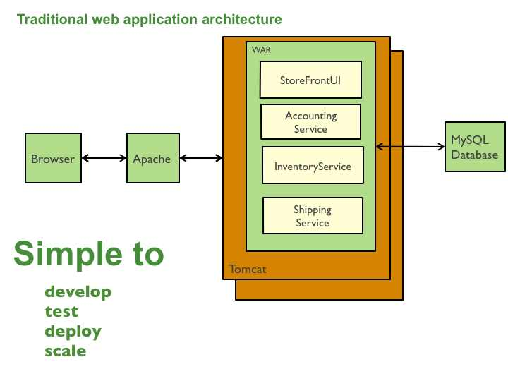
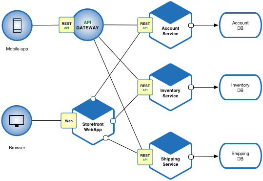
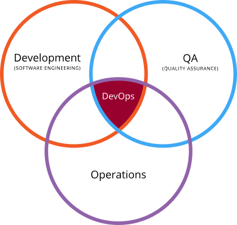

## 1. 마이크로서비스 및 DevOps

### 1) 모놀리식 아키텍처
모놀리식(Monolithic) 아키텍처(레거시 시스템)은 오늘날에도 널리 사용되고 있는 아키텍처다. 대부분 단일 프로세스에서 실행되거나 몇몇 시스템에서 몇 개의 프로세스로 실행되는 거대한 모놀리식 애플리케이션이었다.

모놀리식 아키텍처에서는 애플리케이션을 매번 릴리스 할 때마다 개발자가 전체 애플리케이션을,Java의 경우 WAR 파일로 패키징 하거나, Ruby on Rails 또는 Node.js의 경우 단일 디렉토리 계층으로 묶어서 배포해야 했다.

모놀리식 아키텍처의 장점은 다음과 같다.
- 간단한 개발
- 간편한 배포
- 단순한 확장성

그러나 애플리케이션이 점점 커지고 개발 팀 규모가 커지는 경우 문제점이 발생하게 된다. 모놀리식 아키텍처의 단점은 다음과 같다.
- 코드 품질이 낮아짐: 큰 애플리케이션은 처음 애플리케이션을 접하는 개발자인 경우, 애플리케이션을 이해하고 수정하는데 어려우며, 개발 및 업데이트 속도가 느려질 수 있다.
- 애플리케이션의 시작이 오래 걸림: 규모가 큰 애플리케이션일수록 경우 런타임에서 애플리케이션의 시작이 오래 걸린다.
- 애플리케이션의 지속적인 배포가 어려움: 하나의 컴포넌트를 업데이트하기 위해 전체 애플리케이션을 다시 재배포 해야하며, 모든 애플리케이션이 중단되고 다시 실행되어야 한다.
- 애플리케이션 확장의 어려움: 모놀리식 아키텍처에서는 각 컴포넌트별로 독립적으로 확장할 수 없다. 이는 전체 애플리케이션을 확장해야하며, 이에 따라 시스템 및 하드웨어 자원의 소모가 많이 되며, 클라우드의 경우 불필요한 리소스를 많이 소모 함에 따라 불필요한 비용 증가가 될 수 있다.
- 컴포넌트별 개발의 어려움: 애플리케이션의 크기가 커지면 조직을 특정 기능 한정으로 초점을 맞춘 팀으로 나눌 수 있다. 그러나 모놀리식 애플리케이션은 팀이 독립적으로 개발 및 업데이트하지 못하게 된다.
- 다양한 기술적용의 어려움: 예를 들어 Java로 개발된 모놀리식 애플리케이션이 있다면, 일부 개발에 따라 다른 특정 버전을 사용해야 하는 경우나. 새로운 기술을 도입하기 위해 다른 언어로 개발해야하는 애플리케이션이 있는 경우 모놀리식 아키 텍처로 개발된 아키텍처에서는 불가능 하다.

모놀리식 애플리케이션은 모든 것이 서로 강하게 밀 결합해 구성되어 단일 OS의 단일 프로세스로 실행되기 때문에 모든 것을 하나의 애플리케이션으로 개발, 배치, 관리 되어야 한다. 애플리케이션에 조그마한 추가 및 변경에서 전체를 재배포해야 하며, 장기적으로 시스템이 점점 복잡해져서 결국 전체 적인 품질 저하가 일어날 수 있다.

### 2) 마이크로서비스 아키텍처
모놀리식 아키텍처가 크기가 커짐에 따라 발생하는 문제점을 극복하기 위해 마이크로서비스(Microservice)라는 기능적으로 세분화되고 독립적으로 작동하는 방식을 사용하게 되었다. 세분화되고 독립적으로 작동하는 마이크로서비스 기반의 애플리케이션은 API를 통해 서로 다른 마이크로서비스와 통신하게 된다.

여러 마이크로서비스 사이에는 일반적으로 동기 방식인 HTTP/RESTful API 또는 비동기 방식인 AMQP(Advanced Message Queue Protocol) 프로토콜을 이용하 여 통신한다. 때문에 각 마이크로서비스는 각 기능을 구현하기 가장 적합한 언어로 개발할 수 있다.

마이크로서비스 아키텍처의 장점은 다음과 같다.
- 크고 복잡한 애플리케이션을 지속적으로 배포할 수 있음
  * 향상된 유지 보수성: 각 서비스는 작기 때문에 이해하고 변경하기 쉬움
  * 테스트 용이성: 각 서비스는 독립적으로 테스트 가능
  * 배포 효율성: 각 서비스는 독립적으로 배포 가능
  * 독립적으로 개발, 테스트, 배포 및 확장
- 개발에 생산성이 높고 배포 속도가 높음
- 향상된 장애 격리: 장애가 발생한 서비스만 영향을 받음 (모놀리식 애플
리케이션은 특정 서비스 장애 발생이 전체 시스템에 영향을 미침)
- 다양한 기술적용 가능

그러나 마이크로서비스 아키텍처가 장점만 가지고 있는 것은 아니다. 마이크로서비스의 단점은 다음과 같다.
- 분산시스템 설계에 따른 복잡성
  * 서비스 간 통신 메커니즘을 따로 구현
  * 서비스 간 상호작용 테스트
- 배포 및 관리 운영상의 복잡성
- 증가된 리소스 소비
  * 예를들어 각 서비스가 JVM을 사용하는 경우, 서비스 개수 만큼 모든 애플 리케이션은 JVM에서 동작해야 하기 때문에 JVM 런타임 오버 헤드가 있음. (Netflix의 경우 VM보다 컨테이너로 실행되는 경우 오버 헤드가 훨씬 더 높다고 함)

### 3) DevOps
애플리케이션을 개발하고 운영하는 경우, 개발 팀과 운영 팀 사이에서 가장 큰 문제는 개발 팀에서 애플리케이션을 개발하는 환경과 운영 팀에서 개발 된 애플리케이션을 프로덕션 시스템에 배포해 운영하는 환경과의 차이 때문에 문제가 발생한다. 이러한 차이는 개발자가 사용하는 하드웨어, 운영체제, 사용하는 라이브러리 및 버전까지 많은 부분에서 차이가 발생하게 된다. 또한 프로덕션 시스템은 보안 패치나 최신 상태로 유지함으로 시간에 따른 변화가 발생하게 된다. 이러한 차이점 및 변경사항으로 인해 일관된 환경을 제공하는 것이 어려울 수 있다.

예전에는 개발 팀에서 애플리케이션을 개발해 QA에 넘겨주면 테스트를 하고 다시 운영팀에게 넘겨주면 애플리케이션을 배포, 관리 및 실행하는 흐름을 가지고 있었다. 그러나 최근에는 이런 방식에 변화가 발생을 하였는데, 개발자가 테스트뿐만 아니라 배포 이상의 작업에도 관여하고 있으며, 애플리케이션의 전체 라이프사이클을 함께 관리하는 것이 효율적이라는 것을 알게 되었다. 개발자, 품질보증, 운영팀 모두가 전체 라이프사이클을 다 같이 작업한다는 예기다. 이런 소프트웨어 개발, 품질, 운영 팀의 소통 협업 및 통합을 강조하는 개발 환경 및 문화를 일컬어 DevOps라고 한다.

이러한 마이크로서비스 및 DevOps를 가능하게 하는 기술이 쿠버네티스이며 쿠버네티스는 컨테이너 기술을 이용하여 표준화 되고 일관성 있는 환경을 제공하고, DevOps 문화를 가능하게 해준다.
