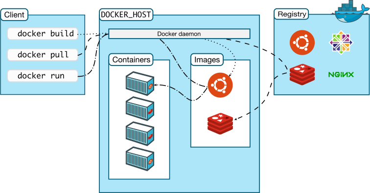
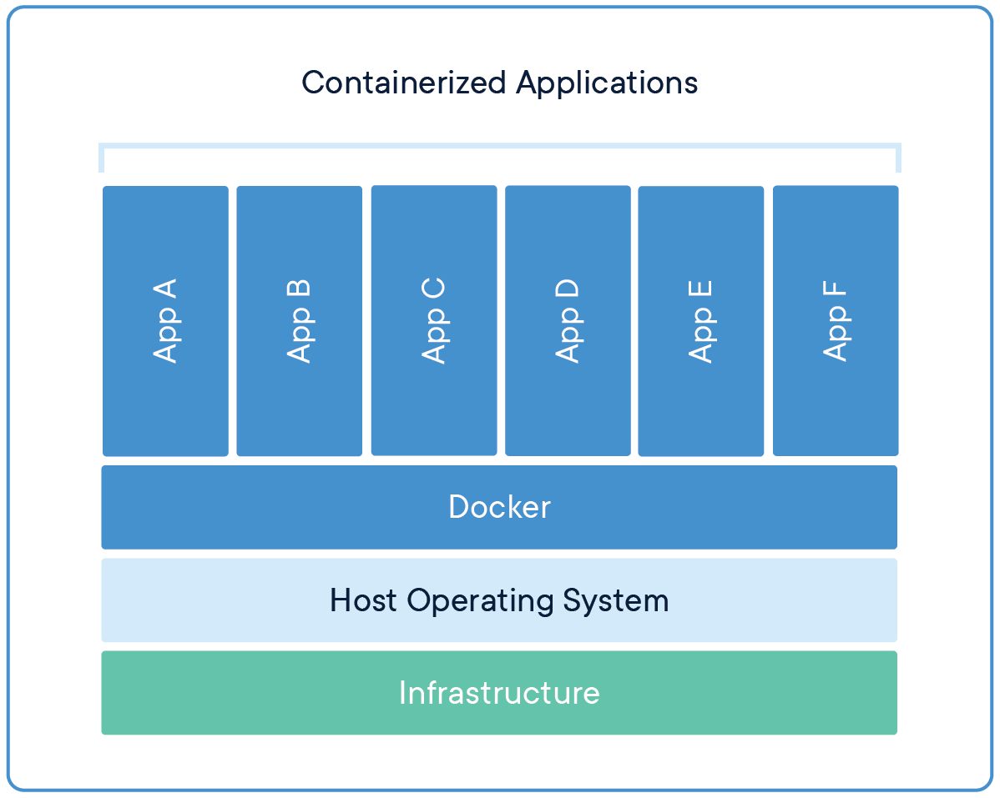
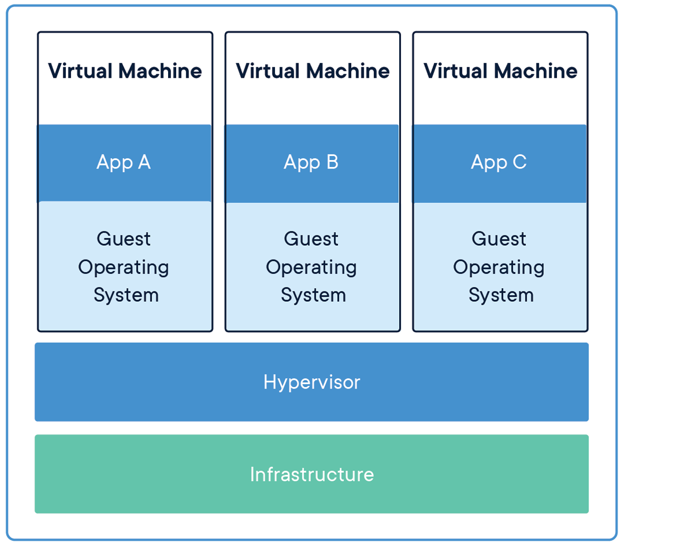

## 2. 컨테이너 소개

### 1) 컨테이너 란
운영체제에서 실행되는 프로세스를 격리(Isolation)하여 별도의 실행 환경을 제공해주며, 해당 프로세스는 운영체제상에서 실행되는 유일한 프로세스 인 것처럼 작동한다. 즉, 운영체제에서 실행되는 여러 프로세스는 컨테이너 라는 개념으로 격리되어 별도의 운영 환경을 제공해주는 기술 이다.

컨테이너를 환경을 실행할 수 있는 기술:
- chroot
- Docker
- LCX
- Solaris Containers(Zones)
- FreeBSD Jail
- WPARS(AIX)
- rkt

### 2) 컨테이너 아키텍처
리눅스 시스템에서 컨테이너를 이용하여 격리 구조를 만드는 기법은, 격리를 담당하는 Linux Namespace와 리소스를 제어하는 Control Group(cgroup) 을 사용하여 격리된 컨테이너 환경을 제공한다.

리눅스 시스템에서 네임스페이스는 기본적으로 단일 네임스페이스를 사용하여 동작하며, 네임스페이스는 다음과 같은 종류가 있다.
- 마운트 포인트
- 프로세스
- 네트워크 - IPC
- UTS
- 사용자

제어 그룹은 프로세스 또는 컨테이너가 사용할 수 있는 리소스의 양을 제한 할 수 있다. 제어 그룹이 제한 할 수 있는 리소스는 다음과 같다.
- CPU
- 메모리
- 네트워크 대역폭
- 디스크 입출력

### 3) 도커 컨테이너
컨테이너 기술은 오래전부터 존재하던 기술이었지만 Docker Inc가 만든 도커 플랫폼의 등장으로 컨테이너 플랫폼에 대해 널리 알려지고 쉽게 사용할 수 있게 되었다. 도커는 네임스페이스와 제어 그룹 기술을 사용하여 애플리케이션을 패키징, 배포, 실행하는 플랫폼이다.

도커의 주요 개념은 다음과 같다.
- 이미지: 실행할 애플리케이션과 라이브러리 및 환경을 하나의 패키지로 묶은 것
- 레지스트리
  * 이미지를 저장하고 공유할 수 있는 스토리지
  * 도커 허브 등과 같은 공용 레지스트리와 개인 및 특정 시스템만 사용할 수 있는 사설 레지스트리를 직접 구축 할 수 있다.
- 컨테이너: 이미지를 실행한 컨테이너

도커는 컨테이너를 주류 기술로 만든 최초의 컨테이너 플랫폼으로, 쿠버네티스에서 기본적으로 애플리케이션을 구동하기 위한 구성요소 중 하나이다.

그러나 컨테이너를 실행하기 위한 플랫폼은 도커만 있는 것은 아니다. 최초의 쿠버네티스에서는 도커 만 컨테이너 플랫폼으로 지원했지만, 지금은 컨테이너 형식 및 컨테이너 런타임에 대한 개방된 표준을 만드는 OCI(Open Container Initiative)가 탄생하였고, 쿠버네티스는 OCI 표준의 컨테이너 대부분을 지원한다. 대표적으로 도커의 대안인 rkt가 있다.

### 4) 컨테이너 vs 가상머신
가상머신은 애플리케이션을 동작시키기 위해서 애플리케이션이 사용하는 리소스만 사용하는 것뿐만 아니라 운영체제가 동작하기 위한 리소스가 추가로 필요하다. 그러나 컨테이너는 애플리케이션이 동작하기위한 리소스만 사용하기 때문에 훨씬 더 빠르고 가볍게 동작시킬 수 있다.

