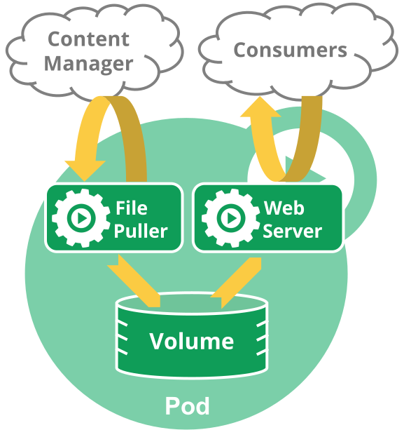

## 1. 파드
파드(Pod)는 쿠버네티스의 기본 구성 요소이다. 쿠버네티스의 객체 모델 중에서 만들고 배포할 수 있는 가장 작은 단위다.

### 1) 파드 기본
파드는 쿠버네티스 클러스터 내에서 애플리케이션을 배포하며 동작하는 프로세스이다. 파드는 애플리케이션 컨테이너이고, 하나 이상의 컨테이너로 구성될 수 있다. 즉, 하나의 파드는 하나의 컨테이너만 가질 수도 있고, 두 개 이상의 컨테이너를 가질 수도 있다.

쿠버네티스 클러스터 내부의 파드는 주로 두 가지 방법으로 사용된다.
- 단일 컨테이너만 동작하는 파드
- (함께 동작하는 작업이 필요한)다중 컨테이너가 동작하는 파드

파드에 하나 이상의 컨테이너가 있다고 하더라도 파드의 컨테이너는 같은 노드에서만 동작하고, 하나의 파드에 있는 다중 컨테이너는 저장소, 네트워크 IP 등을 공유한다.



### 2) 파드 정의
파드를 생성할 수 있는 YAML 파일을 작성해 보자.

> mynapp-pod.yml
```yaml
apiVersion: v1
kind: Pod
metadata:
  name: mynapp-pod
spec:
  containers:
  - image: c1t1d0s7/myweb
    name: mynapp
    ports:
    - containerPort: 8080
      protocol: TCP
```

다음은 파드 리소스의 주요 필드다
- .spec.containers: 컨테이너 정의
- .spec.containers.image: 컨테이너에 사용할 이미지
- .spec.containers.name: 컨테이너 이름
- .spec.containers.ports: 노출할 포트 정의
- .spec.containers.ports.containerPort: 노출할 컨테이너 포트번호
- .spec.containers.ports.protocol: 노출할 컨테이너 포트의 프로토콜(기본: TCP)

API 버전은 v1이고, 생성할 오브젝트 종류는 당연하지만 파드다. 파드 오브젝트의 이름은 mynapp-pod이며, 하나의 컨테이너를 가지고 있다. 컨테이너 이름은 mynapp이며, 사용할 이미지는 c1t1d0s7/myweb 이다. 또한 Node.js 애플리케이션의 응답 대기 포트는 TCP 8080이다.

> 참고  
> API 리소스의 지원되는 필드의 목록은 ```kubectl explain``` 명령으로 확인

### 3) 파드 생성
kubectl create 명령을 사용하여 YAML 파일이나 JSON 파일을 지정한다.
```
$ kubectl create -f mynapp-pod.yml

pod/mynapp-pod created
```

### 4) 파드 목록 확인
생성한 파드의 목록을 확인하자.
```
$ kubectl get pods

NAME         READY   STATUS    RESTARTS   AGE
mynapp-pod   1/1     Running   0          14s
```

### 5) 실행 중인 파드 정의 확인
-o yaml 명령을 이용하여 파드의 정보를 자세히 확인할 수 있다.
```
$ kubectl get pods mynapp-pod -o yaml

apiVersion: v1
kind: Pod
metadata:
  creationTimestamp: "2020-03-16T10:59:29Z"
  name: mynapp-pod
  namespace: default
  resourceVersion: "70043"
  selfLink: /api/v1/namespaces/default/pods/mynapp-pod
  uid: c1087dc0-7f26-4911-bb41-8efe212ca931
spec:
  containers:
  - image: c1t1d0s7/myweb
    imagePullPolicy: Always
    name: mynapp
    ports:
    - containerPort: 8080
      protocol: TCP
...
status:
  conditions:
  - lastProbeTime: null
    lastTransitionTime: "2020-03-16T10:59:29Z"
    status: "True"
    type: Initialized
  - lastProbeTime: null
    lastTransitionTime: "2020-03-16T10:59:35Z"
    status: "True"
    type: Ready
...
  hostIP: 192.168.56.22
  phase: Running
  podIP: 10.233.103.5
  podIPs:
  - ip: 10.233.103.5
  qosClass: BestEffort
  startTime: "2020-03-16T10:59:29Z"
```
파드를 생성한 후 파드 전체의 정의를 YAML 형식으로 확인할 수 있다.

-o json 옵션을 사용하여 JSON 형식으로도 확인할 수 있다.
```
$ kubectl get pods mynapp-pod -o json
```

### 6) 파드의 자세한 정보 확인
kubectl describe 명령을 이용하여 자세히 확인할 수 있다.
```
$ kubectl describe pods mynapp-pod

Name:         mynapp-pod
Namespace:    default
Priority:     0
Node:         kube-node2/192.168.56.22
Start Time:   Mon, 16 Mar 2020 10:59:29 +0000
Labels:       <none>
...
Containers:
  mynapp:
    Container ID:   docker://6ad4e434a749ae52d93767d6a3df0df9353aaec648b10f22260fccc0ac32de51
    Image:          c1t1d0s7/myweb
...
Conditions:
  Type              Status
  Initialized       True
  Ready             True
...
Volumes:
  default-token-x4tb2:
    Type:        Secret (a volume populated by a Secret)
...
QoS Class:       BestEffort
Node-Selectors:  <none>
Tolerations:     node.kubernetes.io/not-ready:NoExecute for 300s
                 node.kubernetes.io/unreachable:NoExecute for 300s
Events:
  Type    Reason     Age        From                 Message
  ----    ------     ----       ----                 -------
  Normal  Scheduled  <unknown>  default-scheduler    Successfully assigned default/mynapp-pod to kube-node2
  Normal  Pulling    2m36s      kubelet, kube-node2  Pulling image "c1t1d0s7/myweb"
...
```

### 7) 파드 로그 확인
kubectl logs 명령을 이용하여 파드의 로그를 확인할 수 있다.
```
$ kubectl logs mynapp-pod

Mon Mar 16 2020 10:59:34 GMT+0000 (Coordinated Universal Time)
...Start My Node.js Application...
```

docker logs 명령과 같이 컨테이너에 동작하는 애플리케이션(이 경우 Node.js)의 표준 출력 및 표준 오류를 확인할 수 있다.

또한 다중 컨테이너를 가지고 있는 파드의 경우 -c 옵션을 사용하여 컨테이너를 지정하여 특정 컨테이너의 로그를 확인할 수 있다.

### 8) 파드 포트 포워딩
kubectl port-forward 명령을 이용하여 호스트 포트를 컨테이너의 포트로 포워딩해보자.
```
$ kubectl port-forward mynapp-pod 8080:8080

Forwarding from 127.0.0.1:8080 -> 8080
Forwarding from [::1]:8080 -> 8080
```

파드의 애플리케이션이 제대로 동작하는지 확인하기 위해서는 앞서 살펴보 았듯이 서비스를 생성해야 하지만, 서비스를 생성하지 않고 간단하게 디버깅 목적으로 포트 포워딩을 구성하여 테스트 할 수 있다.

port-forward 명령은 포그라운드 상태에서 동작하기 때문에, 확인 시 별도의 터미널에서 확인을 하고, 더이상 필요하지 않은 경우 ```Ctrl+C``` 로 중지한다.

curl 명령을 이용해 포워딩된 포트를 이용해 웹 애플리케이션을 확인해보자.
```
$ curl http://localhost:8080

Message: Hello World!
Hostname: mynapp-pod
Platform: linux
Uptime: 35628
IP: 10.233.103.5
DNS: 169.254.25.10
```
