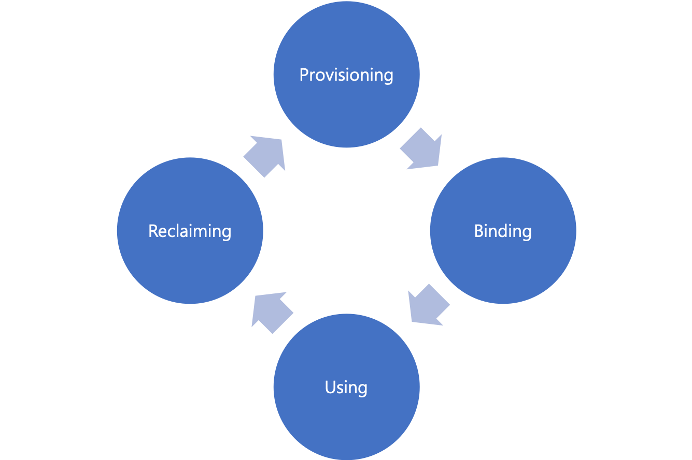

## 4. PersistentVolume 및 PersistentVolumeClaim 볼륨
지금까지 살펴본 볼륨 제공 방식은 컨트롤러의 템플릿이나 파드에 직접 스토리지 볼륨을 정의해야 한다. 이는 몇 가지 문제점이 있는데, 스토리지에 대한 지식이 있어야 한다. EmptyDir, hostPath 같은 경우 많은 지식이 필요하지 않지만 네트워크 기반 스토리지의 경우 스토리지 자체의 지식이 많이 필요하다. 그리고 볼륨의 생명주기(Lifecycle)가 컨트롤러 및 파드의 생명주기가 같아 컨트롤러 및 파드가 삭제되면 볼륨도 같이 삭제된다.

### 1) PersistentVolume 및 PersistentVolumeClaim 소개
이번에 소개할 볼륨 관련 기능은 PersistentVolume(PV) 및 PersistentVolumeClaim(PVC) 리소스다. PV 및 PVC는 컨트롤러 및 파드와 별개의 쿠버네티스 리소스이며, 파드의 생명주기와 별개로 작동한다.

PV 리소스는 쿠버네티스 클러스터 외부 스토리지와 연결을 담당하는 리소스이며, PVC는 PV와 파드를 연결하기 위한 리소스이다.

역할을 나눈다면, 스토리지 지식이 있는 쿠버네티스 클러스터 관리자 또는 스토리지 관리자는 PV 리소스를 생성해 스토리지와 연결해 두고, 파드 개발자는 PVC를 생성해 자신의 파드 및 관리자가 제공해 준 PV와 연결해 파드에서 볼륨을 사용할 수 있게 해줄 수 있다.

| 관리자                           | 개발자                              |
|---------------------------------|-----------------------------------|
| 스토리지 <--> PersistentVolume <--|--> PersistentVolumeClaim <--> 파드 |

즉, 개발자는 스토리지의 지식이 없어도 PVC를 작성해 사용할 PV를 지정하면 원하는 볼륨을 제공받을 수 있다. 또한 파드의 생명주기와 별도로 볼륨 생명주기를 가지게 된다.

### 2) PV 및 PVC 생명주기
PV 및 PVC의 생명주기는 네 가지 단계가 있다.

#### (1) 프로비저닝
프로비저닝(Provisioning)은 PV가 만들어지는 단계이다. PV를 제공하는 방법은 PV를 직접 생성하고 사용하는 "정적 프로비저닝"과 추가 리소스(스토리지 클래스)가 필요하지만 볼륨 사용 요청이 있을 때마다 자동으로 생성하는 "동적 프로비저닝"이 있다.

#### (2) 바인딩
바인딩(Binding)은 PVC 리소스를 만들어 준비된 PV 리소스와 연결하는 단계이다.

PVC 리소스에는 원하는 PV 리소스나 스토리지 용량 및 접근 방법 등을 정의하는데, 적절한 PV 리소스가 없다면 요청이 실패하고, 적절한 PV 리소스가 생성되어 연결될 때까지 대기한다.

PV와 PVC는 반드시 1:1로만 연결된다. A PVC가 사용하고 있는 A PV를 B PVC가 A PV를 바인딩 할 수 없다.

#### (3) 사용
사용(Using)은 PVC에서 제공한 볼륨을 파드가 마운트 해서 사용하고 있는 단계이다. 파드가 사용 중인 PVC 및 PVC가 사용 중인 PV는 임의로 삭제되지 않는다.

#### (4) 회수
회수(Reclaiming)는 사용이 끝난 PVC가 종료/삭제되면 연결된 PV를 회수하는 단계이다. 회수 정책은 세 가지가 있다.

##### 유지(Retain)
PV 리소스를 그대로 유지한다. PV 리소스를 삭제하더라도 외부 스토리지를 사용하고 있다 면 외부 스토리지의 데이터는 그대로 남아있다. 그러나 다른 PVC 리소스가 사용할 수 있는 것은 아니다. 관리자가 수동으로 볼륨을 회수해야 한다.

볼륨 회수 절차는 다음과 같다:
1. PV를 삭제한다. (외부 스토리지는 데이터가 유지됨)
2. 데이터가 더 이상 필요하지 않다면 스토리지에서 삭제한다.
3. 동일한 데이터를 사용해야 한다면, 해당 데이터를 가지고 있는 볼륨을 이용해 PV 리소스를 다시 생성한다.

##### 삭제(Delete)
PVC 리소스가 삭제되면 PV 리소스도 같이 삭제되고, 연결되어 있는 외부 스토리지의 데이터도 삭제한다. 동적 프로비저닝, AWS, GCP, Azure의 기본 정책이다.

##### 재활용(Recycle)
스토리지의 데이터를 삭제하고 다른 PVC가 PV 리소스를 사용 가능하도록 만들어 준다. 현재 NFS 및 hostPath 볼륨만 지원한다.

이 정책은 추후에 없어질 예정이며, 동적 볼륨을 사용할 것을 권장한다.
