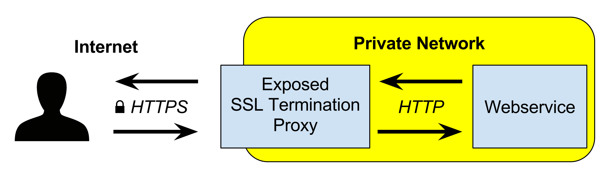

## 5. 시크릿을 이용한 사용자화
시크릿(Secret)은 컨피그 맵과 같은 키/값 저장소 이다. 단지 차이점이라고 하면 시크릿은 패스워드, 암호화 키/인증서, 토큰 등 소량의 민감한 데이터를 저장하고 안전하게 제공될 수 있도록 만들어졌다. 또한 값을 BASE64로 인코딩하여 데이터를 저장할 수 있으며, BASE64로 인코딩된 경우 별도의 절차없이 디코딩하여 제공된다.

일반적으로 컨피그 맵은 단순 데이터나, 민감하지 않은 설정 데이터를 저장하고 참조하는 용도이고, 시크릿은 민감한 데이터를 안전하게 저장하고 안전하게 참조할 수 있다는 차이가 있다. 또한 시크릿은 개별 오브젝트당 1MiB로 제한되어 있다.

### 1) 시크릿 정의 및 확인

#### (1) 시크릿 저장 데이터 종류
직접 시크릿에 저장할 수 있는 데이터 종류는 다음과 같다.
- generic: (기본) 키-값 형식의 임의 데이터
- docker-registry: 도커 저장소 인증 정보
- tls: TLS 키 및 인증서

직접 시크릿에 사용 가능하지 않은 시크릿 저장 데이터 종류는 다음과 같다.
- service-account-token: 서비스 계정 토큰

kubectl get secretes에 표시되는 데이터 종류는 다음과 같다.
- Opaque (=generic)
- kubernetes.io/dockerconfigjson
- kubernetes.io/tls
- kubernetes.io/service-account-token

#### (2) 시크릿 생성 사용법
시크릿을 직접 명령으로 생성하는 방법은 다음과 같다.
```
kubectl create secret <TYPE> <NAME> [OPTIONS]
```

- 일반 시크릿 생성 방법
```
kubectl create secret generic <NAME> [--from-file=[key=]source] [--from-literal=key1=value1]
```

- 도커 저장소 인증 정보용 시크릿 생성 방법
```
kubectl create secret docker-registry <NAME> \
--docker-username=user --docker-password=password \
--docker-email=email [--docker-server=string]
```

- TLS 키/인증서용 시크릿 생성 방법
```
kubectl create secrets tls <NAME> --cert=cert-file --key=key-file
```

#### (3) Base64 인코딩 및 디코딩
평문 데이터를 Base64로 인코딩 하여 데이터를 저장 해보자.

P@ssw0rd 텍스트를 Base64로 인코딩 해보자.
```
$ echo "P@ssw0rd" | base64

UEBzc3cwcmQK
```

Base64로 인코딩된 데이터를 디코딩하는 방법은 다음과 같다.
```
$ echo "UEBzc3cwcmQK" | base64 --decode

P@ssw0rd
```

#### (4) 시크릿 생성
시크릿에 저장할 파일을 생성 해보자.

id.txt 파일과 pwd.txt 파일을 secret 디렉토리에 생성한다.
```
$ echo -n "admin" > id.txt
```
```
$ echo -n "P@ssw0rd" > pwd.txt
```

시크릿을 생성 해보자.
```
$ kubectl create secret generic my-secret --from-file=id.txt --from-file=pwd.txt

secret/my-secret created
```
데이타 종류는 일반(generic) 종류이다.

#### (5) 시크릿 확인
생성된 my-secret 시크릿 리소스를 확인해보자.
```
$ kubectl get secret my-secret

NAME        TYPE     DATA   AGE
my-secret   Opaque   2      58s
```
표시되는 종류는 Opaque이며 generic 형식을 의미한다.

저장된 리소스를 YAML 형식으로 확인해보자.
```
$ kubectl get secret my-secret -o yaml

...
data:
  id.txt: YWRtaW4K
  pwd.txt: UEBzc3cwcmQK
...
```
평문의 데이터가 Base64 인코딩 되어 저장된 것을 확인할 수 있다.

직접 디코딩을 해보자.
```
$ echo "YWRtaW4K" | base64 --decode

admin
```
```
$ echo "UEBzc3cwcmQK" | base64 --decode

P@ssw0rd
```

시크릿 리소스를 자세하게 확인해보자.
```
$ kubectl describe secret my-secret

...
Data
====
id.txt:   6 bytes
pwd.txt:  9 bytes
```
kubectl describe 명령에서는 데이터가 직접 표시되지 않고 크기만 표시된다.

#### (6) 오브젝트 파일을 이용한 시크릿 정의
다음은 YAML 형식의 오브젝트를 이용한 시크릿 정의 예제이다.
```yaml
apiVersion: v1
kind: Secret
metadata:
  name: user-pass-yaml
type: Opaque
data:
  username: YWRtaW4K
  password: UEBzc3cwcmQK
```
YAML 파일을 이용해 데이터를 저장할 때는 직접 Base64로 인코딩된 데이터를 정의해야 한다. 만약 평문으로 정의해서 시크릿 리소스를 생성하는 경우 Base64로 인코딩 되지 않은 데이터가 있다고 오류를 보고한다.

### 2) 기본 토큰 시크릿
쿠버네티스에서 모든 파드에는 기본적으로 토큰 시크릿이 적용되어 있다.

시크릿 목록을 확인해보자.
```
$ kubectl get secrets
NAME                  TYPE                                  DATA   AGE
default-token-x4tb2   kubernetes.io/service-account-token   3      2d11h
...
```
default-token-x4tb2 라는 이름의 시크릿이 존재한다.

default-token-x4tb2 토큰 시크릿을 자세히 확인해보자.
```
$ kubectl describe secrets default-token-x4tb2

...
Data
====
ca.crt:     1025 bytes
namespace:  7 bytes
token:      eyJhbGciOi...
```
CA의 인증서, 네임스페이스명, 토큰 정보가 저장된 것을 확인할 수 있다.

이런 시크릿에 저장된 토큰은 파드에서 쿠버네티스 API 서버와 안전하게 통신하기 위해 필요한 항목이다.

파드를 생성 해보자.
```
$ kubectl create -f mynapp-pod.yml

pod/mynapp-pod created
```

파드의 자세한 정보를 확인해보자.
```
$ kubectl describe pod mynapp-pod

...
    Mounts:
      /var/run/secrets/kubernetes.io/serviceaccount from default-token-x4tb2 (ro)
...
```
마운트 정보에 방금 확인했던 default-token-x4tb2 시크릿 토큰이 마운트된 것을 확인할 수 있다.

### 3) 시크릿을 이용한 Nginx HTTPS 웹 서비스 제공
시크릿에 TLS 키 및 인증서를 저장하고 이를 파드에 제공해 HTTPS를 제공하는 웹 서비스를 구성 해보자.

#### (1) TLS 키 및 인증서 생성
키를 저장하기 위해 nginx-tls 디렉토리를 생성한다.
```
$ mkdir nginx-tls
```

HTTPS를 위한 TLS 키를 생성한다.
```
$ openssl genrsa -out nginx-tls/nginx-tls.key 2048
```

TLS키를 이용하여 TLS 인증서를 생성한다.
```
$ openssl req -new -x509 -key nginx-tls/nginx-tls.key \
-out nginx-tls/nginx-tls.crt \
-days 3650 -subj /CN=mynapp.example.com
```

#### (2) 시크릿 생성
TLS 인증서와 키를 저장하기 위한 시크릿을 생성하자.
```
$ kubectl create secret tls nginx-tls-secret \
  --cert=nginx-tls/nginx-tls.crt \
  --key=nginx-tls/nginx-tls.key

secret/nginx-tls-secret created
```

시크릿 리소스의 자세한 정보를 확인해보자.
```
$  kubectl describe secrets nginx-tls-secret
...
Data
====
tls.crt:  1001 bytes
tls.key:  1675 bytes
```
키 이름은 tls.crt 및 tls.key로 저장된 것을 확인할 수 있다.

#### (3) TLS 설정을 위한 Nginx 설정 파일 및 컨피그 맵 생성
TLS 설정을 위한 Nginx 설정 파일을 생성 해보자.

설정 파일을 저장하기 위해 conf 디렉토리를 생성하자.
```
mkdir conf
```

TLS 적용을 위한 Nginx 설정 파일은 다음과 같다.
> conf/nginx-tls.conf
```
server {
    listen              80;
    listen		          443 ssl;
    server_name         mynapp.example.com;
    ssl_certificate	    /etc/nginx/ssl/tls.crt;
    ssl_certificate_key	/etc/nginx/ssl/tls.key;
    ssl_protocols	    TLSv1 TLSv1.1 TLSv1.2;
    ssl_ciphers		    HIGH:!aNULL:!MD5;
    location / {
        root   /usr/share/nginx/html;
        index  index.html;
    }
}
```

TLS가 설정된 Nginx 설정 파일을 컨피그 맵으로 생성하자.
```
$ kubectl create configmap nginx-tls-config --from-file=conf/nginx-tls.conf

configmap/nginx-tls-config created
```

생성한 컨피그 맵의 자세한 정보를 확인하자.
```
$ kubectl describe configmap nginx-tls-config

...
Data
====
nginx-tls.conf:
----
server {
    listen              80;
    listen    443 ssl;
    server_name         mynapp.example.com;
    ssl_certificate      /etc/nginx/ssl/tls.crt;
    ssl_certificate_key  /etc/nginx/ssl/tls.key;
    ssl_protocols        TLSv1 TLSv1.1 TLSv1.2;
    ssl_ciphers            HIGH:!aNULL:!MD5;
    location / {
        root   /usr/share/nginx/html;
        index  index.html;
    }
}
...
```

#### (4) 시크릿 및 컨피그 맵을 사용하는 파드 생성
다음은 TLS가 적용된 Nginx 파드를 실행하기 위한 파드 오브젝트다.

> mynapp-pod-https.yml
```yaml
apiVersion: v1
kind: Pod
metadata:
  name: mynapp-pod-https
spec:
  containers:
  - image: nginx
    name: mynapp-https
    volumeMounts:
    - name: nginx-tls-config
      mountPath: /etc/nginx/conf.d
    - name: https-cert
      mountPath: /etc/nginx/ssl
      readOnly: true
    ports:
    - containerPort: 80
      protocol: TCP
    - containerPort: 443
      protocol: TCP
  volumes:
  - name: nginx-tls-config
    configMap:
      name: nginx-tls-config
  - name: https-cert
    secret:
      secretName: nginx-tls-secret
```
설정파일이 있는 컨피그 맵과, TLS 인증서 및 키가 있는 시크릿을 볼륨으로 지정하였다.

- nginx-tls-config 컨피그 맵 = nginx-tls-config 볼륨
- nginx-tls-secret 시크릿 = https-cert 볼륨

- nginx-tls-config 볼륨 = /etc/nginx/conf.d 디렉토리에 마운트 
- https-cert 볼륨은 컨테이너에 /etc/nginx/ssl 디렉토리에 마운트 (읽기 전용)

파드를 생성 해보자.
```
$ kubectl create -f mynapp-pod-https.yml

pod/mynapp-pod-https created
```

파드의 자세한 정보를 확인해보자.
```
$ kubectl describe pod mynapp-pod-https

...
    Mounts:
      /etc/nginx/conf.d from nginx-tls-config (rw)
      /etc/nginx/ssl from https-cert (ro)
...
Volumes:
  nginx-tls-config:
    Type:      ConfigMap (a volume populated by a ConfigMap)
    Name:      nginx-tls-config
    Optional:  false
  https-cert:
    Type:        Secret (a volume populated by a Secret)
    SecretName:  nginx-tls-secret
    Optional:    false
...
```

#### (5) HTTPS 웹 서비스 확인
Nginx 파드에 HTTPS가 잘 적용됬는지 확인해보자.

간단하게 확인을 위해 호스트의 8443 포드를 파드의 443 포드로 포워딩 한다.
```
$ kubectl port-forward mynapp-pod-https 8443:443

Forwarding from 127.0.0.1:8443 -> 443
Forwarding from [::1]:8443 -> 443
```

https://localhost:8443 포트로 요청하여 TLS 연결이 되는지 확인한다. 자체 서명(Self-Signed) 인증서기 때문에 -k(insecure) 옵션을 반드시 사용해야 한다.
```
$ curl https://localhost:8443 -k -v
* Rebuilt URL to: https://localhost:8443/
*   Trying 127.0.0.1...
* TCP_NODELAY set
* Connected to localhost (127.0.0.1) port 8443 (#0)
* ALPN, offering h2
* ALPN, offering http/1.1
* successfully set certificate verify locations:
*   CAfile: /etc/ssl/certs/ca-certificates.crt
  CApath: /etc/ssl/certs
* TLSv1.3 (OUT), TLS handshake, Client hello (1):
* TLSv1.3 (IN), TLS handshake, Server hello (2):
* TLSv1.2 (IN), TLS handshake, Certificate (11):
* TLSv1.2 (IN), TLS handshake, Server key exchange (12):
* TLSv1.2 (IN), TLS handshake, Server finished (14):
* TLSv1.2 (OUT), TLS handshake, Client key exchange (16):
* TLSv1.2 (OUT), TLS change cipher, Client hello (1):
* TLSv1.2 (OUT), TLS handshake, Finished (20):
* TLSv1.2 (IN), TLS handshake, Finished (20):
* SSL connection using TLSv1.2 / ECDHE-RSA-AES256-GCM-SHA384
...
```
정상적으로 TLS 핸드세이크가 일어나는 것을 확인할 수 있다.

### 4) 인그레스를 이용한 TLS 종료 프록시 구현

#### (1) TLS 종료 프록시 란?



앞서 살펴본 실습에서는, Nginx 서버(파드)에 직접 TLS 구성을 통해 웹 클라이언트와 웹 서버 사이에 End-to-End 암호화가 이루어 졌다. 그러나 TLS가 구성된 웹 서버가 많아 진다면? 관리적인 부담이 늘어날 것이고, 각 파드에 암/복호화에 따른 부하가 더 많이 걸릴 수 있다. 또한 암호화된 트래픽은 악의적인 트래픽인지 아닌지 판단하기 위해 보안 솔루션을 적용할 수 없어 투명성이 낮아지고, 보안성이 떨어질 수 밖에 없다.

TLS 종료 프록시(Termination Proxy)는 웹 서버(파드)에 직접 TLS 서비스를 구성하지 않고, 웹 클라이언트와 웹 프록시(로드밸런서)사이에서 만 TLS(HTTPS)로 암호화 하고, 내부 네트워크의 TLS 종료 프록시와 웹 서버(파드) 사이는 일반 HTTP로 통신 하는 방식을 구성한다.

TLS 종료 프록시를 사용하면 여러 장점이 존재한다.
- 웹 서버(파드)가 직업 암/복호화를 처리하지 않기 때문에 부하를 줄일 수 있다.
- 보안 솔루션(IPS 등)이 악의적인 공격을 탐지해 보안을 향상할 수 있다.

쿠버네티스 클러스터에서 인그레스 컨트롤러를 이용하여 TLS 종료 프록시 기능을 구성할 수 있다.

#### (2) TLS 종료 프록시를 위한 레플리카셋, 서비스 생성
인그레스 컨트롤러를 통해 서비스 할 레플리카셋 컨트롤러와, 노드 포트 서비스를 생성한다.
```
$ kubectl create -f mynapp-rs.yml -f mynapp-svc-ext-nodeport.yml

replicaset.apps/mynapp-rs created
service/mynapp-svc-ext-np created
```

#### (3) TLS 종료 프록시를 위한 TLS 인증서 생성
TLS 종료 프록시의 인증서/키를 저장할 디렉토리를 생성한다.
```
$ mkdir ingress-tls
```

인그레이스 컨트롤러를 위한 TLS 키를 생성한다.
```
$ openssl genrsa -out ingress-tls/ingress-tls.key 2048
```

인그레이스 컨트롤러를 위한 TLS 인증서를 생성한다.
```
$ openssl req -new -x509 ingress-tls/ingress-tls.key \ 
-out ingress-tls/ingress-tls.crt \
-days 3650 -subj /CN=mynapp.example.com
```

#### (4) TLS 키 및 인증서를 위한 시크릿 생성
인그레스 컨트롤러를 위한 인증서와 키를 시크릿에 저장한다.
```
$ kubectl create secret tls ingress-tls-secret \
--key=ingress-tls/ingress-tls.key \
--cert=ingress-tls/ingress-tls.crt

secret/ingress-tls-secret created
```

인증서와 키가 시크릿에 저장되었는지 확인 한다.
```
$ kubectl describe secret ingress-tls-secret

...
Data
====
tls.crt:  1001 bytes
tls.key:  1679 bytes
```

#### (5) TLS 종료 프록시를 위한 인그레스 컨트롤러 생성
다음은 인그레스 컨트롤러다.

> mynapp-ing-tls-termination.yml
```yaml
apiVersion: networking.k8s.io/v1beta1
kind: Ingress
metadata:
  name: mynapp-ing-tls-term
spec:
  tls:
  - hosts:
    - mynapp.example.com
    secretName: mynapp-tls-secret
  rules:
  - host: mynapp.example.com
    http:
      paths:
      - path: /
        backend:
          serviceName: mynapp-svc-ext-np
          servicePort: 80
```

- ingress.spec.tls: TLS 구성
- ingress.spec.tls.hosts: 사용할 호스트의 FQDN 지정
- ingress.spec.tls.secretName: TLS 인증서 및 키가 저장된 시크릿 지정

인그레스 컨트롤러에 https://myapp.example.com 주소로 접근하면 mynapp-svc-ext-np 노드 포트 서비스로 리다이렉션 시켜 준다.

TLS 종료 프록시 기능의 인그레스 컨트롤러를 생성하자.
```
$ kubectl create -f mynapp-ing-tls-termination.yml

ingress.extensions/mynapp-ing-tls-term created
```

#### (6) 인그레스 컨트롤러 확인
TLS 종료 프록시 기능의 인그레스 컨트롤러가 제대로 생성되었는지 확인한다.
```
$ kubectl get ingresses.networking.k8s.io

NAME                  HOSTS                ADDRESS             PORTS     AGE
mynapp-ing-tls-term   mynapp.example.com   192.168.56.21,...   80, 443   13s
```

curl 명령을 통해 자체 서명 인증서를 사용하는 인그레스 컨틀롤러에 접속 시도를 해본다. 앞서 설명한 대로 인그레스 컨트롤러는 FQDN 기반으로 리다이렉션 하기 때문에 --resolv 옵션을 사용했고, 자체 서명 인증서 때문에 insecure 옵션인 -k 옵션을 사용했다. 마지막으로 TLS 핸드세이크 정보를 확인하기 위해 -v 옵션을 사용했다.
```
$ curl --resolve mynapp.example.com:443:192.168.56.21 \
-k -v https://mynapp.example.com

* Added mynapp.example.com:443:192.168.56.21 to DNS cache
* Rebuilt URL to: https://mynapp.example.com/
* Hostname mynapp.example.com was found in DNS cache
*   Trying 192.168.56.21...
* TCP_NODELAY set
* Connected to mynapp.example.com (192.168.56.21) port 443 (#0)
* ALPN, offering h2
* ALPN, offering http/1.1
* successfully set certificate verify locations:
*   CAfile: /etc/ssl/certs/ca-certificates.crt
  CApath: /etc/ssl/certs
* TLSv1.3 (OUT), TLS handshake, Client hello (1):
* TLSv1.3 (IN), TLS handshake, Server hello (2):
* TLSv1.2 (IN), TLS handshake, Certificate (11):
* TLSv1.2 (IN), TLS handshake, Server key exchange (12):
* TLSv1.2 (IN), TLS handshake, Server finished (14):
* TLSv1.2 (OUT), TLS handshake, Client key exchange (16):
* TLSv1.2 (OUT), TLS change cipher, Client hello (1):
* TLSv1.2 (OUT), TLS handshake, Finished (20):
* TLSv1.2 (IN), TLS handshake, Finished (20):
* SSL connection using TLSv1.2 / ECDHE-RSA-AES128-GCM-SHA256
...
```
결과는 이상없이 TLS 종료 프록시를 통한 웹 서비스가 구축 되었다.

### 5) 시크릿을 환경 변수로 참조하는 방법
마지막으로 시크릿을 볼륨이 아닌 환경 변수로 참조하는 YAML 오브젝트 예제이다.

```yaml
env:
- name: FOO_SECRET
    valueFrom:
      secretKeyRef: # 시크릿 변수 참조
        name: sercret-name # 시크릿 이름
        key: key-name # 시크릿의 키
```

### 6) 리소스 삭제
생성된 리소스가 많아 네임스페이스에 전체 리소스를 한꺼번에 삭제하자.
```
$ kubectl delete all --all

pod "mynapp-pod" deleted
pod "mynapp-pod-https" deleted
pod "mynapp-rs-7fphd" deleted
pod "mynapp-rs-grfkx" deleted
pod "mynapp-rs-rhg5x" deleted
service "kubernetes" deleted
service "mynapp-svc-ext-np" deleted
replicaset.apps "mynapp-rs" deleted
```
