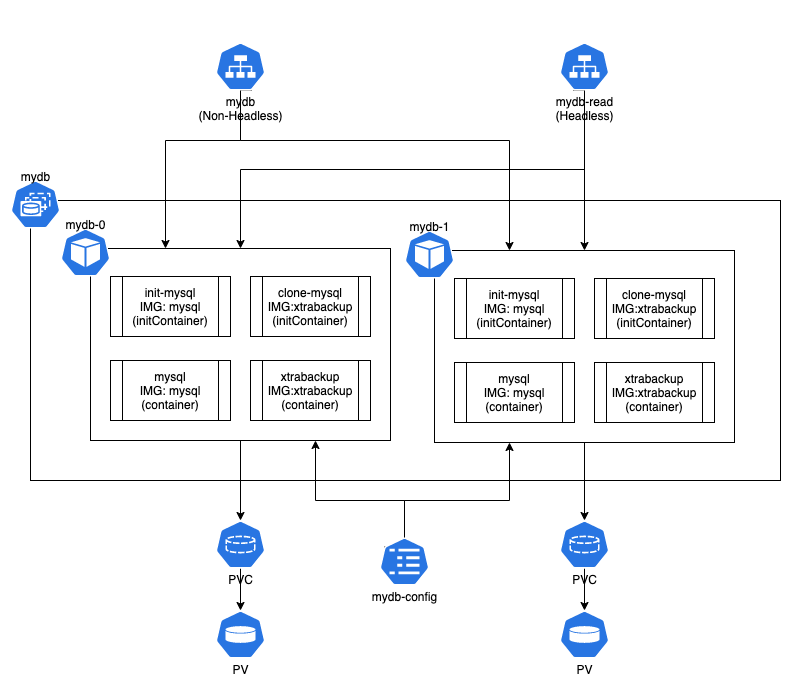

## 3. 스테이트풀셋을 이용한 MySQL 백업 복제본 구성



공식 MySQL 이미지를 이용하여 스테이트풀셋이 관리할 파드를 두 개를 생성 한다. 두 개를 생성하는 이유는 데이터베이스의 백업 복제본을 제공하기 위함 이다. 당연하지만 각각의 파드는 각각의 PVC를 요청하고 다른 PV를 사용함에 따라 별도의 상태를 가질 수 있다.

다음 예제에서는 MySQL 데이터베이스의 백업 복제본을 위해 xtrabackup을 이용하여 복제본을 구성하고, 첫 번째 생성되는 파드는 마스터(읽기/쓰기)로, 두 번째부터 생성되는 파드는 슬레이브(읽기 전용)로 구성된다.

마스터와 슬레이브용 설정파일을 컨피그맵에 등록하고, 서비스는 데이터베이스 쓰기를 위해 마스터를 구별하기 위한 헤드리스 서비스를 구성하고, 데이터베이스 읽기를 위해 일반적인(비-헤드리스) 서비스를 구성하도록 하자.

### 1) MySQL 설정파일 컨피그맵 생성
다음은 MySQL에 사용할 컨피그맵 리소스이다.

> mydb-cm-mysql.yml
```yaml
apiVersion: v1
kind: ConfigMap
metadata:
  name: mydb-config
  labels:
    app: mydb
data:
  master.cnf: |
    [mysqld]
    log-bin
  slave.cnf: |
    [mysqld]
    super-read-only
```
MySQL 데이터베이스 설정 파일이다. 마스터와 슬레이브를 독립적으로 제어할 수 있도록 한다. 마스터는 복제 로그를 슬레이브로 제공하도록하는 설정이고, 슬레이브는 읽기전용으로 쓰기를 금지하도록 하는 설정이다.

마스터의 master.cnf 설정은 슬레이브가 데이터베이스를 복제하기 위한 복제 로그를 남기도록하는 설정이고, 슬레이브의 slave.cnf 파일에는 읽기전용으로 구성하기 위한 설정이다.

컨피그맵을 생성하자.
```
$ kubectl create -f mydb-cm-mysql.yml

configmap/mydb-config created
```

컨피그맵이 제대로 등록되었는지 확인한다.
```
$ kubectl describe configmaps mydb-config

...
Data
====
slave.cnf:
----
[mysqld]
super-read-only

master.cnf:
----
[mysqld]
log-bin
...
```

### 2) 서비스 생성
다음은 데이터베이스 쓰기를 위한 헤드리스 서비스다.
> mydb-svc-write.yml
```yaml
apiVersion: v1
kind: Service
metadata:
  name: mydb
  labels:
    app: mydb
spec:
  ports:
  - name: mysql
    port: 3306
  clusterIP: None
  selector:
    app: mydb
```
각 파드에 대해 따로 접근하기 위해 헤드리스 서비스로 정의되었고, 특히 마스터를 구별하기 위해 반드시 필요하다.

다음은 데이터베이스 읽기를 위한 비-헤드리스 서비스다.
> mydb-svc-read.yml
```yaml
apiVersion: v1
kind: Service
metadata:
  name: mydb-read
  labels:
    app: mydb
spec:
  ports:
  - name: mysql
    port: 3306
  selector:
    app: mydb
```
일반적인 Cluster IP 서비스이며, mydb-read 주소로 접근했을때 부하 분산을 통해 아무 노드나 접근할 수 있도록 한다.

두 서비스를 생성하자.
```
$ kubectl create -f mydb-svc-write.yml -f mydb-svc-read.yml

service/mydb created
service/mydb-read created
```

서비스가 제대로 생성되었는지 확인하자.
```
$ kubectl get service -l app=mydb

NAME        TYPE        CLUSTER-IP      EXTERNAL-IP   PORT(S)    AGE
mydb        ClusterIP   None            <none>        3306/TCP   25m
mydb-read   ClusterIP   10.233.41.241   <none>        3306/TCP   25m
```

### 3) 고가용성을 위한 MySQL 데이터베이스 생성
다음은 MySQL 데이터베이스의 고가용성을 위한 스테이트풀셋 리소스 정의이다.

> mydb-sts-mysql.yml
```yaml
apiVersion: apps/v1
kind: StatefulSet
metadata:
  name: mydb
spec:
  selector:
    matchLabels:
      app: mydb
  serviceName: mydb
  replicas: 2
  template:
    metadata:
      labels:
        app: mydb
    spec:
      initContainers:
      - name: init-mysql
        image: mysql:5.7
        command:
        - bash
        - "-c"
        - |
          set -ex
          [[ `hostname` =~ -([0-9]+)$ ]] || exit 1
          ordinal=${BASH_REMATCH[1]}
          echo [mysqld] > /mnt/conf.d/server-id.cnf
          echo server-id=$((100 + $ordinal)) >> /mnt/conf.d/server-id.cnf
          if [[ $ordinal -eq 0 ]]; then
            cp /mnt/config-map/master.cnf /mnt/conf.d/
          else
            cp /mnt/config-map/slave.cnf /mnt/conf.d/
          fi
        volumeMounts:
        - name: conf
          mountPath: /mnt/conf.d
        - name: config-map
          mountPath: /mnt/config-map
      - name: clone-mysql
        image: gcr.io/google-samples/xtrabackup:1.0
        command:
        - bash
        - "-c"
        - |
          set -ex
          [[ -d /var/lib/mysql/mysql ]] && exit 0
          [[ `hostname` =~ -([0-9]+)$ ]] || exit 1
          ordinal=${BASH_REMATCH[1]}
          [[ $ordinal -eq 0 ]] && exit 0
          ncat --recv-only mydb-$(($ordinal-1)).mydb 3307 | xbstream -x -C /var/lib/mysql
          xtrabackup --prepare --target-dir=/var/lib/mysql
        volumeMounts:
        - name: data
          mountPath: /var/lib/mysql
          subPath: mysql
        - name: conf
          mountPath: /etc/mysql/conf.d
      containers:
      - name: mysql
        image: mysql:5.7
        env:
        - name: MYSQL_ALLOW_EMPTY_PASSWORD
          value: "1"
        ports:
        - name: mysql
          containerPort: 3306
        volumeMounts:
        - name: data
          mountPath: /var/lib/mysql
          subPath: mysql
        - name: conf
          mountPath: /etc/mysql/conf.d
        livenessProbe:
          exec:
            command: ["mysqladmin", "ping"]
          initialDelaySeconds: 30
          periodSeconds: 10
          timeoutSeconds: 5
        readinessProbe:
          exec:
            command: ["mysql", "-h", "127.0.0.1", "-e", "SELECT 1"]
          initialDelaySeconds: 5
          periodSeconds: 2
          timeoutSeconds: 1
      - name: xtrabackup
        image: gcr.io/google-samples/xtrabackup:1.0
        ports:
        - name: xtrabackup
          containerPort: 3307
        command:
        - bash
        - "-c"
        - |
          set -ex
          cd /var/lib/mysql

          if [[ -f xtrabackup_slave_info && "x$(<xtrabackup_slave_info)" != "x" ]]; then
            cat xtrabackup_slave_info | sed -E 's/;$//g' > change_master_to.sql.in
            rm -f xtrabackup_slave_info xtrabackup_binlog_info
          elif [[ -f xtrabackup_binlog_info ]]; then
            [[ `cat xtrabackup_binlog_info` =~ ^(.*?)[[:space:]]+(.*?)$ ]] || exit 1
            rm -f xtrabackup_binlog_info xtrabackup_slave_info
            echo "CHANGE MASTER TO MASTER_LOG_FILE='${BASH_REMATCH[1]}',\
                  MASTER_LOG_POS=${BASH_REMATCH[2]}" > change_master_to.sql.in
          fi

          if [[ -f change_master_to.sql.in ]]; then
            echo "Waiting for mysqld to be ready (accepting connections)"
            until mysql -h 127.0.0.1 -e "SELECT 1"; do sleep 1; done

            echo "Initializing replication from clone position"
            mysql -h 127.0.0.1 \
                  -e "$(<change_master_to.sql.in), \
                          MASTER_HOST='mydb-0.mydb', \
                          MASTER_USER='root', \
                          MASTER_PASSWORD='', \
                          MASTER_CONNECT_RETRY=10; \
                        START SLAVE;" || exit 1
            mv change_master_to.sql.in change_master_to.sql.orig
          fi

          exec ncat --listen --keep-open --send-only --max-conns=1 3307 -c \
            "xtrabackup --backup --slave-info --stream=xbstream --host=127.0.0.1 --user=root"
        volumeMounts:
        - name: data
          mountPath: /var/lib/mysql
          subPath: mysql
        - name: conf
          mountPath: /etc/mysql/conf.d
      volumes:
      - name: conf
        emptyDir: {}
      - name: config-map
        configMap:
          name: mydb-config
  volumeClaimTemplates:
  - metadata:
      name: data
    spec:
      accessModes: ["ReadWriteOnce"]
      resources:
        requests:
          storage: 1Gi
```

statefulset.spec.template.initContainers 필드는 컨트롤러가 파드/컨테이너 최초 배포 시 실행할 초기화 작업이다. 복제 작업 시 사용할 각 MySQL 서버의 ID를 지정하는 부분과, 복제 작업을 위한 초기화 작업이 포함되어 있다.

statefulset.spec.template.containers 필드는 애플리케이션 컨테이너를 정의하는 부분이며, 하나의 파드에 컨테이너는 두 개가 있다.. mysql 컨테이너는 MySQL 애플리케이션을 작동시킬 컨테이너이며, xtrabackup 컨테이너는 마스터-슬레이브 간에 데이터베이스의 복제를 담당하는 컨테이너이다.

마지막으로 PVC 템플릿이다. 스테이트풀셋은 PVC 템플릿을 사용하여 각 파드마다 다른 PVC를 사용 할 수 있도록 한다. 별도로 storageClass를 정의하지 않았으므로 기본 스토리지 클래스가 적용될 것이다.

복제본 개수는 두 개로 설정되었으며, 마스터 하나, 슬레이브 하나가 될 것이다.

- initContainers(초기화 컨테이너)
  * init-mysql
    - /mnt/conf.d/server-id.cnf MySQL 설정파일 생성
    - server-id=100+N MySQL 서버 ID 지정
  * clone-mysql
    - MySQL 슬레이브 파드가 처음 실행되기 전 PV가 비워져 있기 때문에, 복제 작업 수행

- containers(애플리케이션 컨테이너)
  * mysql: MySQL 데이터베이스 애플리케이션 컨테이너
  * xtrabackup: 데이터 복제

MySQL 스테이트풀셋 리소스를 생성한다.
```
$ kubectl create -f mydb-sts-mysql.yml

statefulset.apps/mydb created
```

스테이트풀셋 및 파드의 목록 및 상태를 확인해보자.
```
$ kubectl get statefulsets.apps,pods

NAME                    READY   AGE
statefulset.apps/mydb   0/2     10s

NAME         READY   STATUS     RESTARTS   AGE
pod/mydb-0   0/2     Init:0/2   0          10s
```
mysql-0 파드가 생성되었으며, 초기화 작업을 진행한다. 초기화할 작업은 총 두 개(init-mysql, clone-mysql)가 있다.

statefulset.spec.volumeClaimTemplates 필드에 의해 요청된 PVC를 확인해보자.
```
$ kubectl get persistentvolumeclaims

NAME          STATUS   VOLUME                                     ...
data-mydb-0   Bound    pvc-852f70eb-0b2c-4716-9d0b-6995949334a4   ...
data-mydb-1   Bound    pvc-2621a582-5108-489b-a017-1378d02f7eb5   ...
```
statefulset.spec.volumeClaimTemplates 필드에서 별도로 storageClass를 정의하지 않았기 때문에 앞서 설정한 기본 스토리지 클래스인 csi-cephfs 스토리지 클래스를 사용할 것이다.

PVC에 의해 요청된 PV도 확인해보자.
```
$ kubectl get persistentvolume

NAME                                       CAPACITY   ...
pvc-2621a582-5108-489b-a017-1378d02f7eb5   1Gi        ...
pvc-852f70eb-0b2c-4716-9d0b-6995949334a4   1Gi        ...
```
파드의 복제본 개수가 두 개이기 때문에 두 개의 PVC와 PV가 생성될 것이다.

완전히 두 개의 파드가 동작할 때 까지 살펴본다.
```
$ kubectl get statefulsets.apps,pods

NAME                    READY   AGE
statefulset.apps/mydb   2/2     27m

NAME         READY   STATUS    RESTARTS   AGE
pod/mydb-0   2/2     Running   0          27m
pod/mydb-1   2/2     Running   0          26m
```

### 4) MySQL 데이터베이스 확인

#### (1) 파드 주소 확인
네트워크 도구가 포함된 이미지에는 MySQL 클라이언트 도구도 포함하고 있다. 실행시켜 헤드리스 서비스가 적용된 레플리카셋이 실행한 파드의 주소를 살펴보자.
```
$ kubectl run mysql-client -it --image=ghcr.io/c1t1d0s7/network-multitool --rm bash


bash-5.1# host mydb # 쓰기 작업을 위한 헤드리스 서비스
mydb.default.svc.cluster.local has address 10.233.103.67
mydb.default.svc.cluster.local has address 10.233.76.84

bash-5.1# host mydb-0.mydb # mydb-0 파드 주소
mydb-0.mydb.default.svc.cluster.local has address 10.233.103.67

bash-5.1# host mydb-1.mydb # mydb-1 파드 주소
mydb-1.mydb.default.svc.cluster.local has address 10.233.76.84

bash-5.1# host mydb-read # 읽기 작업을 위한 비-헤드리스 서비스
mydb-read.default.svc.cluster.local has address 10.233.41.241
```
파드를 종료하지 않고 계속 이어서 작업한다.

#### (2) 마스터 데이터베이스에 데이터베이스, 테이블 및 레코드 생성
마스터 데이터베이스에 myapp 데이터베이스를 생성한다.
```
bash-5.0# mysql -h mydb-0.mydb -e 'CREATE DATABASE myapp'
```

myapp 데이터베이스에 message 테이블을 생성한다.
```
bash-5.0# mysql -h mydb-0.mydb -e 'CREATE TABLE myapp.message (message VARCHAR(100))'
```

mynapp 데이터베이스의 message 테이블에 "hello mysql" 값을 삽입한다.
```
bash-5.0# mysql -h mydb-0.mydb -e 'INSERT INTO myapp.message VALUES ("hello mysql")'
```

#### (3) 마스터(mydb-0) 데이터베이스 레코드 확인

myapp.message 테이블 전체를 조회 해본다.
```
bash-5.0# mysql -h mydb-0.mydb -e 'SELECT * FROM myapp.message'

+-------------+
| message     |
+-------------+
| hello mysql |
+-------------+
```

#### (4) 슬레이브(mydb-1) 데이터베이스 레코드 확인
mydb-read 서비스 주소를 이용해 조회 해본다. 사실 마스터를 조회하는지 슬레이브를 조회하는지 여기선 알 수 없다.
```
bash-5.0# mysql -h mydb-read -e 'SELECT * FROM myapp.message'

+-------------+
| message     |
+-------------+
| hello mysql |
+-------------+
```

mydb-1.mydb 슬레이브에 테이블을 조회 해본다.
```
bash-5.0# mysql -h mydb-1.mydb -e 'SELECT * FROM myapp.message'

+-------------+
| message     |
+-------------+
| hello mysql |
+-------------+
```
똑같은 레코드를 확인할 수 있다.

컨테이너를 종료한다.
```
bash-5.1# exit
exit

Session ended, resume using 'kubectl attach mysql-client -c mysql-client -i -t' command when the pod is running
pod "mysql-client" deleted
```

#### (5) 파드 스케일 아웃
여러 방법이 있지만, kubectl scale 명령으로 복제본 세 개로 확장한다.
```
$ kubectl scale statefulset mydb --replicas 3

statefulset.apps/mydb scaled
```

스케일링이 되었는지 스테이트풀셋과 파드 목록을 확인해 본다.
```
$ kubectl get statefulsets.apps,pods

NAME                    READY   AGE
statefulset.apps/mydb   2/3     33m

NAME         READY   STATUS     RESTARTS   AGE
pod/mydb-0   2/2     Running    0          33m
pod/mydb-1   2/2     Running    0          32m
pod/mydb-2   0/2     Init:0/2   0          15s
```

PV 및 PVC도 세 개로 확장된 것을 확인할 수 있다.
```
$ kubectl get persistentvolume,persistentvolumeclaim
NAME                                                        ...
persistentvolume/pvc-2621a582-5108-489b-a017-1378d02f7eb5   ...
persistentvolume/pvc-852f70eb-0b2c-4716-9d0b-6995949334a4   ...
persistentvolume/pvc-ad735d1d-ed30-43f7-b4ce-f6b04abc9da7   ...

NAME                                STATUS ...
persistentvolumeclaim/data-mydb-0   Bound  ...
persistentvolumeclaim/data-mydb-1   Bound  ...
persistentvolumeclaim/data-mydb-2   Bound  ...
```

#### (6) 슬레이브(mydb-2) 데이터베이스 레코드 확인
마지막으로 슬레이브 mydb-2.mydb의 테이블을 조회해본다.
```
$ kubectl run mysql-client -it --image=ghcr.io/c1t1d0s7/network-multitool --rm bash

bash-5.1# mysql -h mydb-2.mydb -e 'SELECT * FROM myapp.message'
+-------------+
| message     |
+-------------+
| hello mysql |
+-------------+

bash-5.1# exit
exit

Session ended, resume using 'kubectl attach mysql-client -c mysql-client -i -t' command when the pod is running
pod "mysql-client" deleted
```

#### (7) 파드 스케일 인
스테이트풀셋의 복제본 개수를 2개로 줄인다.
```
$ kubectl scale statefulset mydb --replicas 2

statefulset.apps/mydb scaled
```

마지막으로 스케인 인 되었는지 확인해보자.
```
$ kubectl get statefulsets.apps,pods

NAME                    READY   AGE
statefulset.apps/mydb   3/2     36m

NAME         READY   STATUS        RESTARTS   AGE
pod/mydb-0   2/2     Running       0          36m
pod/mydb-1   2/2     Running       0          34m
pod/mydb-2   2/2     Terminating   0          2m27s
```

### 5) 리소스 삭제
```
$ kubectl delete service mydb mydb-read

service "mydb" deleted
service "mydb-read" deleted
```

```
$ kubectl delete statefulsets.apps mydb

statefulset.apps "mydb" deleted
```

```
$ kubectl delete pv,pvc --all

persistentvolume "pvc-2621a582-5108-489b-a017-1378d02f7eb5" deleted
persistentvolume "pvc-852f70eb-0b2c-4716-9d0b-6995949334a4" deleted
persistentvolume "pvc-ad735d1d-ed30-43f7-b4ce-f6b04abc9da7" deleted
persistentvolumeclaim "data-mydb-0" deleted
persistentvolumeclaim "data-mydb-1" deleted
persistentvolumeclaim "data-mydb-2" deleted
```
