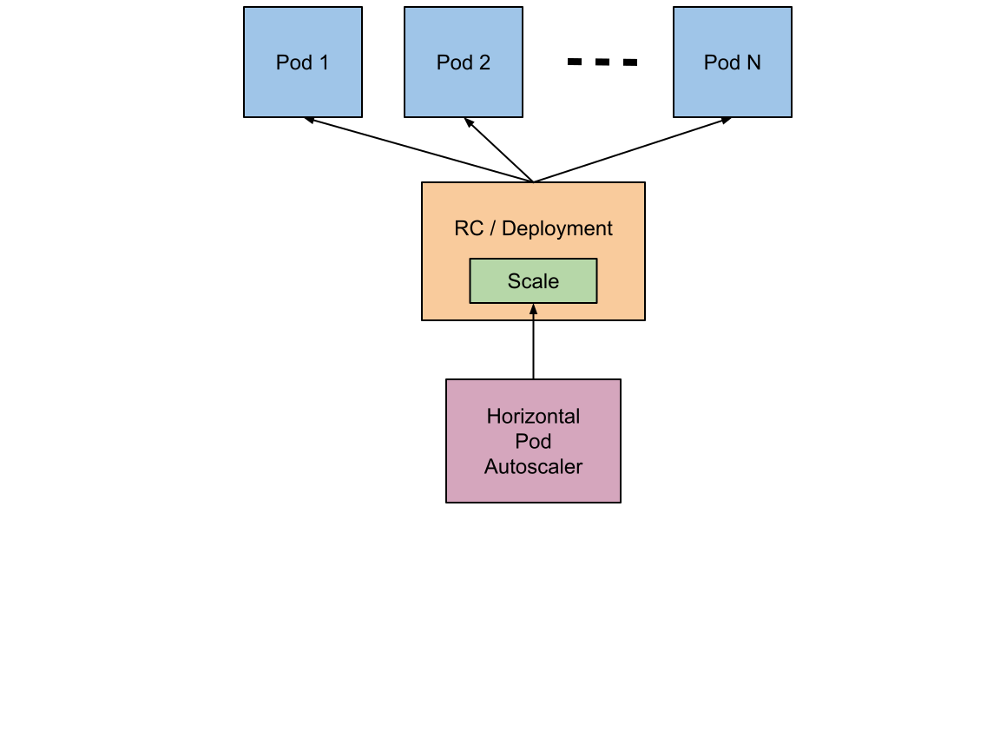

## 2. 오토스케일링

### 1) 오토스케일링 소개
수평적 파드 오토스케일러(Horizontal Pod Autoscaler: HPA)는 줄여서 HPA 라고 한다. 앞서 레플리케이션 컨트롤러나 레플리카셋, 디플로이먼트에서는 수동으로 스케일링 할 수 있었다. HPA는 이름 그대로 HPA 리소스는 수평적으로 파드를 자동으로 스케일링 할 수 있다.

HPA 리소스는 크기를 조정할 수 없는 컨트롤러 리소스에는 적용할 수 없으며, 레플리케이션 컨트롤러, 레플리카셋, 스테이트풀셋, 디플로이먼트가 관리하는 파드를 자동으로 스케일한다.



HPA 동작은 크게 세 단계로 나눌 수 있다.
- 관리되는 모든 파드의 메트릭(CPU, 메모리)을 측정해 가져온다.
- 지정한 목표 값에 부합하도록 필요한 파드 수를 계산한다.
- 파드를 관리하는 컨트롤러의 복제본을 조정한다.

#### (1) 파드의 메트릭 가져오기
> HPA <--> Metric Server <--> cAdvisor (via Kubelet) <--> Pod

파드의 메트릭은 각 노드에 있는 kubelet에서 cAdvisor 에이전트를 실행 시키고 cAdvisor 에이전트가 메트릭을 수집해 이를 메트릭 서버에게 전달한다. 메트릭 서버는 메트릭 API를 통해 HPA 리소스에 해당 메트릭을 전달하게 된다.

#### (2) 파드 수 계산
HPA 리소스가 측정된 메트릭을 가져오면, 스케일링에 필요한 파드의 수를 계산한다.

계산 공식은 다음과 같다.
> 목표 복제본 수 = ceil[현재 복제본 수 X ( 현재 메트릭 값 / 목표 메트릭 값 )]

간단하게 CPU 사용량을 밀러코어로 예를들면 다음과 같다.

현재 복제본 수는 3개이고, 현재 메트릭 값은 200m, 목표 메트릭 값은 100m 이라고 가정할 때, ceil[3*(200/100)]을 계산하면 목표하는 복제본 수는 6개가 된다.

물론 다른 메트릭이나, 멀티 메트릭을 사용하는 경우 계산 방법은 더 복잡 해진다.

#### (3) 복제본 수 조정
목표하는 복제본 수를 계산 했다면, 파드를 관리하는 컨트롤러의 복제본 수를 조정한다. 

HPA가 관리 할 수 있는 컨트롤러는 다음과 같다.
- 레플리케이션 컨트롤러
- 레플리카셋
- 스테이트풀셋
- 디플로이먼트

현재 HPA에 사용가능한 API는 autoscaling 그룹의 v1, v2beta1, v2beta2 이며, 기본적으로 v1은 CPU 메트릭만 지원되고, CPU 이외에 메모리 및 사용자 정의 메트릭을 사용하기 위해서는 autoscaling/v2beta2를 사용해야 한다.

#### (4) HPA 리소스 정의
다음은 autoscaling/v1 API 버전의 리소스 정의 예제다.

```yaml
apiVersion: autoscaling/v1
kind: HorizontalPodAutoscaler
metadata:
  name: mynapp-hpa-cpu
spec:
  scaleTargetRef:
    apiVersion: apps/v1
    kind: Deployment
    name: mynapp-deploy-hpa
  minReplicas: 1
  maxReplicas: 5
  targetCPUUtilizationPercentage: 70
```

- hpa.spec.scaleTargetRef: HPA 리소스가 복제본을 제어할 대상 컨트롤러
- hpa.spec.scaleTargetRef.apiVersion: 대상 컨트롤러의 API 버전
- hpa.spec.scaleTargetRef.kind: 대상 컨트롤러 종류
- hpa.spec.scaleTargetRef.name: 대상 컨트롤러 이름
- hpa.spec.minReplicas: 최소 복제본 개수
- hpa.spec.maxReplicas: 최대 복제본 개수
- hpa.spec.targetCPUUtilizationPercentage: CPU 평균 사용량 목표값(비율)

### 2) HPA 생성 및 관리

#### (1) HPA를 위한 디플로이먼트
다음은 HPA를 위한 디플로이먼트 리소스 정의 파일이다.

> mynapp-deploy-hpa.yml 파일
```yaml
apiVersion: apps/v1
kind: Deployment
metadata:
  name: mynapp-deploy-hpa
spec:
  replicas: 3
  selector:
    matchLabels:
      app: mynapp-deploy-hpa
  template:
    metadata:
      labels:
        app: mynapp-deploy-hpa
    spec:
      containers:
      - image: c1t1d0s7/myweb:v1
        name: mynapp
        resources:
          requests:
            cpu: 50m
            memory: 5Mi
          limits:
            cpu: 100m
            memory: 20Mi
        ports:
        - containerPort: 8080
```
기본 복제본 개수는 세 개이며, 리소스 제한 및 요청 사항을 설정한다.

디플로이먼트를 생성하자.
```
$ kubectl create -f mynapp-deploy-hpa.yml

deployment.apps/mynapp-deploy-hpa created
```

디플로이먼트와 파드가 제대로 생성되었는지 확인하자.
```
$ kubectl get deployments,pods

NAME                                READY   UP-TO-DATE   AVAILABLE   AGE
deployment.apps/mynapp-deploy-hpa   3/3     3            3           16s

NAME                                     READY   STATUS    RESTARTS   AGE
pod/mynapp-deploy-hpa-7bc8d67d57-d9fmc   1/1     Running   0          16s
pod/mynapp-deploy-hpa-7bc8d67d57-kwdwc   1/1     Running   0          16s
pod/mynapp-deploy-hpa-7bc8d67d57-sl8zx   1/1     Running   0          16s
```

#### (2) HPA 생성
다음은 HPA 리소스 파일이다.

> mynapp-hpa-cpu.yml 파일
```yaml
apiVersion: autoscaling/v1
kind: HorizontalPodAutoscaler
metadata:
  name: mynapp-hpa-cpu
spec:
  scaleTargetRef:
    apiVersion: apps/v1
    kind: Deployment
    name: mynapp-deploy-hpa
  minReplicas: 1
  maxReplicas: 5
  targetCPUUtilizationPercentage: 70
```

HPA 리소스를 생성하자.
```
$ kubectl create -f mynapp-hpa-cpu.yml

horizontalpodautoscaler.autoscaling/mynapp-hpa-cpu created
```

참고로 다음 명령은 위와 같은 효과를 낸다.
```
$ kubectl autoscale deployment mynapp-deploy-hpa --min 1 --max 5 --cpu-percent 70
```

#### (3) HPA 동작 확인
HPA 상태를 확인해보자.
```
$ kubectl get hpa

NAME             REFERENCE                      TARGETS   MINPODS   MAXPODS   REPLICAS   AGE
mynapp-hpa-cpu   Deployment/mynapp-deploy-hpa   0%/70%    1         5         3          106s
```
대상(TARGETS) 필드에 "unknown"이라고 표시되면 아직 메트릭이 한번도 수집되지 않았다는 것이다.

파드 목록을 확인해보자.
```
$ kubectl get pods

NAME                                 READY   STATUS    RESTARTS   AGE
mynapp-deploy-hpa-7bc8d67d57-d9fmc   1/1     Running   0          23m
mynapp-deploy-hpa-7bc8d67d57-kwdwc   1/1     Running   0          23m
mynapp-deploy-hpa-7bc8d67d57-sl8zx   1/1     Running   0          23m
```
디플로이먼트 리소스의 기본 복제본 개수는 세 개이다.

특정 파드에 부하를 주자.
```
$ kubectl exec mynapp-deploy-hpa-7bc8d67d57-d9fmc -- sha1sum /dev/zero
```

다시 HPA 상태를 확인해보자.
```
$ kubectl get hpa

NAME             REFERENCE                      TARGETS    MINPODS   MAXPODS   REPLICAS   AGE
mynapp-hpa-cpu   Deployment/mynapp-deploy-hpa   66%/70%   1         5         3          8m31s
```

충분히 부하가 걸리지 않으면 다른 파드에도 부하를 주자.
```
kubectl exec mynapp-deploy-hpa-7bc8d67d57-kwdwc -- sha1sum /dev/zero
```

HPA 상태를 확인해보자.
```
$ kubectl get hpa
NAME             REFERENCE                      TARGETS    MINPODS   MAXPODS   REPLICAS   AGE
mynapp-hpa-cpu   Deployment/mynapp-deploy-hpa   134%/70%   1         5         3          8m31s
```
현재 CPU 사용이 목표값을 넘어섰다. 곧 스케일링 이루어 질것이다.

다시 HPA 상태를 확인해보자.
```
$ kubectl get hpa
NAME             REFERENCE                      TARGETS    MINPODS   MAXPODS   REPLICAS   AGE
mynapp-hpa-cpu   Deployment/mynapp-deploy-hpa   79%/70%    1         5         5          10m
```
다섯 개의 복제본으로 스케일 아웃된 것을 확인할 수 있다. 최대 복제본 수를 넘을 수 없기 때문에 목표 값인 70%를 맞추지 못하고 있다.

파드의 목록을 확인 해보자.
```
$ kubectl get pods
NAME                                 READY   STATUS    RESTARTS   AGE
mynapp-deploy-hpa-7bc8d67d57-65x2p   1/1     Running   0          3m8s
mynapp-deploy-hpa-7bc8d67d57-d9fmc   1/1     Running   0          33m
mynapp-deploy-hpa-7bc8d67d57-kwdwc   1/1     Running   0          33m
mynapp-deploy-hpa-7bc8d67d57-rwjmt   1/1     Running   0          3m8s
mynapp-deploy-hpa-7bc8d67d57-sl8zx   1/1     Running   0          33m
```
다섯 개의 파드를 확인할 수 있다.

sha1sum 명령으로 일부러 부하를 생성한 것을 종료하고, 약 5분 후 다시 HPA 리소스를 확인해보자.
```
$ kubectl get hpa

NAME             REFERENCE                      TARGETS   MINPODS   MAXPODS   REPLICAS   AGE
mynapp-hpa-cpu   Deployment/mynapp-deploy-hpa   0%/70%    1         5         1          35m
```
부하가 없기 때문에 최소 복제본 개수인 1개로 스케일 인 되었다.

> 참고  
> HPA 리소스는 목표 값을 넘어서더라도 곧바로 스케일링을 하지 않고, 스케일 아웃은 3분의 지연시간을, 스케인 인은 5분의 지연시간을 둔다.  
> 목표 값을 넘거나 낮아졌다고 곧장 스케일을 시도해 본제본 개수가 짧은 시간에 계속적으로 스케일링이 이루어 진다면, 클러스터 전체의 성능에 좋지않은 영향을 미칠수 있기 때문이다.

### 3) 리소스 삭제
```
$ kubectl delete hpa mynapp-hpa-cpu

horizontalpodautoscaler.autoscaling "mynapp-hpa-cpu" deleted
```
```
$ kubectl delete deploy mynapp-deploy-hpa

deployment.apps "mynapp-deploy-hpa" deleted
```
