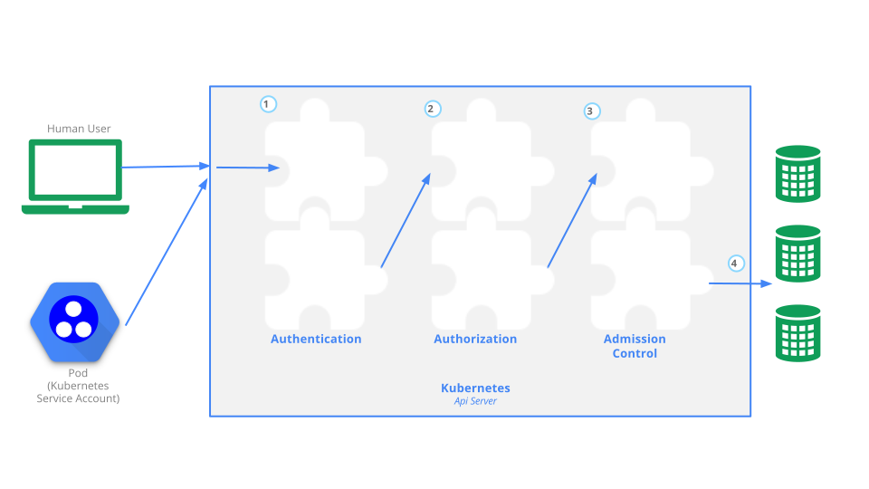

## 1. 인증 및 kubeconfig
모든 쿠버네티스 클러스터를 사용하는 사용자는 kubectl 클라이언트나 HTTP REST 요청을 통해 API 서버(kube-apiserver)에 접근한다. 해당 사용자는 제공한 인증 정보를 바탕으로 API 접근 권한을 부여받을 수 있다. 



### 1) 인증

#### (1) 사용자
쿠버네티스 클러스터에는 쿠버네티스에서 관리하는 서비스 계정과 일반 사용자가 있다.

서비스 계정(Service Account)은 쿠버네티스 API로 관리되는 쿠버네티스에 존재하는 사용자다. 서비스 계정은 시크릿에 자격증명 정보가 저장되어 있으며, API 요청시 해당 자격증명으로 인증을 수행하게 된다.

일반 사용자(Normal User)는 쿠버네티스 자체적으로 관리하지 않는, 쿠버네티스 클러스터 외부의, 외부 계정 관리 시스템(OpenStack Keystone, LDAP, Kerberos, Active Directory, Google 계정 등 OAuth2 공급자)과 연동되어 인증에 사용되는 사용자를 말한다.

API 서버에 요청할 때, 서비스 계정이나 일반 사용자가 아닐경우 익명(Anonymous) 사용자로 처리된다.

지금 부터 사용자라 함은 서비스 계정을 얘기하는 것으로 간주하면 된다.

#### (2) 인증 방법
- 클라이언트 인증서
  - X.509 기반의 TLS 인증서
  - 클라이언트가 인증서와 키를 이용한 인증
  - 지금까지 모든 kubectl 명령에 사용했던 방식
- 베어러(Bearer) 토큰
  - HTTP 요청 헤더에 ```Authorization: Bearer [TOKEN]``` 토큰을 전송
  - 서비스 계정 토큰
  - OAuth2 Bearer 토큰
- 인증 프록시
  - HTTP 요청 헤더에 ```X-Remote-User``` 등의 인증 정보 전송
- 기본 HTTP 인증
  - HTTP 요청 헤더에 ```Authorization: Basic BASE64ENCODED(USER:PASSWORD)``` 인증 정보 전송
  - 간편한 인증으로 편의를 위해 만들어 놓음(보안에 좋지 못함)
  - 패스워드를 변경하기 위해 API 서버가 재시작 되어야 함

> 참고  
> https://kubernetes.io/docs/reference/access-authn-authz/authentication/

### 2) kubeconfig 파일
지금까지 우리는 kubectl 명령을 사용하여 쿠버네티스 클러스터를 관리하였고, 이 kubectl 명령 클라이언트는 kubeconfig 파일을 사용하여 쿠버네티스 클러스터에 인증을 받았다.

kubeconfig 파일은 기본적으로 ~/.kube 디렉토리에 config 라는 파일이름으로 존재한다. 즉, kubectl 명령이 인증을 위해 참조하는 기본 kubeconfig 파일은 ~/.kube/config 파일이다. 만약 다른 kubeconfig 파일로 인증을 하고자 한다면 KUBECONFIG 쉘 환경 변수에 파일의 경로를 지정하거나, --kubeconfig 옵션을 사용하여 지정할 수 있다.

kubeconfig 파일역시 YAML 파일 형식으로 작성되며, 필요한 경우 직접 수정하거나, kubectl config 명령으로 확인하거나 관리할 수 있다.

#### (1) kubeconfig 파일 구조
다음은 기본적인 kubeconfig 파일의 구조이다. 파일의 구조를 확인하기 위해 일부부만 구성되어 있다.
```yaml
apiVersion: v1
kind: Config
preferences: {}

clusters:
- cluster:
  name: production
    server: https://1.2.3.4
- cluster:
  name: development
    server: https://5.6.7.8

users:
- name: admin
    token: abc
- name: user
    token: xyz

contexts:
- context:
  name: prod-admin
    cluster: production
    user: admin
    namespaces: default
- context:
  name: devel-user
    cluster: development
    user: user
    namespaces: devel
```

- config.clusters: 쿠버네티스 클러스터 이름 및 접속 정보
- config.users: 사용자의 인증을 위한 자격증명 정보
- config.contexts: 클러스터, 사용자, 네임스페이스를 묶어 하나의 요소로 관리

#### (2) kubectl config 명령 사용법
- 클러스터 생성 및 변경: ```kubectl config set-cluster [NAME] [OPTIONS]```
- 클러스터 정보 삭제: ```kubectl config delete-cluster [NAME]```
- 사용자 자격증명 생성 및 변경: ```kubectl config set-credentioals [NAME] [OPTIONS]```
- 사용자 자격증명 정보 삭제: ```kubectl config unset users.[NAME]```
- 컨텍스트 생성 및 변경: ```kubectl config set-context [NAME] [OPTIONS]```
- 컨텍스트 정보 삭제: ```kubectl config delete-context [NAME]```

- 클러스터 목록 확인: ```kubectl config get-clusters```
- 컨텍스트 목록 확인: ```kubectl config get-contexts```
- 현재 활성 컨텍스트 확인: ```kubectl config current-context```
- 사용할 컨텍스트 전환: ```kubectl config use-context [NAME]```

- kubeconfig 파일 확인: ```kubectl config view```
  - --minify: 현재 활성 정보만 확인

#### (3) kubeconfig 파일 생성 및 관리
kubeconfig 파일의 구조 이해하기 위해, 기본 kubeconfig 파일을 사용하지 말고, 다른 위치에 생성하고 관리해보자.

홈디렉토리로 이동한다.
```
$ cd ~
```

config-practice 디렉토리를 생성하고 이동하자.
```
$ mkdir config-practice
$ cd config-practice
```

production 클러스터를 생성하고 production 클러스터의 인증 API 서버는 https://1.2.3.4 이다.
```
$ kubectl config --kubeconfig=config-test set-cluster production --server=https://1.2.3.4

Cluster "production" set.
```

development 클러스터를 생성하고 production 클러스터의 인증 API 서버는 https://5.6.7.8 이다.
```
$ kubectl config --kubeconfig=config-test set-cluster development --server=https://5.6.7.8

Cluster "development" set.
```

admin 사용자를 자정하고, admin 사용자의 토큰을 지정한다.
```
$ kubectl config --kubeconfig=config-test set-credentials admin --token=abc

User "admin" set.
```

user 사용자를 지정하고, user 사용자의 토큰을 지정한다.
```
$ kubectl config --kubeconfig=config-test set-credentials user --token=xyz

User "user" set.
```

> 참고  
> set-credentials 명령은 서비스 계정을 생성하거나, 토큰을 생성하는 명령이 아니다.  

production 클러스터, admin 사용자, default 네임스페이스 정보를 묶어 prod-admin 컨텍스트를 생성한다.
```
$ kubectl config --kubeconfig=config-test set-context prod-admin --cluster=production --namespace=default --user admin

Context "prod-admin" created.
```

development 클러스터, user 사용자, devel 네임스페이스 정보를 묶어 dev-user 컨텍스트를 생성한다.
```
$ kubectl config --kubeconfig=config-test set-context dev-user --cluster=development --namespace=devel --user=user

Context "dev-user" created.
```

지금까지 구성한 kubeconfig 파일의 내용을 확인하자.
```
$ kubectl config --kubeconfig=config-test view

apiVersion: v1
clusters:
- cluster:
    server: https://5.6.7.8
  name: development
- cluster:
    server: https://1.2.3.4
  name: production
contexts:
- context:
    cluster: development
    namespace: devel
    user: user
  name: dev-user
- context:
    cluster: production
    namespace: default
    user: admin
  name: prod-admin
current-context: ""
kind: Config
preferences: {}
users:
- name: admin
  user:
    token: abc
- name: user
  user:
    token: xyz
```

클러스터 목록을 확인해보자.
```
$ kubectl config --kubeconfig=config-test get-clusters

NAME
development
production
```

컨텍스트 목록을 확인해보자.
```
$ kubectl config --kubeconfig=config-test get-contexts

CURRENT   NAME         CLUSTER       AUTHINFO   NAMESPACE
          dev-user     development   user       devel
          prod-admin   production    admin      default
```
아직 활성화된 컨텍스트는 없다.

prod-admin 컨텍스트를 활성화 하자.
```
$ kubectl config --kubeconfig=config-test use-context prod-admin

Switched to context "prod-admin".
```
이제부터 kubectl 명령은 API 서버에 요청시 prod-admin 컨텍스트에 지정된 production 클러스터에 admin 사용자로 자격증명을 하여 인증을 하게 된다.

현재 활성화된 컨텍스트를 확인해보자.
```
$ kubectl config --kubeconfig=config-test current-context

prod-admin
```

컨텍스트 목록에서도 활성화된 컨텍스트를 확인할 수 있다.
```
$ kubectl config --kubeconfig=config-test get-contexts
CURRENT   NAME         CLUSTER       AUTHINFO   NAMESPACE
          dev-user     development   user       devel
*         prod-admin   production    admin      default
```

#### (4) 기본 kubeconfig 파일 확인
다시 돌아가서 기존에 사용하던 ```~/.kube/config``` 파일을 확인해보자.
```
$ kubectl config view

apiVersion: v1
clusters:
- cluster:
    certificate-authority-data: DATA+OMITTED
    server: https://192.168.56.11:6443
  name: cluster.local
contexts:
- context:
    cluster: cluster.local
    user: kubernetes-admin
  name: kubernetes-admin@cluster.local
current-context: kubernetes-admin@cluster.local
kind: Config
preferences: {}
users:
- name: kubernetes-admin
  user:
    client-certificate-data: REDACTED
    client-key-data: REDACTED
```
- 클러스터 이름: cluster.local
- 클러스터 API 서버: https://192.168.56.11:6443
- 사용자 이름: kubernetes-admin
- 컨텍스트 이름: kubernetes-admin@cluster.local

컨텍스트 목록 및 활성 컨텍스트를 확인해보자.
```
$ kubectl config get-contexts

CURRENT   NAME                             CLUSTER         AUTHINFO           NAMESPACE
*         kubernetes-admin@cluster.local   cluster.local   kubernetes-admin
```
