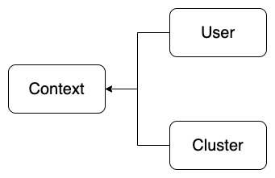

## 2. 서비스 어카운트 및 클러스터 접근 구성

### 1) 서비스 어카운트

#### (1) 기본 서비스 어카운트 확인
쿠버네티스 클러스터에 기본적으로 생성되어 있는 서비스 어카운트를 확인해보자.
```
$ kubectl get serviceaccounts

NAME      SECRETS   AGE
default   1         2d6h
```
default 라는 이름에 서비스 어카운트가 존재한다. 서비스 어카운트는 항상 인증에 사용할 토큰을 가지고 있다. 서비스 어카운트를 생성하면 시크릿이 생성되며, 해당 시크릿에는 CA 인증서, 네임스페이스 이름 및 해당 서비스 어카운트의 토큰이 저장되어 있다.

> 참고  
> default 서비스 어카운트 및 토큰은 앞서 학습한 시크릿 파트에서 확인 해본적이 있다.  
> 해당 시크릿의 토큰은 파드가 기본적으로 마운트하고 있으며, 파드가 API 서버와 통신할때 인증하기 위함이다. 

default 서비스 어카운트의 상세 정보를 확인하자.
```
$ kubectl describe serviceaccounts default

Name:                default
Namespace:           default
Labels:              <none>
Annotations:         <none>
Image pull secrets:  <none>
Mountable secrets:   default-token-xdc8q
Tokens:              default-token-xdc8q
Events:              <none>
```
토큰이 저장된 시크릿 이름을 확인할 수 있다.

시크릿의 상세 정보를 확인해 보자.
```
$ kubectl describe secret default-token-xdc8q

Name:         default-token-xdc8q
Namespace:    default
Labels:       <none>
Annotations:  kubernetes.io/service-account.name: default
              kubernetes.io/service-account.uid: 7369ae39-3e24-4416-9f15-271b9813e11b

Type:  kubernetes.io/service-account-token

Data
====
ca.crt:     1025 bytes
namespace:  7 bytes
token:      eyJhbGciOiJ...
```
CA 인증서, 네임스페이스 이름, 서비스 어카운트의 토큰 정보가 저장되어 있다.

#### (2) 서비스 어카운트 오브젝트 선언
다음은 서비스 어카운트 오브젝트 주요 필드다.
```yaml
apiVersion: v1
kind: ServiceAccount
metadata:
  name: testuser
  namespace: default
```
서비스 어카운트의 이름과 네임스페이스를 제외하고 크게 선언할 것은 없다.

#### (3) 서비스 어카운트 리소스 생성 및 확인
myuser1 서비스 어카운트 리소스다.
> sa-myuser1.yml
```yaml
apiVersion: v1
kind: ServiceAccount
metadata:
  name: myuser1
  namespace: default
```

myuser2 서비스 어카운트 리소스다.
> sa-myuser2.yml
```yaml
apiVersion: v1
kind: ServiceAccount
metadata:
  name: myuser2
  namespace: default
```

myadmin 서비스 어카운트 리소스다.
> sa-myadmin.yml
```yaml
apiVersion: v1
kind: ServiceAccount
metadata:
  name: myadmin
  namespace: default
```

세 개의 서비스 어카운트를 생성하자.
```
$ kubectl create -f sa-myadmin.yaml -f sa-myuser1.yaml -f sa-myuser2.yaml

serviceaccount/myadmin created
serviceaccount/myuser1 created
serviceaccount/myuser2 created
```

서비스 어카운트의 목록을 확인해 보자.
```
$ kubectl get serviceaccounts

NAME      SECRETS   AGE
default   1         2d6h
myadmin   1         15s
myuser1   1         15s
myuser2   1         15s
```

서비스 어카운트의 상세정보로 시크릿 정보를 확인하자.
```
$ kubectl describe serviceaccounts myadmin

Name:                myadmin
...
Tokens:              myadmin-token-p7xrj
...
```

```
$ kubectl describe serviceaccounts myuser1

Name:                myuser1
...
Tokens:              myuser1-token-nnpb4
...
```

```
$ kubectl describe serviceaccounts myuser2
...
Tokens:              myuser2-token-89697
...
```

서비스 어카운트의 토큰이 저장된 시크릿 목록을 확인하자.
```
$ kubectl get secrets

NAME                  TYPE                                  DATA   AGE
...
myadmin-token-p7xrj   kubernetes.io/service-account-token   3      119s
myuser1-token-nnpb4   kubernetes.io/service-account-token   3      119s
myuser2-token-89697   kubernetes.io/service-account-token   3      119s
...
```

### 2) 클러스터 접근 구성 - kubeconfig
지금까지 우리는 kubectl 명령을 사용하여 쿠버네티스 클러스터를 관리하였고, 이 kubectl 명령 클라이언트는 kubeconfig 파일의 구성정보를 이용하여 쿠버네티스 클러스터에 접근하며 인증을 요청한다.

kubeconfig 파일은 기본적으로 ~/.kube 디렉토리에 config 라는 파일이름으로 존재한다. 즉, kubectl 명령이 인증을 위해 참조하는 기본 kubeconfig 파일은 ~/.kube/config 파일이다. 만약 다른 kubeconfig 파일로 인증을 하고자 한다면 KUBECONFIG 쉘 환경 변수에 파일의 경로를 지정하거나, --kubeconfig 옵션을 사용하여 지정할 수 있다.

kubeconfig 파일역시 YAML 파일 형식으로 작성되며, 필요한 경우 직접 수정하거나, kubectl config 명령으로 확인하거나 관리할 수 있다.

#### (1) kubeconfig 파일 구조
다음은 기본적인 kubeconfig 파일의 구조이다. 파일의 구조를 확인하기 위해 일부부만 구성되어 있다.
```yaml
apiVersion: v1
kind: Config
preferences: {}

clusters:
- cluster:
  name: production
    server: https://1.2.3.4
- cluster:
  name: development
    server: https://5.6.7.8

users:
- name: admin
    token: abc
- name: user
    token: xyz

contexts:
- context:
  name: prod-admin
    cluster: production
    user: admin
    namespaces: default
- context:
  name: devel-user
    cluster: development
    user: user
    namespaces: devel
```



- config.clusters: 쿠버네티스 클러스터 이름 및 접속 정보
- config.users: 사용자의 인증을 위한 자격증명 정보
- config.contexts: 클러스터, 사용자, 네임스페이스를 묶어 하나의 요소로 관리

#### (2) kubectl config 명령 사용법
- 클러스터 생성 및 변경: ```kubectl config set-cluster [NAME] [OPTIONS]```
- 클러스터 정보 삭제: ```kubectl config delete-cluster [NAME]```
- 사용자 자격증명 생성 및 변경: ```kubectl config set-credentioals [NAME] [OPTIONS]```
- 사용자 자격증명 정보 삭제: ```kubectl config unset users.[NAME]```
- 컨텍스트 생성 및 변경: ```kubectl config set-context [NAME] [OPTIONS]```
- 컨텍스트 정보 삭제: ```kubectl config delete-context [NAME]```

- 클러스터 목록 확인: ```kubectl config get-clusters```
- 컨텍스트 목록 확인: ```kubectl config get-contexts```
- 현재 활성 컨텍스트 확인: ```kubectl config current-context```
- 사용할 컨텍스트 전환: ```kubectl config use-context [NAME]```

- kubeconfig 파일 확인: ```kubectl config view```
  - --minify: 현재 활성 정보만 확인

#### (3) kubeconfig 파일 생성 및 관리
kubeconfig 파일의 구조 이해하기 위해, 기본 kubeconfig 파일을 사용하지 말고, 다른 위치에 생성하고 관리해보자.

홈디렉토리로 이동한다.
```
$ cd ~
```

config-practice 디렉토리를 생성하고 이동하자.
```
$ mkdir config-practice
$ cd config-practice
```

production 클러스터를 생성하고 production 클러스터의 인증 API 서버는 https://1.2.3.4 이다.
```
$ kubectl config --kubeconfig=config-test set-cluster production --server=https://1.2.3.4

Cluster "production" set.
```

development 클러스터를 생성하고 production 클러스터의 인증 API 서버는 https://5.6.7.8 이다.
```
$ kubectl config --kubeconfig=config-test set-cluster development --server=https://5.6.7.8

Cluster "development" set.
```

admin 사용자를 자정하고, admin 사용자의 토큰을 지정한다.
```
$ kubectl config --kubeconfig=config-test set-credentials admin --token=abc

User "admin" set.
```

user 사용자를 지정하고, user 사용자의 토큰을 지정한다.
```
$ kubectl config --kubeconfig=config-test set-credentials user --token=xyz

User "user" set.
```

> 참고  
> set-credentials 명령은 서비스 계정을 생성하거나, 토큰을 생성하는 명령이 아니다.  

production 클러스터, admin 사용자, default 네임스페이스 정보를 묶어 prod-admin 컨텍스트를 생성한다.
```
$ kubectl config --kubeconfig=config-test set-context prod-admin --cluster=production --namespace=default --user admin

Context "prod-admin" created.
```

development 클러스터, user 사용자, devel 네임스페이스 정보를 묶어 dev-user 컨텍스트를 생성한다.
```
$ kubectl config --kubeconfig=config-test set-context dev-user --cluster=development --namespace=devel --user=user

Context "dev-user" created.
```

지금까지 구성한 kubeconfig 파일의 내용을 확인하자.
```
$ kubectl config --kubeconfig=config-test view

apiVersion: v1
clusters:
- cluster:
    server: https://5.6.7.8
  name: development
- cluster:
    server: https://1.2.3.4
  name: production
contexts:
- context:
    cluster: development
    namespace: devel
    user: user
  name: dev-user
- context:
    cluster: production
    namespace: default
    user: admin
  name: prod-admin
current-context: ""
kind: Config
preferences: {}
users:
- name: admin
  user:
    token: abc
- name: user
  user:
    token: xyz
```

클러스터 목록을 확인해보자.
```
$ kubectl config --kubeconfig=config-test get-clusters

NAME
development
production
```

컨텍스트 목록을 확인해보자.
```
$ kubectl config --kubeconfig=config-test get-contexts

CURRENT   NAME         CLUSTER       AUTHINFO   NAMESPACE
          dev-user     development   user       devel
          prod-admin   production    admin      default
```
아직 활성화된 컨텍스트는 없다.

prod-admin 컨텍스트를 활성화 하자.
```
$ kubectl config --kubeconfig=config-test use-context prod-admin

Switched to context "prod-admin".
```
이제부터 kubectl 명령은 API 서버에 요청시 prod-admin 컨텍스트에 지정된 production 클러스터에 admin 사용자로 자격증명을 하여 인증을 하게 된다.

현재 활성화된 컨텍스트를 확인해보자.
```
$ kubectl config --kubeconfig=config-test current-context

prod-admin
```

컨텍스트 목록에서도 활성화된 컨텍스트를 확인할 수 있다.
```
$ kubectl config --kubeconfig=config-test get-contexts
CURRENT   NAME         CLUSTER       AUTHINFO   NAMESPACE
          dev-user     development   user       devel
*         prod-admin   production    admin      default
```

#### (4) 기본 kubeconfig 파일 확인
다시 돌아가서 기존에 사용하던 ```~/.kube/config``` 파일을 확인해보자.
```
$ kubectl config view

apiVersion: v1
clusters:
- cluster:
    certificate-authority-data: DATA+OMITTED
    server: https://192.168.56.11:6443
  name: cluster.local
contexts:
- context:
    cluster: cluster.local
    user: kubernetes-admin
  name: kubernetes-admin@cluster.local
current-context: kubernetes-admin@cluster.local
kind: Config
preferences: {}
users:
- name: kubernetes-admin
  user:
    client-certificate-data: REDACTED
    client-key-data: REDACTED
```
- 클러스터 이름: cluster.local
- 클러스터 API 서버: https://192.168.56.11:6443
- 사용자 이름: kubernetes-admin
- 컨텍스트 이름: kubernetes-admin@cluster.local

컨텍스트 목록 및 활성 컨텍스트를 확인해보자.
```
$ kubectl config get-contexts

CURRENT   NAME                             CLUSTER         AUTHINFO           NAMESPACE
*         kubernetes-admin@cluster.local   cluster.local   kubernetes-admin
```

> 참고
> 네임스페이스가 지정되어있지 않으면 default 네임스페이스를 사용한다.

### 3) 서비스 어카운트 접근 구성
이전에 생성한 서비스 계정을 kubeconfig에 사용자 및 컨텍스트를 구성해보자.

#### (1) myuser1 사용자 구성
myuser1 사용자의 토큰이 저장된 시크릿 이름을 확인하자.
```
$ kubectl describe serviceaccounts myuser1 | grep Tokens

Tokens:              myuser1-token-nnpb4
```

해당 시크릿의 토큰 값을 확인하고 클립보드에 복사해 놓는다.
```
$ kubectl describe secrets myuser1-token-nnpb4 | grep ^token

token:      eyJhbGciOiJS...
```

방금 클립보드에 복사해 놓은 토큰을 붙여넣어, myuser1 사용자의 자격증명을 생성하자.
```
$ kubectl config set-credentials myuser1 --token=eyJhbGciOiJS...

User "myuser1" set.
```

myuser1 사용자와 기존에 존재하던 cluster.local 클러스터를 결합해 myuser1@cluster.local 컨텍스트를 생성한다.
```
$ kubectl config set-context myuser1@cluster.local --cluster=cluster.local --user=myuser1 --namespace=default

Context "myuser1@cluster.local" created.
```

#### (2) myuser2 사용자 구성
myuser2 사용자의 토큰이 저장된 시크릿 이름을 확인하자.
```
$ kubectl describe serviceaccounts myuser2 | grep Tokens

Tokens:              myuser2-token-89697
```

해당 시크릿의 토큰 값을 확인하고 클립보드에 복사해 놓는다.
```
$ kubectl describe secret myuser2-token-89697 | grep ^token

token:      eyJhbGciOiJS...
```

방금 클립보드에 복사해 놓은 토큰을 붙여넣어, myuser2 사용자의 자격증명을 생성하자.
```
$ kubectl config set-credentials myuser2 --token=eyJhbGciOiJS...

User "myuser2" set.
```

myuser2 사용자와 기존에 존재하던 cluster.local 클러스터를 결합해 myuser2@cluster.local 컨텍스트를 생성한다.
```
$ kubectl config set-context myuser2@cluster.local --cluster=cluster.local --user=myuser2 --namespace=default

Context "myuser2@cluster.local" created.
```

#### (3) myadmin 사용자 구성
myadmin 사용자의 토큰이 저장된 시크릿 이름을 확인하자.
```
$ kubectl describe serviceaccounts myadmin | grep Tokens

Tokens:              myadmin-token-p7xrj
```

해당 시크릿의 토큰 값을 확인하고 클립보드에 복사해 놓는다.
```
$ kubectl describe secret myadmin-token-p7xrj| grep ^token

token:      eyJhbGciOiJS...
```

방금 클립보드에 복사해 놓은 토큰을 붙여넣어, myadmin 사용자의 자격증명을 생성하자.
```
$ kubectl config set-credentials myadcmin --token=eyJhbGciOiJS...

User "myadmin" set.
```

myadmin 사용자와 기존에 존재하던 cluster.local 클러스터를 결합해 myadmin@cluster.local 컨텍스트를 생성한다.
```
$ kkubectl config set-context myadmin@cluster.local --cluster=cluster.local --user=myadmin --namespace=default

Context "myadmin@cluster.local" created.
```

#### (4) kubeconfig 파일 확인
컨텍스트 정보를 확인하자.
```
$ kubectl config get-contexts

CURRENT   NAME                             CLUSTER         AUTHINFO           NAMESPACE
*         kubernetes-admin@cluster.local   cluster.local   kubernetes-admin
          myadmin@cluster.local            cluster.local   myadmin            default
          myuser1@cluster.local            cluster.local   myuser1            default
          myuser2@cluster.local            cluster.local   myuser2            default
```
