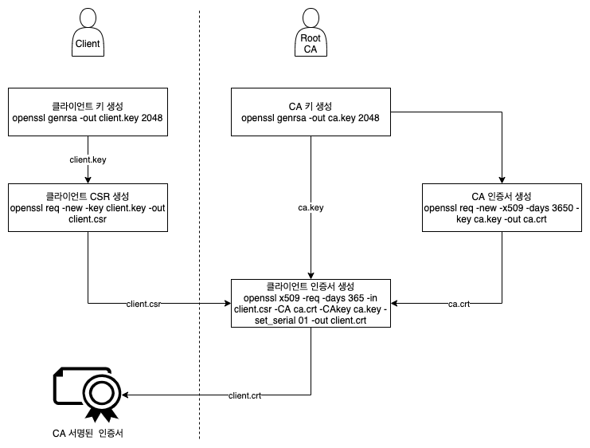

## 4. X.509 인증서 기반 사용자 인증

### 1) X.509 인증서


#### (1) 클라이언트 키 생성
클라이언트 개인키를 생성한다.
```
$ openssl genrsa -out myuser3.key 2048

Generating RSA private key, 2048 bit long modulus (2 primes)
......................+++++
........................+++++
e is 65537 (0x010001)
```

#### (2) 클라이언트 CSR 생성
생성한 클러이언트 개인키로 인증서 서명 요청(CSR: Certificate Signing Request)을 생성한다.
```
$ openssl req -new -key myuser3.key -out myuser3.csr -subj "/CN=myuser3"
```
LDAP DN(Distinguished Name)에서 CN(Common Name)은 사용자 이름을 지정한다.

#### (3) CSR 리소스 생성
먼저 CSR 파일을 BASE64로 인코딩 한다.
```
$ cat myuser3.csr | base64 | tr -d "\n"

LS0tLS1CRUdJTiBDRVJUSUZJQ0FURSBSRVFVRVNULS0tLS0KT...
```
BASE64로 인코딩된 값은 CSR 리소스 생성시 필요하기 때문에 클립보드 등 복사한다.

> 참고
> 마지막 %는 생략함

CSR 오브젝트를 생성하자.
> myuser3-csr.yaml
```yaml
apiVersion: certificates.k8s.io/v1beta1
kind: CertificateSigningRequest
metadata:
  name: myuser3
spec:
  request: <BASE64 ENCODED VALUE>
  signerName: kubernetes.io/kube-apiserver-client
  usages:
  - client auth
```

- .spec.request: BASE64로 인코딩된 CSR
- .spec.signerName: 서명자
  * kubernetes.io/legacy-unknown
    * 신뢰를 보장하지 않음
    * 타사에서 서명된 클라이언트 인증서 허용
    * CSR API가 certificates.k8s.io/v1 이후 허용되지 않음
    * 자동 승인: X
  * kubernetes.io/kube-apiserver-client
    * 서명: API 서버
    * 자동 승인: X
    * 허용된 주체(subject): 모두(사용자 및 그룹)
    * 허용된 키 사용(usages): 정확히 ["client auth"] 만 포함해야 함
  * kubernetes.io/kube-apiserver-client-kubelet
    * 서명: API 서버
    * 자동 승인: O
    * 허용된 주체: "system:nodes" 그룹
    * 허용된 키 사용: 정확히 ["key encipherment", "digital signature", "client auth"] 포함
  * kubernetes.io/kubelet-serving
    * 서명: kubelet
    * 자동 승인: X
    * 허용된 주체: 모두
    * 허용된 키 사용: 모두
- .spec.usages: 키 사용 용도 

CSR 리소스를 생성하자.
```
$ kubectl create -f myuser3-csr.yaml

certificatesigningrequest.certificates.k8s.io/myuser3 created
```

CSR 리소스를 확인하자.
```
$ kubectl get certificatesigningrequests.certificates.k8s.io

NAME      AGE   SIGNERNAME                            REQUESTOR          CONDITION
myuser3   23s   kubernetes.io/kube-apiserver-client   kubernetes-admin   Pending
```
myuser3 CSR 리소스의 상태(CONDITION)은 승인 되지 않은 상태이며, kube-apiserver-client 서명자는 자동 승인을 하지 않기 때문이다.

#### (4) CSR 승인
특별한 문제가 없으면 CSR을 승인해 서명된 인증서를 생성하자.
```
$ kubectl certificate approve myuser3

certificatesigningrequest.certificates.k8s.io/myuser3 approved
```

CSR 리소스 상태를 다시 확인하자.
```
$ kubectl get certificatesigningrequests.certificates.k8s.io

NAME      AGE     SIGNERNAME                            REQUESTOR          CONDITION
myuser3   4m26s   kubernetes.io/kube-apiserver-client   kubernetes-admin   Approved,Issued
```
CSR이 승인되었으며, 인증서가 발급되었다.

#### (5) 인증서 저장 및 확인
발급된 인증서는 CSR 리소스의 상세 정보에서 확인할 수 있다.
```
$ kubectl get certificatesigningrequests.certificates.k8s.io myuser3 -o yaml

...
status:
  certificate: LS0tLS1CRUdJTiBDRVJUSUZJQ0FURS0tLS0tCk1JSUMxakNDQWI2Z0F3SUJBZ0lRQ2ZsdCtTcmJuNXQxV1dYeG04N2VaekFOQmdrcWhraUc5dzBCQVFzRkFEQVYKTVJNd0VRWURWUVFERXdwcmRXSmxjbTVsZEdWek1CNFhEVEl4TURNd05UQXlNakUwT0ZvWERUSXlNRE13TlRBeQpNakUwT0Zvd0VqRVFNQTRHQTFVRUF4TUhiWGwxYzJWeU16Q0NBU0l3RFFZSktvWklodmNOQVFFQkJRQURnZ0VQCkFEQ0NBUW9DZ2dFQkFMeTQ4dGV2eVVZWVVhRytQVU91MmtvK1dhczN2aklHU3MvdkNnNVI1SGcrcjJWM2ZzUlkKd2xhQmtvR0QzWlZpdnBPNTduY2pyayt0UG8rQ1F2MWpJYmJ6bFRBTTJVQlNCMjVnaWkvOTBYdS8yWXlsSGdQMQpmQmx0WStPd0xwak5KaVFJVVZQZHVxOUdreWMzdkNxSGVZYm42Y29Ock1iSU9qeXJoV1NrU0dzNHoyTytnQ3RYCkU3SUVSdlByamRVZ0w5QTFoT25IeGNzUVNkS1VZbzh3WkprWU42QTUrOGYwV09JRTNSaW1McGlaY3hsL25sTS8KMTNBbWJhL2cwUHNCN3hJdFBORmJIejNNQS9qR0hTY204QnBqNnV3dHRzR0N0L2JCNndsVzhlbmRZc1NTNnpjSgp2S0E1Qlp0TDgxOFFQUnBXYVdYRWRCa2Y0QSt6QmpXbmVJMENBd0VBQWFNbE1DTXdFd1lEVlIwbEJBd3dDZ1lJCkt3WUJCUVVIQXdJd0RBWURWUjBUQVFIL0JBSXdBREFOQmdrcWhraUc5dzBCQVFzRkFBT0NBUUVBdHlSODNjdFgKRVVhV3I4YlNBZVcyRGI2eVlHZmpPcy9DdENRa0t1ZnplbGdFRVVBN1E5SFZ4NW8zeEVuaVl6bnh5dVhOeURhTQpqMGxYa3BhT2JmOVRzbDNBQmFSM0ZBUWx2U1J0d1pFczJEaVBSSVo5WlVCSERJajFUZ3BodHZhbUtwcno3bFl6CkNvUGNtdGtOVWs5VmlYajdPVEJuMTcwNlRuNTVyT1BuTWJoYUxlM01IbEgvMTUxejJWL0pPc3dwdzJzaVMxSy8KSm1Da2JlODVpQm9GZk1JRi9mQVJMMHR6UEpGNzRGREEvbCt6QnpwQVIybnNSSFl6WDZvSk1SdnQ4a1czQXRTMAozRGdyL0dFaXNqdjVmTG41cXl2dS9RcDZnNTJJZFcxSmpZQ0xiWEVRM0ozT0tEeVZEWFpRQVp1SkN5ZFRGbHZ0Ck4xT0NRMUFQVTlLcWZRPT0KLS0tLS1FTkQgQ0VSVElGSUNBVEUtLS0tLQo=
  conditions:
  - lastUpdateTime: "2021-03-05T02:26:48Z"
    message: This CSR was approved by kubectl certificate approve.
    reason: KubectlApprove
    type: Approved
```
서명된 인증서는 .status.certificate 필드에서 확인할 수 있다.

이 인증서 값을 jsonpath를 이용하면 쉽게 파일로 저장할 수 있다.
```
$ kubectl get certificatesigningrequests.certificates.k8s.io myuser3 -o jsonpath='{.status.certificate}' | base64 -d > myuser3.crt
```

인증서를 확인 해보자.
```
$ openssl x509 -in myuser3.crt -text -noout

Certificate:
    Data:
        Version: 3 (0x2)
        Serial Number:
            09:f9:6d:f9:2a:db:9f:9b:75:59:65:f1:9b:ce:de:67
        Signature Algorithm: sha256WithRSAEncryption
        Issuer: CN = kubernetes
        Validity
            Not Before: Mar  5 02:21:48 2021 GMT
            Not After : Mar  5 02:21:48 2022 GMT
        Subject: CN = myuser3
...
```

### 2) 롤 및 롤 바인딩
myuser3 사용자에게 부여할 롤 및 롤 바인딩을 생성하자.

#### (1) 롤 생성
> role-admin-pod.yaml
```yaml
kind: Role
apiVersion: rbac.authorization.k8s.io/v1
metadata:
  namespace: default
  name: admin-pod
rules:
- apiGroups: [""]
  resources: ["pods"]
  verbs: ["create", "get", "list", "update", "delete"]
```
파드를 관리할 수 있는 권한을 부여했다.

롤 리소스를 생성하자.
```
$ kubectl create -f role-admin-pod.yaml

role.rbac.authorization.k8s.io/admin-pod created
```

#### (2) 롤 바인딩 생성
myuser3 사용자와 admin-pod 롤을 연결해준다.
> rbind-myuser3.yaml
```yaml
apiVersion: rbac.authorization.k8s.io/v1
kind: RoleBinding
metadata:
  name: myuser3-admin-pod
  namespace: default
roleRef:
  apiGroup: rbac.authorization.k8s.io
  kind: Role
  name: admin-pod
subjects:
- apiGroup: rbac.authorization.k8s.io
  kind: User
  name: myuser3
```

롤 바인딩 리소스를 생성하자.
```
$ kubectl create -f rbind-myuser3.yaml

rolebinding.rbac.authorization.k8s.io/myuser3-admin-pod created
```

### 3) 사용자 접근 구성
myuser3 사용자를 구성한다.
```
$ kubectl config set-credentials myuser3 --client-key=myuser3.key --client-certificate=myuser3.crt --embed-certs=true

User "myuser3" set.
```
--embed-certs 옵션을 활성화하면 kubeconfig 파일 내에 인증서 및 키가 삽입되고, 비활성화하면 인증서 및 키 파일의 위치가 지정된다.

myuser3 사용자와 cluster.local 클러스터를 결합해 myuser3@cluster.local 컨텍스트를 생성한다.
```
$ kubectl config set-context myuser3@cluster.local --cluster=cluster.local --user=myuser3 --namespace=default

Context "myuser3@cluster.local" created.
```

```
$ kubectl config get-contexts

CURRENT   NAME                             CLUSTER         AUTHINFO           NAMESPACE
*         kubernetes-admin@cluster.local   cluster.local   kubernetes-admin
          myadmin@cluster.local            cluster.local   myadmin            default
          myuser1@cluster.local            cluster.local   myuser1            default
          myuser2@cluster.local            cluster.local   myuser2            default
          myuser3@cluster.local            cluster.local   myuser3            default
```

```
$ kubectl config use-context myuser3@cluster.local

Switched to context "myuser3@cluster.local".
```

### 4) 사용자 테스트
```
$ kubectl get nodes

Error from server (Forbidden): nodes is forbidden: User "myuser3" cannot list resource "nodes" in API group "" at the cluster scope
```

```
$ kubectl run mypod --image=ghcr.io/c1t1d0s7/go-myweb

pod/mypod created
```

```
$ kubectl get pods

NAME    READY   STATUS    RESTARTS   AGE
mypod   1/1     Running   0          4s
```

```
$ kubectl delete pod mypod

pod "mypod" deleted
```

```
$ kubectl config use-context kubernetes-admin@cluster.local

Switched to context "kubernetes-admin@cluster.local".
```
