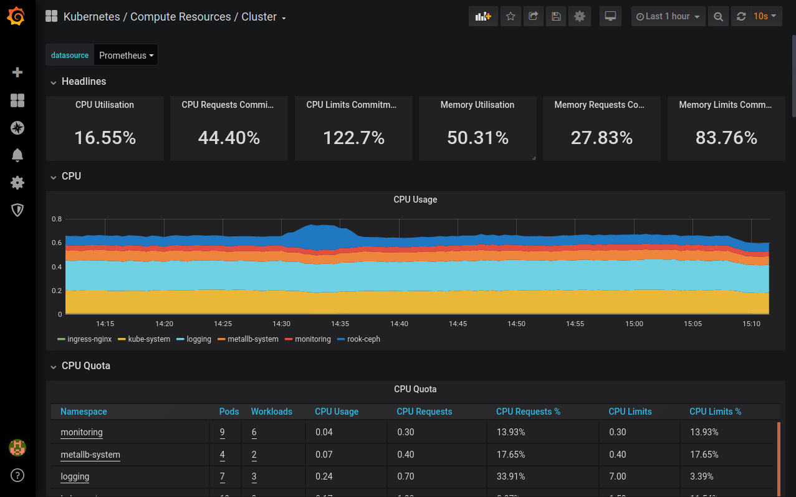

## 2. Prometheus 모니터링

### 1) 쿠버네티스 기본 모니터링 개요
지금까지 쿠버네티스 클러스터의 노드 및 파드의 상태 및 리소스 사용율을 확인하기 위해 kubectl top 명령을 사용했다. kubectl top 명령에서 제공하는 CPU 및 메모리 사용량 메트릭의 정보는 metrics-server에 의해 제공되고 있다. 

사실 쿠버네티스에서 기본적으로 사용할 수 있었던 모니터링 도구는 Heapster로, Heapster는 메트릭을 Kubelet으로 부터 수집하고, 메트릭을 시계열 데이터베이스인 influxDB에 저장하고 이를 관리하며, Grafana를 이용해 시각화할 수 있었다. 

Heapster는 별도의 influxDB 저장소가 있기 때문에 이전 메트릭도 확인할 수 있었지만, metrics-server는 별도의 저장소가 없기 때문에 현재의 실시간 메트릭만 확인할 수 있다.

Heapster는 쿠버네티스 1.0.6 버전부터 제공했으며, 1.11 버전에서 Deprecated 되었으며, 1.13 버전에서 완전히 제거 되었다.

현재 Heapster 프로젝트의 Github 저장소에서는 다음과 같이 마이그레이션할 것을 권장한다.
- 기본 CPU / 메모리 메트릭: metrics-server
- 일반 모니터링: Prometheus Operator

현재 우리가 구성한 쿠버네티스 클러스터는 metrics-server에 의해 CPU와 메모리 메트릭만 실시간으로 확인할 수 있고, Prometheus Operator를 사용하면, 시각화 뿐만아니라, 이전 메트릭도 확인할 수 있고, CPU 및 메모리 뿐만아니라 네트워크 관련 메트릭도 확인할 수 있다.

### 2) Prometheus 개요
Prometheus 프로젝트는 2012년 오픈소스 모니터링 및 경고 시스템으로 SoundCloud에서 Google의 Borgmon에 영감을 받아 기존의 StatsD 및 Graphite로 구성된 모니터링 도구를 대체하기 위해 개발되었다. Prometheus는 2015년 공개되었으며, 2016년 CNCF의 두 번째 프로젝트(첫 번째는 Kubernetes)로 지원을 받고 있다.

#### (1) Prometheus 아키텍처


#### (2) Prometheus 구성 요소
- Prometheus 서버: 시계열 데이터를 취득하고 저장
- Pushgateway: Job 리소스와 같은 생명주기가 짧은 리소스의 메트릭 수집
- 클라이언트 라이브러리: 메트릭 수집
- Exporters: HAProxy, StatsD, Graphite와 같은 서비스의 메트릭 내보내기(Prometheus로 가져오기)
- Alertmanager: 알람 전송
- Grafana: PromQL을 이용하여 Prometheus 서버로 부터 데이터를 가져와서 시각화 제공
- Service Discovery: 메트릭 측정 대상 찾기

### 3) Helm을 이용한 Prometheus 설치

#### (1) Prometheus Operator용 네임스페이스 생성
Prometheus Operator를 설치하기 위한 monitor 네임스페이를 생성한다.
```
$ kubectl create namespace monitor

namespace/monitor created
```

#### (2) Prometheus 차트 저장소
Prometheus 차트 저장소를 추가하자.
```
$ helm repo add prometheus-community https://prometheus-community.github.io/helm-charts

"prometheus-community" has been added to your repositories
```

차트 목록을 업데이트 하자.
```
$ helm repo update

Hang tight while we grab the latest from your chart repositories...
...Successfully got an update from the "prometheus-community" chart repository
...Successfully got an update from the "stable" chart repository
Update Complete. ⎈Happy Helming!⎈
```

#### (2) Prometheus Operator 설치
Prometheus Operator 설치에 사용할 사용자화 파일을 생성한다.
> prometheus-grafana.yaml
```
grafana:
  service:
    type: LoadBalancer
```
Grafana에 접속하기 위한 서비스 리소스는 기본 ClusterIP로 생성된다. NodePort나 LoadBalancer로 구성할 수 있고, 필요하면 Ingress 컨트롤러를 구성할 수 있다.

사용자화 파일을 이용해 릴리즈 이름은 monitor로 하고, monitoring 네임스페이스에 설치한다.
```
$ helm install prom prometheus-community/kube-prometheus-stack -f prometheus-grafana.yaml -n monitor

NAME: prom
LAST DEPLOYED: Fri Mar  5 05:59:58 2021
NAMESPACE: monitor
STATUS: deployed
REVISION: 1
NOTES:
kube-prometheus-stack has been installed. Check its status by running:
  kubectl --namespace monitor get pods -l "release=prom"

Visit https://github.com/prometheus-operator/kube-prometheus for instructions on how to create & configure Alertmanager and Prometheus instances using the Operator.
```

파드 및 관련 리소스가 생성되는지 확인하자.
```
$ kubectl get all -n monitor
NAME                                                         ...
pod/alertmanager-prom-kube-prometheus-stack-alertmanager-0   ...
pod/prom-grafana-74d8ff948-mz95h                             ...
pod/prom-kube-prometheus-stack-operator-b445644dd-gx9lx      ...
pod/prom-kube-state-metrics-6cf6567878-xwz7t                 ...
pod/prom-prometheus-node-exporter-7l5rl                      ...
pod/prom-prometheus-node-exporter-kjn7h                      ...
pod/prom-prometheus-node-exporter-rgcw5                      ...
pod/prom-prometheus-node-exporter-vxldw                      ...
pod/prometheus-prom-kube-prometheus-stack-prometheus-0       ...

NAME                                              ...
service/alertmanager-operated                     ...
service/prom-grafana                              ...
service/prom-kube-prometheus-stack-alertmanager   ...
service/prom-kube-prometheus-stack-operator       ...
service/prom-kube-prometheus-stack-prometheus     ...
service/prom-kube-state-metrics                   ...
service/prom-prometheus-node-exporter             ...
service/prometheus-operated                       ...

NAME                                           ...
daemonset.apps/prom-prometheus-node-exporter   ...

NAME                                                  ...
deployment.apps/prom-grafana                          ...
deployment.apps/prom-kube-prometheus-stack-operator   ...
deployment.apps/prom-kube-state-metrics               ...

NAME                                                            ...
replicaset.apps/prom-grafana-74d8ff948                          ...
replicaset.apps/prom-kube-prometheus-stack-operator-b445644dd   ...
replicaset.apps/prom-kube-state-metrics-6cf6567878              ...

NAME                                                                    ...
statefulset.apps/alertmanager-prom-kube-prometheus-stack-alertmanager   ...
statefulset.apps/prometheus-prom-kube-prometheus-stack-prometheus       ...
```

### 5) Grafana 대시보드 확인
모든 리소스가 생성되면, 웹 브라우저에서 쿠버네티스 클러스터의 노드 IP와 monitor-grafana 서비스의 포트로 접속하면 된다.

```http://LB-IP```



- 관리자 계정: admin
- 패스워드: prom-operator

### 6) Helm 릴리즈 삭제
```
$ helm delete prom -n monitor

release "prom" uninstalled
```
