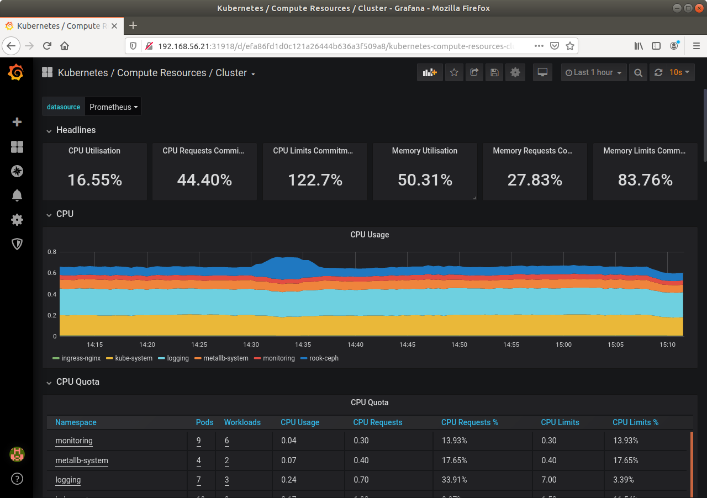

## 2. Prometheus 모니터링

### 1) 쿠버네티스 기본 모니터링 개요
지금까지 쿠버네티스 클러스터의 노드 및 파드의 상태 및 리소스 사용율을 확인하기 위해 kubectl top 명령을 사용했다. kubectl top 명령에서 제공하는 CPU 및 메모리 사용량 메트릭의 정보는 metrics-server에 의해 제공되고 있다. 

사실 쿠버네티스에서 기본적으로 사용할 수 있었던 모니터링 도구는 Heapster로, Heapster는 메트릭을 Kubelet으로 부터 수집하고, 메트릭을 시계열 데이터베이스인 influxDB에 저장하고 이를 관리하며, Grafana를 이용해 시각화할 수 있었다. 

Heapster는 별도의 influxDB 저장소가 있기 때문에 이전 메트릭도 확인할 수 있었지만, metrics-server는 별도의 저장소가 없기 때문에 현재의 실시간 메트릭만 확인할 수 있다.

Heapster는 쿠버네티스 1.0.6 버전부터 제공했으며, 1.11 버전에서 Deprecated 되었으며, 1.13 버전에서 완전히 제거 되었다.

현재 Heapster 프로젝트의 Github 저장소에서는 다음과 같이 마이그레이션할 것을 권장한다.
- 기본 CPU / 메모리 메트릭: metrics-server
- 일반 모니터링: Prometheus Operator

현재 우리가 구성한 쿠버네티스 클러스터는 metrics-server에 의해 CPU와 메모리 메트릭만 실시간으로 확인할 수 있고, Prometheus Operator를 사용하면, 시각화 뿐만아니라, 이전 메트릭도 확인할 수 있고, CPU 및 메모리 뿐만아니라 네트워크 관련 메트릭도 확인할 수 있다.

### 2) Prometheus 개요
Prometheus 프로젝트는 2012년 오픈소스 모니터링 및 경고 시스템으로 SoundCloud에서 Google의 Borgmon에 영감을 받아 기존의 StatsD 및 Graphite로 구성된 모니터링 도구를 대체하기 위해 개발되었다. Prometheus는 2015년 공개되었으며, 2016년 CNCF의 두 번째 프로젝트(첫 번째는 Kubernetes)로 지원을 받고 있다.

#### (1) Prometheus 아키텍처


#### (2) Prometheus 구성 요소
- Prometheus 서버: 시계열 데이터를 취득하고 저장
- Pushgateway: Job 리소스와 같은 생명주기가 짧은 리소스의 메트릭 수집
- 클라이언트 라이브러리: 메트릭 수집
- Exporters: HAProxy, StatsD, Graphite와 같은 서비스의 메트릭 내보내기(Prometheus로 가져오기)
- Alertmanager: 알람 전송
- Grafana: PromQL을 이용하여 Prometheus 서버로 부터 데이터를 가져와서 시각화 제공
- Service Discovery: 메트릭 측정 대상 찾기

### 3) Prometheus Operator 란?
Prometheus를 쿠버네티스 클러스터에 설치하기 위해 인터넷이나 책, 자료를 찾아보면 정말 다양한 방법이 있다는 것을 알 수 있다. 이런 다양한 방법에 대해 차이점을 확인해보자.

#### 1) Operator 란?
"Prometheus Operator"라는 이름의 Operator에 관한 얘기다. 쿠버네티스에 Helm 차트로 어플리케이션을 배포할 때 이름에 Operator가 붙어 있는 많은 차트가 있다. 그럼 Operator란 무엇을 의미하는가?

쿠버네티스 클러스터에서 애플리케이션을 배포하기 위해, 컨트롤러 리소스, 서비스, 인그레스, HPA, PV, PVC, 컨피그맵, 시크릿 등 여러 리소스가 결합해 하나의 서비스를 만들 수 있다. 이런 여러 리소스를 일일이 하나씩 수작업으로 관리하는 것은 불편하고 어려운 일이다. 이런 문제를 해결하는 것이 Operator Framework다.

Operator Framwork는 이런 애플리케이션의 여러 리소스를 개별적으로 관리하던 것을 효과적이고 자동화되며 확장 가능한 방식으로 개발하고 관리하기 위한 오픈소스 툴킷이다.

Operator Framwork는 CoreOS에서 시작된 프로젝트며 현재 CoreOS는 Red Hat에 의해 인수되었다.

> 참고  
> https://operatorhub.io/  
> https://github.com/operator-framework

#### 2) stable/prometheus 차트
Helm 공식 차트 저장소의 prometheus 차트다. 이 차트는 Prometheus 구성요소중 단지 Prometheus 서버만 설치하기 위한 공식 차트다. Prometheus의 다른 구성요소도 prometheus-* 이름으로 확인할 수 있다.

#### 3) kube-prometheus
Prometheus 설치 차트로, prometheus-operator와 YAML 리소스 파일의 모음을 결합한 Prometheus 배포 방법이다. 예전에는 Helm 차트로 제공됬지만, 더이상 Helm 차트가 아니다.

> 참고  
> https://github.com/coreos/kube-prometheus

#### 4) prometheus-operator 차트
Operator Framework로 개발된 쿠버네티스의 네이티브 애플리케이션으로 배포하기 위한 Helm 차트다.

### 4) Helm을 이용한 Prometheus Operator 설치

#### (1) Prometheus Operator용 네임스페이스 생성
Prometheus Operator를 설치하기 위한 monitoring 네임스페이를 생성한다.
```
$ kubectl create namespace monitoring

namespace/monitoring created
```

#### (2) Prometheus Operator 설치
Prometheus Operator 설치에 사용할 사용자화 파일을 생성한다.
> prometheus-values.yaml
```
grafana:
  service:
    type: NodePort
```
Grafana에 접속하기 위한 서비스 리소스는 기본 ClusterIP로 생성된다. NodePort나 LoadBalancer로 구성할 수 있고, 필요하면 Ingress 컨트롤러를 구성할 수 있다.

사용자화 파일을 이용해 릴리즈 이름은 monitor로 하고, monitoring 네임스페이스에 설치한다.
```
$ helm install monitor stable/prometheus-operator -f prometheus-values.yaml -n monitoring

...
NAME: monitor
LAST DEPLOYED: Tue Mar 31 10:52:01 2020
NAMESPACE: monitoring
STATUS: deployed
REVISION: 1
NOTES:
The Prometheus Operator has been installed. Check its status by running:
  kubectl --namespace monitoring get pods -l "release=monitor"

Visit https://github.com/coreos/prometheus-operator for instructions on how
to create & configure Alertmanager and Prometheus instances using the Operator.
```

파드 및 관련 리소스가 생성되는지 확인하자.
```
$ kubectl get all -n monitoring

NAME                                                         ...
pod/alertmanager-monitor-prometheus-operato-alertmanager-0   ...
pod/monitor-grafana-68cf69644c-7mch4                         ...
pod/monitor-kube-state-metrics-756787548f-6nbbm              ...
pod/monitor-prometheus-node-exporter-2zj6g                   ...
pod/monitor-prometheus-node-exporter-d4ghs                   ...
pod/monitor-prometheus-node-exporter-l57sc                   ...
pod/monitor-prometheus-node-exporter-qtmhr                   ...
pod/monitor-prometheus-operato-operator-75f7c6c9b6-jdkrz     ...
pod/prometheus-monitor-prometheus-operato-prometheus-0       ...

NAME                                              ...
service/alertmanager-operated                     ...
service/monitor-grafana                           ...
service/monitor-kube-state-metrics                ...
service/monitor-prometheus-node-exporter          ...
service/monitor-prometheus-operato-alertmanager   ...
service/monitor-prometheus-operato-operator       ...
service/monitor-prometheus-operato-prometheus     ...
service/prometheus-operated                       ...

NAME                                              ...
daemonset.apps/monitor-prometheus-node-exporter   ...

NAME                                                  ...
deployment.apps/monitor-grafana                       ...
deployment.apps/monitor-kube-state-metrics            ...
deployment.apps/monitor-prometheus-operato-operator   ...

NAME                                                             ...
replicaset.apps/monitor-grafana-68cf69644c                       ...
replicaset.apps/monitor-kube-state-metrics-756787548f            ...
replicaset.apps/monitor-prometheus-operato-operator-75f7c6c9b6   ...

NAME                                                                    ...
statefulset.apps/alertmanager-monitor-prometheus-operato-alertmanager   ...
statefulset.apps/prometheus-monitor-prometheus-operato-prometheus       ...
```

### 5) Grafana 대시보드 확인
모든 리소스가 생성되면, 웹 브라우저에서 쿠버네티스 클러스터의 노드 IP와 monitor-grafana 서비스의 포트로 접속하면 된다.

```http://192.168.56.21:XXXXX```



- 관리자 계정: admin
- 패스워드: prom-operator
