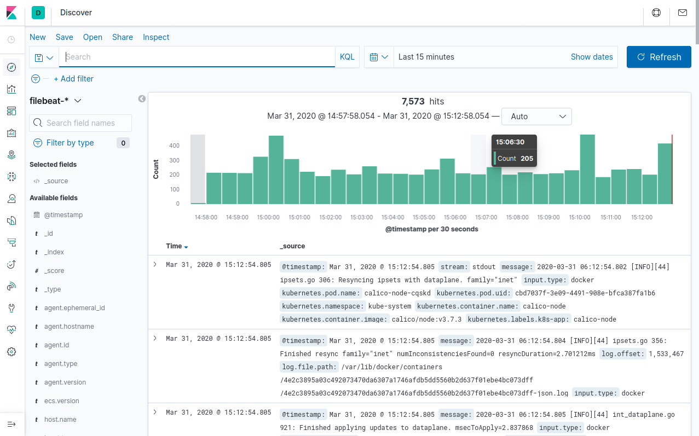

## 3. Elastic Stack 로깅

### 1) 쿠버네티스 기본 로깅 개요
쿠버네티스 클러스터는 기본적으로 로컬 호스트의 /var/log/pods, /var/log/containers 디렉터리에 해당 파드 및 컨테이너의 로그를 JSON 형식으로 남긴다. 현재 실행 중인 파드의 경우 kubectl logs 명령으로 확인할 수 있다.

이렇게 호스트 로컬에 로그를 남기는 경우 쿠버네티스 클러스터 노드의 수가 많다면, 로그를 관리하는 작업이 쉽지 않을 것이다. 또한 로그는 파드의 생명주기와 같아 파드가 삭제되면 해당 로그도 사라진다.

엔터프라이즈 환경에서는 로그를 중앙 집중식으로 모으고 관리하고, 파드의 생명주기와 상관없이 계속적으로 로그를 확인해야 하는 경우도 있다.

이 문제를 Elastic Stack을 구성하여 해결할 수 있다.

### 2) Elastic Stack 개요


Elastic Stack은 검색 및 분석 엔진으로 유명한 Elasticsearch 프로젝트로부터 시작되었다. 처음에는 로그를 검색하고 분석하는 Elasticsearch, 로그를 수집하고 필터링하는 Logstash, 로그를 시각화해서 보여주는 Kibana의 앞 글자를 따서 ELK Stack이라고 불렀다. 그러나 Logstash의 몇몇 문제점으로 인해 Logstash 대신 Fluentd를 사용해 로그를 수집하는 구성으로 EFK Stack이 탄생하였고, 최근에는 로그뿐만 아니라, 메트릭, 패킷 등을 수집할 수 있는 Beat 구성을 추가해 Elastic Stack이라는 구성을 제공한다.

Elasticsearch는 2012년에 설립된 Elastic NV라는 회사에서 만들어졌으며, Elasticsearch, Kibana, Logstash, Beats 등 여러 제품을 가지고 있으며 Apache 2.0 라이선스로 공개되어 있다. EFK Stack의 Fluentd는 Elastic NV의 제품이 아닌 별도의 오픈소스다. 모두 CNCF 재단에서 지원하는 프로젝트다.

- Elastic Stack: Elasticsearch + Beats + (Logstash) + Kibana
- EFK Stack: Elasticsearch + Fluentd + Kibana
- ELK Stack: Elasticsearch + Logstash + Kibana

- 검색 및 분석 엔진: Elasticsearch
- 시각화: Kibana
- 데이터 수집: Logstash, Fluentd, Fluentbit, Elastic Beats(FileBeats, MetricBeats ...)

### 3) 로그 수집기 비교
현재 오픈소스에서 가장 인기 있는 데이터 수집기는 Logstash와 Fluentd이다. 

최근에는 Logstash 보다 Fluentd를 도입하는 추세가 있지만, 개인적인 의경으로는 아직까지는 Logstash가 약간의 우위에 있는 것 같다. Logstash는 Elastic NV의 제품이라, Elasticsearch의 개발 속도와 같이 맞물려 있지만, Fluentd는 같은 회사의 제품이 아니다 보니 개발 속도가 조금 늦는 감이 없지 않아 있다.

Logstash는 JRuby(Java + Ruby)로 만들어져 *nix 계열뿐만 아니라 윈도우 계열에서도 동작하며, Fluentd는 *nix의 라이브러리에 대한 종속성으로 최근까지 윈도우 계열을 지원하지 않았지만, 최근에는 윈도우 계열도 지원하기 시작했다.

Logstash와 Fluentd의 주요 차이점은 Logstash는 내부에 영구(Persistent) 메시지 큐가 없다는 것이다. 그래서 Logstash는 안정성을 보장하기 위해 Redis 데이터베이스와 함께 배포해, (로그) 메시지를 Redis 데이터베이스에 저장하는 방법을 권장한다. Fluentd는 자체적으로 영구 저장소를 제공하는 버퍼를 가지고 있으며 메모리나 디스크에 저장할 수 있다.

Logstash보다 Fluentd를 많이 사용하게 된 가장 큰 차이점은 성능 부분 때문이다. Fluentd는 메모리를 40MB 사용하는 것에 비해, Logstash는 120MB 정도를 사용한다. 약 80MB 차이가 별거 아닐 수도 있지만, Logstash 및 Fluentd는 로그 수집을 위해 쿠버네티스 클러스터 노드 각 하나씩 설치되다는 것을 생각하면, 노드 개수가 많은 경우 상당한 메모리 소모가 차이 나게 된다.

이 성능 때문에 최종(Leaf) 노드에서 로그 수집에만 사용되는 별도의 구성요소를 추가했는데, Logstash는 FileBeats, Fluentd는 FluentBit가 있다. FileBeats와 FluentBit는 Logstash와 Fluentd 대신에 로그를 수집해 Elasticsearch에 직접 전송할 수도 있고, FileBeats와 FluentBit는 로그 수집을 Logstash와 Fluentd는 로그 집계(Aggregation)로 구성할 수 있다.

- FileBeats -> Elasticsearch -> Kibana
- FluentBit -> Elasticsearch -> Kibana
- FileBeats -> Logstash -> Elasticsearch -> Kibana
- FluentBit -> Fluentd -> Elasticsearch -> Kibana

### 4) ECK를 이용한 Elastic Stack 설치

#### (1) ECK 란?
ECK는 Elastic Cloud on Kubernetes로 Operator 패턴을 기반으로 Kubernetes에서 Elasticsearch, Kibana, APM Server, Enterprise Search, Beats의 설치 및 관리를 지원한다.

현재 최신 버전은 ECK 1.4이며, ECK 1.4 지원 버전은 다음과 같다.
- kubectl 1.11+
- Kubernetes 1.12+ or OpenShift 3.11+
- Google Kubernetes Engine (GKE), Azure Kubernetes Service (AKS), and Amazon Elastic Kubernetes Service (EKS)
- Elasticsearch, Kibana, APM Server: 6.8+, 7.1+
- Enterprise Search: 7.7+
- Beats: 7.0+

#### (2) Elastic Helm 차트 저장소 추가
Helm 차트 저장소를 추가한다.
```
$ helm repo add elastic https://helm.elastic.co

"elastic" has been added to your repositories
```

패키지 목록을 업데이트한다.
```
$ helm repo update

Hang tight while we grab the latest from your chart repositories...
...Successfully got an update from the "elastic" chart repository
...Successfully got an update from the "prometheus-community" chart repository
...Successfully got an update from the "stable" chart repository
Update Complete. ⎈Happy Helming!⎈
```

#### (3) ECK Operator 설치
eck-operator 패키지를 설치한다.
```
$ helm install elastic-operator elastic/eck-operator -n logging --create-namespace

NAME: elastic-operator
LAST DEPLOYED: Fri Mar  5 06:52:22 2021
NAMESPACE: logging
STATUS: deployed
REVISION: 1
TEST SUITE: None
NOTES:
1. Inspect the operator logs by running the following command:
   kubectl logs -n logging sts/elastic-operator
```
--create-namespace 옵션은 logging 네임스페이스가 없으면 알아서 생성한다.

#### (4) Elasticsearch 설치 및 확인
다음은 Elasticsearch CRD 리소스 예제다. 
> eck-elasticsearch.yaml
```yaml
apiVersion: elasticsearch.k8s.elastic.co/v1
kind: Elasticsearch
metadata:
  name: elasticsearch
  namespace: logging
spec:
  version: 7.11.1
  nodeSets:
  - name: default
    count: 1
    config:
      node.store.allow_mmap: false
```
테스트 환경이기 때문에 복제본은 하나만 설정한다.

Elasticsearch 리소스를 생성하자.
```
$ kubectl apply -f eck-elasticsearch.yaml

elasticsearch.elasticsearch.k8s.elastic.co/elasticsearch created
```

Elasticsearch 리소스의 상태를 확인해보자.
```
$ kubectl get elasticsearch -n logging

NAME            HEALTH   NODES   VERSION   PHASE   AGE
elasticsearch   green    1       7.11.1    Ready   50s
```
상태가 green이 될 때까지 기다리자.

Elasticsearch에 접근하기 위한 서비스를 확인해보자.
```
$ kubectl get service elasticsearch-es-http -n logging

NAME                    TYPE        CLUSTER-IP     EXTERNAL-IP   PORT(S)    AGE
elasticsearch-es-http   ClusterIP   10.233.43.36   <none>        9200/TCP   100s
```

Elasticsearch에 접근해 동작을 확인하기 위해 포트 포워딩을 건다.
```
$ kubectl port-forward service/elasticsearch-es-http 9200 -n logging

Forwarding from 127.0.0.1:9200 -> 9200
Forwarding from [::1]:9200 -> 9200
```

Elasticsearch에 접근하기 위한 패스워드는 시크릿 리소스에 저장되어 있다. 새 터미널을 열어 환경 변수에 패스워드를 등록하자.
```
$ PASSWORD=$(kubectl get secret elasticsearch-es-elastic-user -o go-template='{{.data.elastic | base64decode}}' -n logging)
```

패스워드를 확인해보자.
```
$ echo $PASSWORD

kmP8gos867a49RSij8Oez328
```

elastic 사용자와 패스워드 변수로 인증해 Elasticsearch가 응답하는지 확인해보자.
```
$ curl -u "elastic:$PASSWORD" -k "https://localhost:9200"

{
  "name" : "elasticsearch-es-default-0",
  "cluster_name" : "elasticsearch",
  "cluster_uuid" : "aSm57gkVTsiSjFaR_uUK2w",
  "version" : {
    "number" : "7.11.1",
    "build_flavor" : "default",
    "build_type" : "docker",
    "build_hash" : "ff17057114c2199c9c1bbecc727003a907c0db7a",
    "build_date" : "2021-02-15T13:44:09.394032Z",
    "build_snapshot" : false,
    "lucene_version" : "8.7.0",
    "minimum_wire_compatibility_version" : "6.8.0",
    "minimum_index_compatibility_version" : "6.0.0-beta1"
  },
  "tagline" : "You Know, for Search"
}
```

#### (5) Filebeats 설치 및 확인
Filebeats 예제는 다음과 같다.
> eck-filebeats.yaml
```yaml
apiVersion: beat.k8s.elastic.co/v1beta1
kind: Beat
metadata:
  name: filebeats
  namespace: logging
spec:
  type: filebeat
  version: 7.11.1
  elasticsearchRef:
    name: elasticsearch
  config:
    filebeat.inputs:
    - type: container
      paths:
      - /var/log/containers/*.log
  daemonSet:
    podTemplate:
      spec:
        dnsPolicy: ClusterFirstWithHostNet
        hostNetwork: true
        securityContext:
          runAsUser: 0
        containers:
        - name: filebeat
          volumeMounts:
          - name: varlogcontainers
            mountPath: /var/log/containers
          - name: varlogpods
            mountPath: /var/log/pods
          - name: varlibdockercontainers
            mountPath: /var/lib/docker/containers
        volumes:
        - name: varlogcontainers
          hostPath:
            path: /var/log/containers
        - name: varlogpods
          hostPath:
            path: /var/log/pods
        - name: varlibdockercontainers
          hostPath:
            path: /var/lib/docker/containers
```

Filebeats 리소스를 생성하자.
```
$ kubectl apply -f eck-filebeats.yaml

beat.beat.k8s.elastic.co/filebeats created
```

Filebeats 리소스 상태를 확인해보자.
```
$ kubectl get beat -n logging

NAME        HEALTH   AVAILABLE   EXPECTED   TYPE       VERSION   AGE
filebeats   green    3           3          filebeat   7.11.1    65s
```
Filebeats는 데몬셋으로 노드 개수만큼 생성되며 모든 상태가 green 인지 확인하자.

다음은 파드의 목록이다.
```
$ kubectl get pods --selector='beat.k8s.elastic.co/name=filebeats' -n logging

NAME                            READY   STATUS    RESTARTS   AGE
filebeats-beat-filebeat-qqln9   1/1     Running   0          2m10s
filebeats-beat-filebeat-rzz49   1/1     Running   0          2m10s
filebeats-beat-filebeat-whrvq   1/1     Running   0          2m10s
```

#### (6) Kibana 설치 및 확인
> eck-kibana.yaml
```yaml
apiVersion: kibana.k8s.elastic.co/v1
kind: Kibana
metadata:
  name: kibana
  namespace: logging
spec:
  version: 7.11.1
  count: 1
  elasticsearchRef:
    name: elasticsearch
  http:
    service:
      spec:
        type: LoadBalancer
```
Kibana도 하나만 배포하며, 접근하기 위한 서비스는 LoadBalancer 타입으로 지정했다. 기본 서비스 타입은 ClusterIP다.

Kibana 리소스를 생성하자.
```
$ kubectl apply -f eck-kibana.yaml

kibana.kibana.k8s.elastic.co/kibana created
```

Kibana 리소스 상태를 확인해보자.
```
$ kubectl get kibana -n logging

NAME     HEALTH   NODES   VERSION   AGE
kibana   green    1       7.11.1    59s
```
역시 상태가 green 인지 확인한다.

Kibana 서비스의 EXTERNAL-IP를 확인해보자.
```
$ kubectl get service kibana-kb-http -n logging

NAME             TYPE           CLUSTER-IP      EXTERNAL-IP      PORT(S)          AGE
kibana-kb-http   LoadBalancer   10.233.55.203   192.168.56.200   5601:32385/TCP   78s
```
IP는 192.168.56.200이며, 포트는 5601이다.

마지막으로 패스워드를 다시 한번 확인하자.
```
$ kubectl get secret elasticsearch-es-elastic-user -o=jsonpath='{.data.elastic}' -n logging | base64 --decode; echo

kmP8gos867a49RSij8Oez328
```

### 5) Kibana 대시보드 확인

Kibana 파드가 생성되면, 쿠버네티스 클러스터의 노드 IP와 dashboard-kibana 서비스의 포트로 접속하면 된다.

```
https://<LB-IP>:5601
```
ID: elastic

1. Welcome 페이지: Explorer on my own 선택 
2. 좌측 패널: Analytics --> Discover 선택
3. Create index pattern 선택 
4. Step 1 of 2
	- Index pattern 박스에 `filebeat-*` 입력
	- 하단에 filebeat-X.X.X-YYYY-MM-DD-000001 인덱스가 매칭이 되는지 확인
	- Next Step 선택 
6. Step 2 of 2
	- Time field 드롭박스에 @timestamp 선택 
	- Create index pattern 선택 
7. 좌측 패널: Discover 선택


