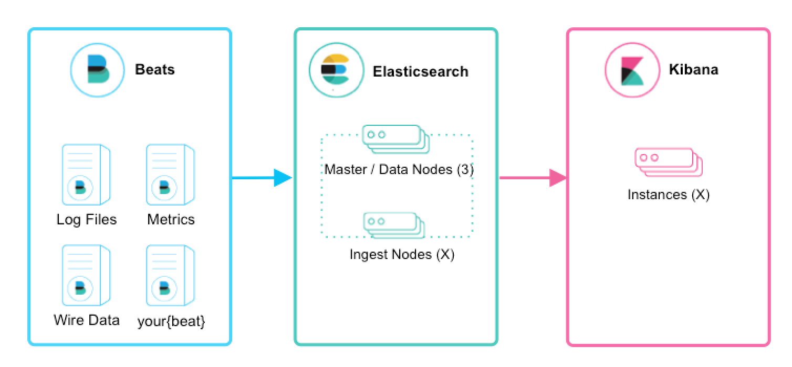

## 3. Elastic Stack 로깅

stable 저장소에 있는 elasticsearch 관련 차트는 더이상 업데이트되지 않는다.

helm repo add elastic https://helm.elastic.co

kubectl create namespace logging

$ cat elastic-value.yaml
esJavaOpts: "-Xmx128m -Xms128m"

resources:
  requests:
    cpu: "100m"
    memory: "512M"
  limits:
    cpu: "1000m"
    memory: "1024M"

helm install search elastic/elasticsearch -f elastic-value.yaml -n logging

kubectl get all -n logging

helm install collector elastic/filebeat -n logging

kubectl get all -n logging

$ cat kibana-value.yaml
resources:
  requests:
    cpu: "100m"
    memory: "512M"
  limits:
    cpu: "1000m"
    memory: "1024M"

service:
  type: NodePort

helm install dashboard elastic/kibana -f kibana-value.yaml -n logging
