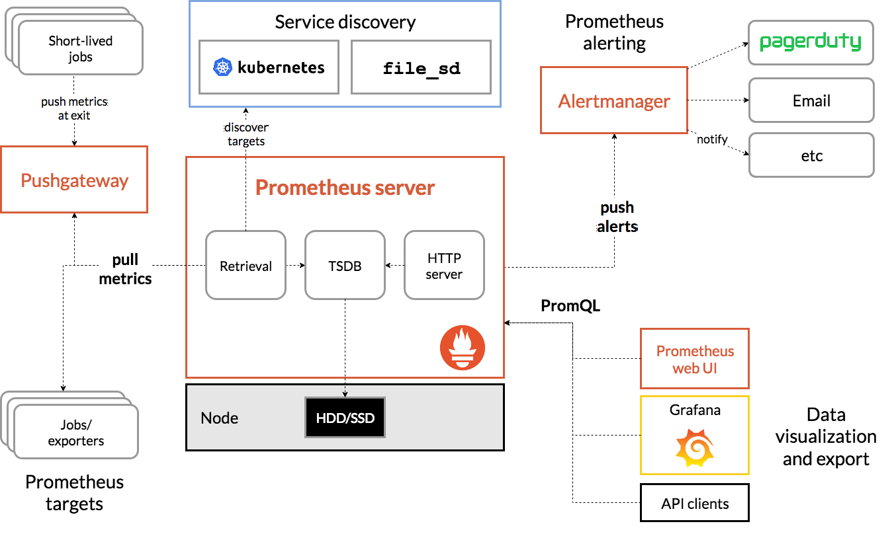

## 2. Prometheus 모니터링

https://prometheus.io/docs/introduction/overview/

kubectl create namespace monitor

helm install monitor stable/prometheus-operator -n monitor

helm list -n monitor

kubectl -n monitor edit service monitor-grafana (NodePort/LoadBalancer)

http://x.x.x.x:xxxxx
admin
prom-operator

grafana.